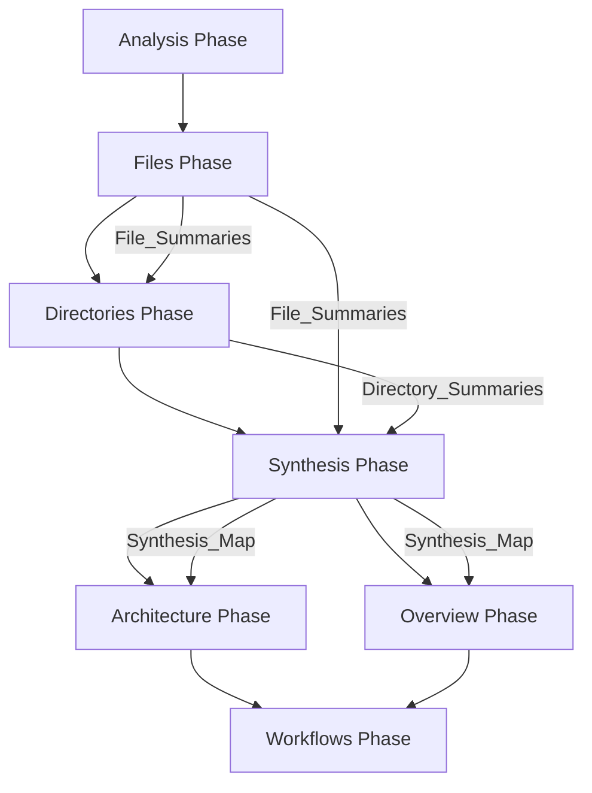
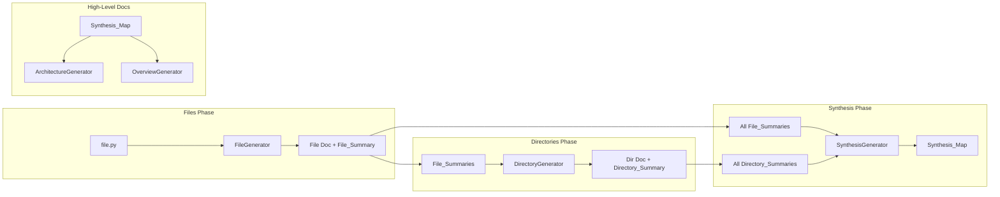

# Design Document: Bottom-Up Wiki Generation

## Overview

This design refactors the wiki generation pipeline to use a bottom-up approach. Instead of generating Architecture and Overview pages first (which rely on README.md existing), the system will:

1. Generate file documentation first, extracting structured File_Summaries
2. Generate directory documentation, informed by File_Summaries
3. Synthesize all summaries into a Synthesis_Map
4. Generate Architecture and Overview using the Synthesis_Map as primary context

This ensures high-quality documentation even when no README exists, because the LLM has actually read and understood the code before writing high-level docs.

## Architecture

### Generation Pipeline Flow



### Data Flow



## Components and Interfaces

### File_Summary Data Model

```python
@dataclass
class FileSummary:
    """Structured summary extracted from file documentation."""
    
    file_path: str
    purpose: str  # One-sentence description
    layer: str  # api | domain | infrastructure | utility | config | test
    key_abstractions: list[str]  # Primary classes/functions/types
    internal_deps: list[str]  # Paths to other repo files
    external_deps: list[str]  # External libraries/packages
```

### Directory_Summary Data Model

```python
@dataclass
class DirectorySummary:
    """Structured summary extracted from directory documentation."""
    
    directory_path: str
    purpose: str  # One-sentence description
    contains: list[str]  # Files in directory
    role_in_system: str  # How it fits in architecture
```

### Synthesis_Map Data Model

```python
@dataclass
class SynthesisMap:
    """Aggregated codebase understanding."""
    
    layers: dict[str, LayerInfo]  # layer_name -> LayerInfo
    key_components: list[ComponentInfo]  # Important abstractions
    dependency_graph: dict[str, list[str]]  # component -> dependencies
    project_summary: str  # LLM-generated overall summary
    
@dataclass
class LayerInfo:
    """Information about a code layer."""
    
    name: str
    purpose: str
    directories: list[str]
    files: list[str]

@dataclass
class ComponentInfo:
    """Information about a key component."""
    
    name: str
    file: str
    role: str
    layer: str
```

### SummaryParser Interface

```python
class SummaryParser:
    """Parses structured summaries from LLM-generated markdown."""
    
    def parse_file_summary(self, markdown: str, file_path: str) -> tuple[str, FileSummary]:
        """Parse File_Summary from markdown, return (clean_markdown, summary)."""
        ...
    
    def parse_directory_summary(self, markdown: str, dir_path: str) -> tuple[str, DirectorySummary]:
        """Parse Directory_Summary from markdown, return (clean_markdown, summary)."""
        ...
```

### SynthesisGenerator Interface

```python
class SynthesisGenerator:
    """Generates Synthesis_Map from collected summaries."""
    
    def __init__(self, llm_client):
        self.llm_client = llm_client
    
    async def generate(
        self,
        file_summaries: list[FileSummary],
        directory_summaries: list[DirectorySummary],
    ) -> SynthesisMap:
        """Generate synthesis map from all summaries."""
        ...
    
    async def _batch_process(
        self,
        summaries: list[FileSummary | DirectorySummary],
        batch_size: int,
    ) -> list[dict]:
        """Process summaries in batches if they exceed context limit."""
        ...
```

### Updated FileGenerator Interface

```python
class FileGenerator:
    """Generates file documentation with structured summary."""
    
    async def generate(
        self,
        file_path: str,
        content: str,
        symbols: list[dict],
        imports: list[str],
    ) -> tuple[GeneratedPage, FileSummary]:
        """Generate file doc and extract summary."""
        ...
```

### Updated DirectoryGenerator Interface

```python
class DirectoryGenerator:
    """Generates directory documentation with structured summary."""
    
    async def generate(
        self,
        directory_path: str,
        file_list: list[str],
        symbols: list[dict],
        file_summaries: list[FileSummary],  # NEW: summaries of contained files
    ) -> tuple[GeneratedPage, DirectorySummary]:
        """Generate directory doc and extract summary."""
        ...
```

### Updated ArchitectureGenerator Interface

```python
class ArchitectureGenerator:
    """Generates architecture documentation from synthesis."""
    
    async def generate(
        self,
        synthesis_map: SynthesisMap,
        file_tree: str,
        dependencies: list[str],
    ) -> GeneratedPage:
        """Generate architecture doc using synthesis as primary context."""
        ...
```

### Updated OverviewGenerator Interface

```python
class OverviewGenerator:
    """Generates overview documentation from synthesis."""
    
    async def generate(
        self,
        synthesis_map: SynthesisMap,
        readme_content: str | None,
        file_tree: str,
        package_info: dict,
    ) -> GeneratedPage:
        """Generate overview using synthesis as primary context."""
        ...
```

## Data Models

### Database Schema Updates

The existing `wiki_pages` table's `metadata` column will store summaries:

```sql
-- Existing table, metadata column stores JSON
-- For file pages: {"source_hash": "...", "summary": {...FileSummary fields...}}
-- For directory pages: {"source_hash": "...", "summary": {...DirectorySummary fields...}}
```

### Synthesis_Map Storage

Stored as JSON at `.oyawiki/meta/synthesis.json`:

```json
{
  "generated_at": "2025-01-09T12:00:00Z",
  "synthesis_hash": "abc123...",
  "layers": {
    "api": {
      "name": "api",
      "purpose": "REST API endpoints and request handling",
      "directories": ["backend/src/oya/api"],
      "files": ["backend/src/oya/api/routers/repos.py", "..."]
    }
  },
  "key_components": [
    {
      "name": "GenerationOrchestrator",
      "file": "backend/src/oya/generation/orchestrator.py",
      "role": "Coordinates wiki generation pipeline",
      "layer": "domain"
    }
  ],
  "dependency_graph": {
    "api": ["domain", "infrastructure"],
    "domain": ["infrastructure"]
  },
  "project_summary": "Oya is a local-first wiki generator..."
}
```

### YAML Summary Block Format

Embedded in LLM output, parsed and stripped:

```yaml
---
file_summary:
  purpose: "Orchestrates the wiki generation pipeline"
  layer: "domain"
  key_abstractions:
    - "GenerationOrchestrator"
    - "GenerationPhase"
  internal_deps:
    - "backend/src/oya/generation/file.py"
    - "backend/src/oya/generation/directory.py"
  external_deps:
    - "asyncio"
    - "pathlib"
---
```


## Correctness Properties

*A property is a characteristic or behavior that should hold true across all valid executions of a system—essentially, a formal statement about what the system should do. Properties serve as the bridge between human-readable specifications and machine-verifiable correctness guarantees.*

### Property 1: File_Summary Completeness

*For any* valid source file processed by the File_Generator, the resulting File_Summary SHALL contain all required fields (purpose, layer, key_abstractions, internal_deps, external_deps) with the layer field being one of the valid values (api, domain, infrastructure, utility, config, test).

**Validates: Requirements 1.2, 1.3, 1.4, 1.5, 1.6**

### Property 2: File_Summary Fallback on Parse Failure

*For any* malformed or missing YAML summary block in LLM output, the parser SHALL return a fallback File_Summary with purpose="Unknown" and layer="utility", and the system SHALL not raise an exception.

**Validates: Requirements 1.7, 8.3**

### Property 3: File_Summary Persistence Round-Trip

*For any* File_Summary generated and persisted to the database, querying the database for that file's metadata and deserializing SHALL produce an equivalent File_Summary object.

**Validates: Requirements 1.8**

### Property 4: Directory_Summary Completeness

*For any* directory processed by the Directory_Generator, the resulting Directory_Summary SHALL contain all required fields (purpose, contains, role_in_system) with non-empty values.

**Validates: Requirements 2.2, 2.3, 2.4**

### Property 5: Directory_Summary Fallback on Parse Failure

*For any* malformed or missing YAML summary block in directory LLM output, the parser SHALL return a fallback Directory_Summary with purpose="Unknown", and the system SHALL not raise an exception.

**Validates: Requirements 2.5**

### Property 6: Directory_Summary Persistence Round-Trip

*For any* Directory_Summary generated and persisted to the database, querying the database for that directory's metadata and deserializing SHALL produce an equivalent Directory_Summary object.

**Validates: Requirements 2.7**

### Property 7: Synthesis_Map Layer Grouping Completeness

*For any* set of File_Summaries with layer classifications, the resulting Synthesis_Map SHALL contain all files grouped under their respective layers, with no file appearing in multiple layers and no file missing from all layers.

**Validates: Requirements 3.2**

### Property 8: Synthesis_Map JSON Round-Trip

*For any* valid Synthesis_Map, serializing to JSON and deserializing back SHALL produce an equivalent Synthesis_Map object.

**Validates: Requirements 3.5**

### Property 9: Synthesis Batching for Large Inputs

*For any* set of summaries exceeding the configured context limit, the Synthesis_Generator SHALL process them in batches and produce a valid merged Synthesis_Map without exceeding token limits in any single LLM call.

**Validates: Requirements 3.8**

### Property 10: Cascade - File Change Triggers Regeneration

*For any* file whose content hash has changed since the last generation, running the Generation_Pipeline SHALL regenerate that file's documentation.

**Validates: Requirements 7.1**

### Property 11: Cascade - File Regeneration Triggers Synthesis

*For any* generation run where at least one file's documentation was regenerated, the Synthesis_Map SHALL also be regenerated.

**Validates: Requirements 7.2**

### Property 12: Cascade - Synthesis Change Triggers High-Level Docs

*For any* generation run where the Synthesis_Map was regenerated, the Architecture and Overview pages SHALL also be regenerated.

**Validates: Requirements 7.3**

### Property 13: No-Change Skip

*For any* generation run where no files have changed content AND no new notes exist, the Generation_Pipeline SHALL skip all regeneration and return without modifying any wiki pages.

**Validates: Requirements 7.5**

### Property 14: YAML Parsing and Stripping

*For any* markdown content containing a valid YAML summary block (delimited by `---`), the parser SHALL extract the summary data AND return markdown content with the YAML block removed.

**Validates: Requirements 8.1, 8.4, 8.5**

## Error Handling

### LLM Output Parsing Failures

When the LLM produces output that cannot be parsed:

1. **Missing YAML block**: Use fallback summary with default values
2. **Malformed YAML**: Log warning, use fallback summary
3. **Missing required fields**: Use fallback values for missing fields only
4. **Invalid layer value**: Default to "utility"

### Synthesis Failures

When synthesis cannot complete:

1. **Empty summaries**: Generate minimal Synthesis_Map with empty layers
2. **LLM timeout**: Retry with smaller batch size
3. **Batch merge conflict**: Log warning, prefer later batch results

### Cascade Failures

When cascade regeneration fails:

1. **Synthesis fails after file regen**: Keep old synthesis, log error
2. **Arch/Overview fails after synthesis**: Keep old pages, log error
3. **Partial failure**: Complete successful regenerations, report failures

### Database Errors

1. **Summary persistence fails**: Log error, continue generation (summary lost but doc saved)
2. **Summary retrieval fails**: Regenerate summary from scratch

## Testing Strategy

### Test-Driven Development (Red-Green-Refactor)

All implementation follows the red-green-refactor cycle:

1. **Red**: Write a small, focused test that fails (because the code doesn't exist yet)
2. **Green**: Write the simplest possible code to make the test pass
3. **Refactor**: Clean up the code while keeping tests green

This ensures every piece of functionality has test coverage from the start.

### Unit Tests

Unit tests verify specific components in isolation:

- **SummaryParser**: Test YAML extraction, field validation, fallback behavior
- **FileSummary/DirectorySummary dataclasses**: Test serialization, validation
- **SynthesisMap**: Test layer grouping logic, JSON serialization
- **Batch processing**: Test splitting and merging logic

### Property-Based Tests

Property-based tests verify universal properties across generated inputs:

- **Library**: pytest with hypothesis
- **Minimum iterations**: 100 per property
- **Tag format**: `Feature: bottom-up-generation, Property N: {property_text}`

Each correctness property (1-14) will have a corresponding property-based test that generates random valid inputs and verifies the property holds.

### Integration Tests

Integration tests verify end-to-end flows:

- **Pipeline order**: Verify phases execute in correct order
- **Data flow**: Verify summaries flow from files → directories → synthesis → arch/overview
- **Cascade behavior**: Verify changes propagate correctly
- **No-README scenario**: Verify generation succeeds without README

### Test Data Generation

For property-based tests, generators will produce:

- **Random source files**: Valid Python/TypeScript/Java code snippets
- **Random File_Summaries**: Valid summaries with random field values
- **Random Directory_Summaries**: Valid summaries with random file lists
- **Malformed YAML**: Various invalid YAML structures for fallback testing
- **Large summary sets**: For batching tests

