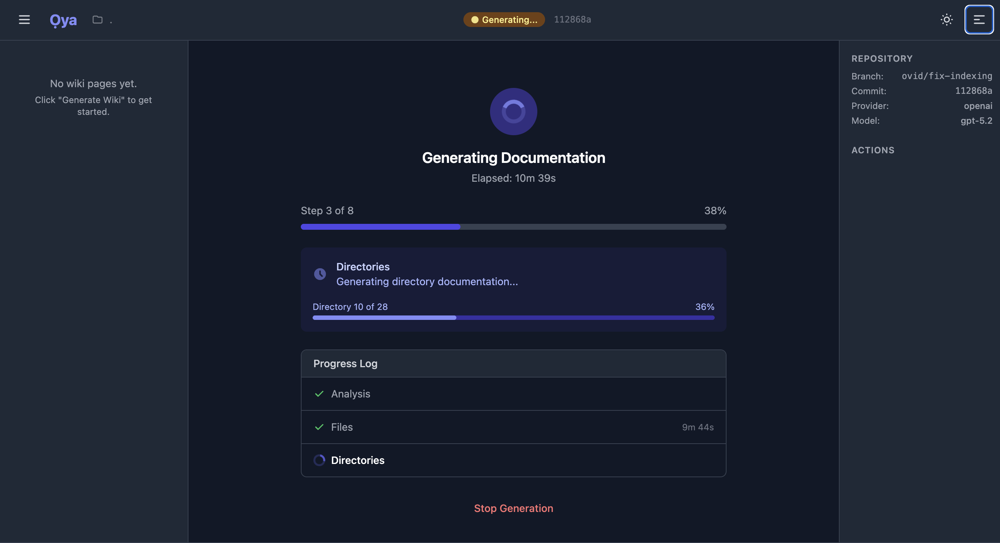

# Ọya

**Your codebase, explained.**

[](https://deepwiki.com/Ovid/Oya)


---

## Alpha Software

This is a work in progress. It works, but expect rough edges. File issues when you find them.

* We're using ChromaDB with its built-in embeddings. This is fine for testing, but we need a proper embedding model for production-quality work.
* Clearing LLM logs is done manually at present. In production, this is not good.
* If you use use the OpenAPI interface, no way to propagate additional information, such as username, auth info, or whatever else is needed for auditability.
* ... and more.

---

## The Problem

You inherit a codebase. Or you come back to your own code after six months. Either way, you're lost.

You could read every file. You could grep for patterns and hope. You could ask a coworker who's busy. Or you could paste code into ChatGPT and get a confident-sounding answer that's subtly wrong.

Documentation exists, but it's out of date. Comments lie. The wiki was last updated two years ago by someone who left.

## What Ọya Does

Ọya reads your code and writes documentation that actually reflects what's there. Not what someone meant to write. Not what the comments claim. What the code actually does.

Then you can ask questions: *"How does authentication work?"* *"Where are database connections handled?"* *"What calls this function?"*

Ọya answers—but only when it has evidence. No hallucinations. No confident nonsense. If it doesn't know, it says so.

And when Ọya gets something wrong (it will), you can correct it. Your corrections become ground truth. The next time Ọya regenerates, it learns from your fixes.



## Why This Matters

**Your data stays on your machine.** Ọya runs locally. Your code never leaves your computer unless you want it to. No cloud uploads. No "we'll just index your repo real quick."

**AI that knows its limits.** Most AI tools answer every question confidently, even when they're making things up. Ọya's Q&A is evidence-gated—it only answers when it can cite the code that proves it's right.

**Documentation you can fix.** AI makes mistakes. Instead of fighting with a black box, you add a correction. Ọya treats your notes as truth and incorporates them automatically.

**Works with your LLM.** Use OpenAI, Anthropic, Google, or run it entirely offline with Ollama. Your choice.

---

## Getting Started

See **[SETUP.md](SETUP.md)** for complete installation instructions.

**Quickest path:**

```bash
git clone https://github.com/your-org/oya.git
cd oya
cp .env.example .env    # Add your LLM API key
docker-compose up       # Open http://localhost:5173
```

On first run, add a repository (Git URL or local path) and click Generate.

---

## Who is Ọya?

Ọya is the Yoruba orisha of winds, lightning, and storms. She controls transformation and change—fitting for a tool that turns tangled code into clear understanding.

[Learn more about Ọya](https://en.wikipedia.org/wiki/%E1%BB%8Cya)

---

## License

MIT License - see [LICENSE](LICENSE) for details.
