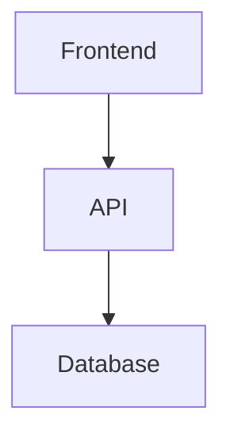

# Oya v1 Implementation Plan

> **For Claude:** REQUIRED SUB-SKILL: Use superpowers:executing-plans to implement this plan task-by-task.

**Goal:** Build a local-first, editable DeepWiki clone that generates trustworthy, correctable documentation for codebases.

**Architecture:** Python FastAPI backend with embedded ChromaDB and SQLite, React/Vite frontend with Tailwind CSS. Docker Compose orchestrates two services. Users mount their repo as a volume, backend generates wiki pages hierarchically, frontend renders with citations. Notes system allows corrections that override AI inference.

**Tech Stack:** FastAPI, SQLite, ChromaDB, LiteLLM, GitPython, Tree-sitter | React 18, TypeScript, Vite, Tailwind CSS, Headless UI, CodeMirror, react-markdown

---

## Phase 1: Project Scaffolding

### Task 1.1: Create Backend Project Structure

**Files:**
- Create: `backend/pyproject.toml`
- Create: `backend/src/oya/__init__.py`
- Create: `backend/src/oya/main.py`
- Create: `backend/tests/__init__.py`
- Create: `backend/tests/test_health.py`

**Step 1: Create backend directory structure**

```bash
mkdir -p backend/src/oya backend/tests
```

**Step 2: Create pyproject.toml with dependencies**

```toml
[project]
name = "oya"
version = "0.1.0"
description = "Local-first editable wiki generator for codebases"
requires-python = ">=3.11"
dependencies = [
    "fastapi>=0.109.0",
    "uvicorn[standard]>=0.27.0",
    "pydantic>=2.5.0",
    "pydantic-settings>=2.1.0",
]

[project.optional-dependencies]
dev = [
    "pytest>=8.0.0",
    "pytest-asyncio>=0.23.0",
    "httpx>=0.26.0",
    "ruff>=0.1.0",
]

[build-system]
requires = ["hatchling"]
build-backend = "hatchling.build"

[tool.hatch.build.targets.wheel]
packages = ["src/oya"]

[tool.pytest.ini_options]
asyncio_mode = "auto"
testpaths = ["tests"]

[tool.ruff]
line-length = 100
target-version = "py311"
```

**Step 3: Create oya package init**

```python
# backend/src/oya/__init__.py
"""Oya - Local-first editable wiki generator for codebases."""

__version__ = "0.1.0"
```

**Step 4: Create minimal FastAPI app**

```python
# backend/src/oya/main.py
"""FastAPI application entry point."""

from fastapi import FastAPI

app = FastAPI(
    title="Oya",
    description="Local-first editable wiki generator for codebases",
    version="0.1.0",
)


@app.get("/health")
async def health_check() -> dict[str, str]:
    """Health check endpoint."""
    return {"status": "healthy"}
```

**Step 5: Write the failing test**

```python
# backend/tests/test_health.py
"""Health check endpoint tests."""

import pytest
from httpx import ASGITransport, AsyncClient

from oya.main import app


@pytest.fixture
async def client():
    """Create async test client."""
    async with AsyncClient(
        transport=ASGITransport(app=app),
        base_url="http://test",
    ) as client:
        yield client


async def test_health_check_returns_healthy(client: AsyncClient):
    """Health endpoint returns healthy status."""
    response = await client.get("/health")

    assert response.status_code == 200
    assert response.json() == {"status": "healthy"}
```

**Step 6: Create tests init**

```python
# backend/tests/__init__.py
"""Oya test suite."""
```

**Step 7: Install dependencies and run test**

```bash
cd backend
pip install -e ".[dev]"
pytest tests/test_health.py -v
```

Expected: PASS

**Step 8: Commit**

```bash
git add backend/
git commit -m "feat(backend): scaffold FastAPI project with health endpoint"
```

---

### Task 1.2: Create Frontend Project Structure

**Files:**
- Create: `frontend/package.json`
- Create: `frontend/tsconfig.json`
- Create: `frontend/vite.config.ts`
- Create: `frontend/index.html`
- Create: `frontend/src/main.tsx`
- Create: `frontend/src/App.tsx`
- Create: `frontend/src/vite-env.d.ts`

**Step 1: Create frontend with Vite**

```bash
cd frontend
npm create vite@latest . -- --template react-ts
```

**Step 2: Install additional dependencies**

```bash
npm install @headlessui/react
npm install -D tailwindcss postcss autoprefixer
npx tailwindcss init -p
```

**Step 3: Configure tailwind.config.js**

```javascript
/** @type {import('tailwindcss').Config} */
export default {
  content: [
    "./index.html",
    "./src/**/*.{js,ts,jsx,tsx}",
  ],
  darkMode: 'class',
  theme: {
    extend: {},
  },
  plugins: [],
}
```

**Step 4: Create src/index.css with Tailwind**

```css
@tailwind base;
@tailwind components;
@tailwind utilities;
```

**Step 5: Update src/App.tsx with minimal shell**

```tsx
function App() {
  return (
    <div className="min-h-screen bg-gray-50 dark:bg-gray-900">
      <header className="bg-white dark:bg-gray-800 shadow">
        <div className="px-4 py-3">
          <h1 className="text-xl font-semibold text-gray-900 dark:text-white">
            Oya
          </h1>
        </div>
      </header>
      <main className="p-4">
        <p className="text-gray-600 dark:text-gray-300">
          Wiki generator loading...
        </p>
      </main>
    </div>
  )
}

export default App
```

**Step 6: Verify dev server works**

```bash
npm run dev
```

Expected: App loads at http://localhost:5173 with "Oya" header

**Step 7: Commit**

```bash
git add frontend/
git commit -m "feat(frontend): scaffold React/Vite project with Tailwind"
```

---

### Task 1.3: Create Docker Compose Setup

**Files:**
- Create: `backend/Dockerfile`
- Create: `frontend/Dockerfile`
- Create: `docker-compose.yml`
- Create: `.env.example`

**Step 1: Create backend Dockerfile**

```dockerfile
# backend/Dockerfile
FROM python:3.11-slim

WORKDIR /app

# Install system dependencies
RUN apt-get update && apt-get install -y \
    git \
    && rm -rf /var/lib/apt/lists/*

# Install Python dependencies
COPY pyproject.toml .
RUN pip install --no-cache-dir -e .

# Copy source
COPY src/ src/

# Run uvicorn
CMD ["uvicorn", "oya.main:app", "--host", "0.0.0.0", "--port", "8000"]
```

**Step 2: Create frontend Dockerfile**

```dockerfile
# frontend/Dockerfile
FROM node:20-slim

WORKDIR /app

# Copy package files
COPY package*.json ./

# Install dependencies
RUN npm ci

# Copy source
COPY . .

# Expose port
EXPOSE 3000

# Run dev server (for dev mode)
CMD ["npm", "run", "dev", "--", "--host", "0.0.0.0", "--port", "3000"]
```

**Step 3: Create docker-compose.yml**

```yaml
version: '3.9'

services:
  backend:
    build: ./backend
    ports:
      - "8000:8000"
    volumes:
      - ${REPO_PATH:-.}:/workspace:ro
      - oya-data:/workspace/.coretechs
    environment:
      - WORKSPACE_PATH=/workspace
    env_file:
      - .env

  frontend:
    build: ./frontend
    ports:
      - "3000:3000"
    depends_on:
      - backend
    environment:
      - VITE_API_URL=http://localhost:8000

volumes:
  oya-data:
```

**Step 4: Create .env.example**

```bash
# .env.example
# Copy to .env and fill in values

# Path to repository to analyze (required)
REPO_PATH=/path/to/your/repo

# LLM Provider (choose one)
OPENAI_API_KEY=
ANTHROPIC_API_KEY=
GOOGLE_API_KEY=

# Or use local Ollama
OLLAMA_ENDPOINT=http://host.docker.internal:11434

# Active provider configuration
ACTIVE_PROVIDER=openai
ACTIVE_MODEL=gpt-4o
```

**Step 5: Test Docker build**

```bash
docker-compose build
```

Expected: Both images build successfully

**Step 6: Commit**

```bash
git add backend/Dockerfile frontend/Dockerfile docker-compose.yml .env.example
git commit -m "feat: add Docker Compose setup for development"
```

---

## Phase 2: Backend Core Infrastructure

### Task 2.1: Add SQLite Database Layer

**Files:**
- Create: `backend/src/oya/db/__init__.py`
- Create: `backend/src/oya/db/connection.py`
- Create: `backend/src/oya/db/models.py`
- Create: `backend/src/oya/db/migrations.py`
- Create: `backend/tests/test_db.py`

**Step 1: Write the failing test for database connection**

```python
# backend/tests/test_db.py
"""Database connection and schema tests."""

import tempfile
from pathlib import Path

import pytest

from oya.db.connection import Database
from oya.db.migrations import run_migrations


@pytest.fixture
def temp_db():
    """Create a temporary database."""
    with tempfile.TemporaryDirectory() as tmpdir:
        db_path = Path(tmpdir) / "test.db"
        yield db_path


def test_database_connects(temp_db: Path):
    """Database connects and creates file."""
    db = Database(temp_db)

    assert temp_db.exists()
    db.close()


def test_migrations_create_tables(temp_db: Path):
    """Migrations create required tables."""
    db = Database(temp_db)
    run_migrations(db)

    # Check tables exist
    tables = db.execute(
        "SELECT name FROM sqlite_master WHERE type='table'"
    ).fetchall()
    table_names = {row[0] for row in tables}

    assert "generations" in table_names
    assert "wiki_pages" in table_names
    assert "notes" in table_names
    assert "citations" in table_names

    db.close()
```

**Step 2: Run test to verify it fails**

```bash
pytest backend/tests/test_db.py -v
```

Expected: FAIL with import error

**Step 3: Create db package init**

```python
# backend/src/oya/db/__init__.py
"""Database layer for Oya."""

from oya.db.connection import Database
from oya.db.migrations import run_migrations

__all__ = ["Database", "run_migrations"]
```

**Step 4: Implement Database connection class**

```python
# backend/src/oya/db/connection.py
"""SQLite database connection management."""

import sqlite3
from pathlib import Path
from typing import Any


class Database:
    """SQLite database wrapper with connection management."""

    def __init__(self, db_path: Path):
        """Initialize database connection.

        Args:
            db_path: Path to SQLite database file.
        """
        self.db_path = db_path
        db_path.parent.mkdir(parents=True, exist_ok=True)
        self._conn = sqlite3.connect(db_path, check_same_thread=False)
        self._conn.row_factory = sqlite3.Row
        # Enable foreign keys
        self._conn.execute("PRAGMA foreign_keys = ON")

    def execute(self, sql: str, params: tuple[Any, ...] = ()) -> sqlite3.Cursor:
        """Execute SQL statement.

        Args:
            sql: SQL statement.
            params: Query parameters.

        Returns:
            Cursor with results.
        """
        return self._conn.execute(sql, params)

    def executemany(self, sql: str, params_list: list[tuple[Any, ...]]) -> sqlite3.Cursor:
        """Execute SQL statement for multiple parameter sets.

        Args:
            sql: SQL statement.
            params_list: List of parameter tuples.

        Returns:
            Cursor with results.
        """
        return self._conn.executemany(sql, params_list)

    def commit(self) -> None:
        """Commit current transaction."""
        self._conn.commit()

    def close(self) -> None:
        """Close database connection."""
        self._conn.close()
```

**Step 5: Implement migrations**

```python
# backend/src/oya/db/migrations.py
"""Database schema migrations."""

from oya.db.connection import Database

SCHEMA = """
-- Job/generation tracking
CREATE TABLE IF NOT EXISTS generations (
    id TEXT PRIMARY KEY,
    type TEXT NOT NULL,  -- 'full', 'file', 'directory', 'workflow', etc.
    status TEXT NOT NULL DEFAULT 'pending',  -- pending, running, completed, failed
    started_at TEXT,
    completed_at TEXT,
    commit_hash TEXT,
    error_message TEXT,
    progress_data TEXT  -- JSON blob for progress tracking
);

-- Wiki page metadata
CREATE TABLE IF NOT EXISTS wiki_pages (
    id INTEGER PRIMARY KEY AUTOINCREMENT,
    path TEXT NOT NULL UNIQUE,  -- e.g., 'overview', 'files/src-main-py'
    type TEXT NOT NULL,  -- overview, architecture, workflow, directory, file
    title TEXT NOT NULL,
    generated_at TEXT NOT NULL,
    commit_hash TEXT NOT NULL,
    word_count INTEGER DEFAULT 0,
    content_hash TEXT  -- For change detection
);

-- Human correction notes
CREATE TABLE IF NOT EXISTS notes (
    id TEXT PRIMARY KEY,
    filepath TEXT NOT NULL,  -- Path in .coretechs/notes/
    scope TEXT NOT NULL,  -- file, directory, workflow, architecture, general
    target TEXT,  -- Path or slug this note applies to
    created_at TEXT NOT NULL,
    author TEXT,
    git_branch TEXT,
    git_commit TEXT,
    git_dirty INTEGER DEFAULT 0,
    content_preview TEXT  -- First 200 chars for display
);

-- Citation tracking
CREATE TABLE IF NOT EXISTS citations (
    id INTEGER PRIMARY KEY AUTOINCREMENT,
    wiki_page_id INTEGER NOT NULL REFERENCES wiki_pages(id) ON DELETE CASCADE,
    source_type TEXT NOT NULL,  -- 'code', 'note', 'wiki'
    source_path TEXT NOT NULL,
    start_line INTEGER,
    end_line INTEGER,
    commit_hash TEXT,
    citation_key TEXT NOT NULL,  -- [1], [2], etc.
    snippet_preview TEXT
);

-- Full-text search
CREATE VIRTUAL TABLE IF NOT EXISTS fts_content USING fts5(
    title,
    content,
    path,
    type,
    content='wiki_pages',
    content_rowid='id'
);

-- Indexes
CREATE INDEX IF NOT EXISTS idx_wiki_pages_type ON wiki_pages(type);
CREATE INDEX IF NOT EXISTS idx_notes_scope ON notes(scope);
CREATE INDEX IF NOT EXISTS idx_notes_target ON notes(target);
CREATE INDEX IF NOT EXISTS idx_citations_wiki_page ON citations(wiki_page_id);
CREATE INDEX IF NOT EXISTS idx_generations_status ON generations(status);
"""


def run_migrations(db: Database) -> None:
    """Run database migrations.

    Args:
        db: Database connection.
    """
    db.execute(SCHEMA)
    db.commit()
```

**Step 6: Run tests to verify they pass**

```bash
pytest backend/tests/test_db.py -v
```

Expected: PASS

**Step 7: Commit**

```bash
git add backend/src/oya/db/ backend/tests/test_db.py
git commit -m "feat(backend): add SQLite database layer with schema"
```

---

### Task 2.2: Add Configuration System

**Files:**
- Create: `backend/src/oya/config.py`
- Create: `backend/tests/test_config.py`

**Step 1: Write the failing test**

```python
# backend/tests/test_config.py
"""Configuration tests."""

import os
import tempfile
from pathlib import Path

import pytest

from oya.config import Settings, load_settings


@pytest.fixture
def temp_workspace():
    """Create temporary workspace directory."""
    with tempfile.TemporaryDirectory() as tmpdir:
        workspace = Path(tmpdir) / "workspace"
        workspace.mkdir()
        yield workspace


def test_settings_from_environment(temp_workspace: Path, monkeypatch):
    """Settings load from environment variables."""
    monkeypatch.setenv("WORKSPACE_PATH", str(temp_workspace))
    monkeypatch.setenv("ACTIVE_PROVIDER", "openai")
    monkeypatch.setenv("ACTIVE_MODEL", "gpt-4o")

    settings = load_settings()

    assert settings.workspace_path == temp_workspace
    assert settings.active_provider == "openai"
    assert settings.active_model == "gpt-4o"


def test_settings_defaults(temp_workspace: Path, monkeypatch):
    """Settings have sensible defaults."""
    monkeypatch.setenv("WORKSPACE_PATH", str(temp_workspace))
    # Clear LLM settings
    monkeypatch.delenv("ACTIVE_PROVIDER", raising=False)
    monkeypatch.delenv("ACTIVE_MODEL", raising=False)

    settings = load_settings()

    assert settings.active_provider == "ollama"  # Default fallback
    assert settings.active_model == "llama2"


def test_coretechs_paths(temp_workspace: Path, monkeypatch):
    """Coretechs subdirectory paths are computed correctly."""
    monkeypatch.setenv("WORKSPACE_PATH", str(temp_workspace))

    settings = load_settings()

    assert settings.coretechs_path == temp_workspace / ".coretechs"
    assert settings.wiki_path == temp_workspace / ".coretechs" / "wiki"
    assert settings.notes_path == temp_workspace / ".coretechs" / "notes"
    assert settings.db_path == temp_workspace / ".coretechs" / "meta" / "oya.db"
```

**Step 2: Run test to verify it fails**

```bash
pytest backend/tests/test_config.py -v
```

Expected: FAIL with import error

**Step 3: Implement configuration**

```python
# backend/src/oya/config.py
"""Application configuration."""

import os
from dataclasses import dataclass
from functools import lru_cache
from pathlib import Path


@dataclass
class Settings:
    """Application settings."""

    # Workspace
    workspace_path: Path

    # LLM Provider
    active_provider: str
    active_model: str
    openai_api_key: str | None = None
    anthropic_api_key: str | None = None
    google_api_key: str | None = None
    ollama_endpoint: str = "http://localhost:11434"

    # Generation settings
    max_file_size_kb: int = 500
    parallel_file_limit: int = 10
    chunk_size: int = 1000

    @property
    def coretechs_path(self) -> Path:
        """Path to .coretechs directory."""
        return self.workspace_path / ".coretechs"

    @property
    def wiki_path(self) -> Path:
        """Path to wiki directory."""
        return self.coretechs_path / "wiki"

    @property
    def notes_path(self) -> Path:
        """Path to notes directory."""
        return self.coretechs_path / "notes"

    @property
    def db_path(self) -> Path:
        """Path to SQLite database."""
        return self.coretechs_path / "meta" / "oya.db"

    @property
    def index_path(self) -> Path:
        """Path to ChromaDB index."""
        return self.coretechs_path / "index"

    @property
    def cache_path(self) -> Path:
        """Path to cache directory."""
        return self.coretechs_path / "cache"


@lru_cache
def load_settings() -> Settings:
    """Load settings from environment.

    Returns:
        Populated Settings instance.
    """
    workspace = Path(os.environ.get("WORKSPACE_PATH", "/workspace"))

    # Determine provider - default to ollama if no API keys
    provider = os.environ.get("ACTIVE_PROVIDER", "")
    model = os.environ.get("ACTIVE_MODEL", "")

    openai_key = os.environ.get("OPENAI_API_KEY")
    anthropic_key = os.environ.get("ANTHROPIC_API_KEY")
    google_key = os.environ.get("GOOGLE_API_KEY")

    # Default to ollama if no provider specified and no keys
    if not provider:
        if openai_key:
            provider = "openai"
            model = model or "gpt-4o"
        elif anthropic_key:
            provider = "anthropic"
            model = model or "claude-3-sonnet-20240229"
        elif google_key:
            provider = "google"
            model = model or "gemini-pro"
        else:
            provider = "ollama"
            model = model or "llama2"

    if not model:
        model = "llama2" if provider == "ollama" else "gpt-4o"

    return Settings(
        workspace_path=workspace,
        active_provider=provider,
        active_model=model,
        openai_api_key=openai_key,
        anthropic_api_key=anthropic_key,
        google_api_key=google_key,
        ollama_endpoint=os.environ.get("OLLAMA_ENDPOINT", "http://localhost:11434"),
        max_file_size_kb=int(os.environ.get("MAX_FILE_SIZE_KB", "500")),
        parallel_file_limit=int(os.environ.get("PARALLEL_FILE_LIMIT", "10")),
        chunk_size=int(os.environ.get("CHUNK_SIZE", "1000")),
    )
```

**Step 4: Run tests to verify they pass**

```bash
pytest backend/tests/test_config.py -v
```

Expected: PASS

**Step 5: Commit**

```bash
git add backend/src/oya/config.py backend/tests/test_config.py
git commit -m "feat(backend): add configuration system with environment loading"
```

---

### Task 2.3: Add ChromaDB Vector Store

**Files:**
- Modify: `backend/pyproject.toml` (add chromadb dependency)
- Create: `backend/src/oya/vectorstore/__init__.py`
- Create: `backend/src/oya/vectorstore/store.py`
- Create: `backend/tests/test_vectorstore.py`

**Step 1: Add chromadb to dependencies**

In `backend/pyproject.toml`, add to dependencies:
```toml
dependencies = [
    "fastapi>=0.109.0",
    "uvicorn[standard]>=0.27.0",
    "pydantic>=2.5.0",
    "pydantic-settings>=2.1.0",
    "chromadb>=0.4.22",
]
```

**Step 2: Install updated dependencies**

```bash
cd backend
pip install -e ".[dev]"
```

**Step 3: Write the failing test**

```python
# backend/tests/test_vectorstore.py
"""Vector store tests."""

import tempfile
from pathlib import Path

import pytest

from oya.vectorstore import VectorStore


@pytest.fixture
def temp_index():
    """Create temporary index directory."""
    with tempfile.TemporaryDirectory() as tmpdir:
        yield Path(tmpdir)


def test_vectorstore_initializes(temp_index: Path):
    """Vector store initializes and creates collection."""
    store = VectorStore(temp_index)

    assert store.collection is not None


def test_add_and_query_documents(temp_index: Path):
    """Can add documents and query them."""
    store = VectorStore(temp_index)

    # Add documents
    store.add_documents(
        ids=["doc1", "doc2"],
        documents=[
            "The login function handles user authentication",
            "The database schema defines user tables",
        ],
        metadatas=[
            {"source": "auth.py", "type": "code"},
            {"source": "schema.sql", "type": "code"},
        ],
    )

    # Query
    results = store.query("how does login work", n_results=1)

    assert len(results["ids"][0]) == 1
    assert results["ids"][0][0] == "doc1"


def test_query_with_filter(temp_index: Path):
    """Can filter queries by metadata."""
    store = VectorStore(temp_index)

    store.add_documents(
        ids=["code1", "note1"],
        documents=[
            "Authentication uses JWT tokens",
            "CORRECTION: Authentication uses OAuth2, not JWT",
        ],
        metadatas=[
            {"source": "auth.py", "type": "code"},
            {"source": "note-001.md", "type": "note"},
        ],
    )

    # Query only notes
    results = store.query(
        "how does authentication work",
        n_results=2,
        where={"type": "note"},
    )

    assert len(results["ids"][0]) == 1
    assert results["ids"][0][0] == "note1"
```

**Step 4: Run test to verify it fails**

```bash
pytest backend/tests/test_vectorstore.py -v
```

Expected: FAIL with import error

**Step 5: Create vectorstore package init**

```python
# backend/src/oya/vectorstore/__init__.py
"""Vector storage for semantic search."""

from oya.vectorstore.store import VectorStore

__all__ = ["VectorStore"]
```

**Step 6: Implement VectorStore**

```python
# backend/src/oya/vectorstore/store.py
"""ChromaDB vector store wrapper."""

from pathlib import Path
from typing import Any

import chromadb
from chromadb.config import Settings


class VectorStore:
    """ChromaDB-based vector store for semantic search."""

    COLLECTION_NAME = "oya_content"

    def __init__(self, persist_path: Path):
        """Initialize vector store.

        Args:
            persist_path: Directory for persistent storage.
        """
        persist_path.mkdir(parents=True, exist_ok=True)

        self._client = chromadb.Client(
            Settings(
                chroma_db_impl="duckdb+parquet",
                persist_directory=str(persist_path),
                anonymized_telemetry=False,
            )
        )

        self.collection = self._client.get_or_create_collection(
            name=self.COLLECTION_NAME,
            metadata={"hnsw:space": "cosine"},
        )

    def add_documents(
        self,
        ids: list[str],
        documents: list[str],
        metadatas: list[dict[str, Any]] | None = None,
    ) -> None:
        """Add documents to the store.

        Args:
            ids: Unique identifiers for documents.
            documents: Document text content.
            metadatas: Optional metadata for each document.
        """
        self.collection.add(
            ids=ids,
            documents=documents,
            metadatas=metadatas,
        )

    def query(
        self,
        query_text: str,
        n_results: int = 10,
        where: dict[str, Any] | None = None,
    ) -> dict[str, Any]:
        """Query the store for similar documents.

        Args:
            query_text: Query string.
            n_results: Maximum number of results.
            where: Optional metadata filter.

        Returns:
            Query results with ids, documents, distances, metadatas.
        """
        return self.collection.query(
            query_texts=[query_text],
            n_results=n_results,
            where=where,
        )

    def delete(self, ids: list[str]) -> None:
        """Delete documents by ID.

        Args:
            ids: Document IDs to delete.
        """
        self.collection.delete(ids=ids)

    def clear(self) -> None:
        """Clear all documents from collection."""
        self._client.delete_collection(self.COLLECTION_NAME)
        self.collection = self._client.get_or_create_collection(
            name=self.COLLECTION_NAME,
            metadata={"hnsw:space": "cosine"},
        )
```

**Step 7: Run tests to verify they pass**

```bash
pytest backend/tests/test_vectorstore.py -v
```

Expected: PASS

**Step 8: Commit**

```bash
git add backend/pyproject.toml backend/src/oya/vectorstore/ backend/tests/test_vectorstore.py
git commit -m "feat(backend): add ChromaDB vector store for semantic search"
```

---

### Task 2.4: Add LiteLLM Integration

**Files:**
- Modify: `backend/pyproject.toml` (add litellm dependency)
- Create: `backend/src/oya/llm/__init__.py`
- Create: `backend/src/oya/llm/client.py`
- Create: `backend/tests/test_llm.py`

**Step 1: Add litellm to dependencies**

In `backend/pyproject.toml`, add to dependencies:
```toml
    "litellm>=1.17.0",
```

**Step 2: Install updated dependencies**

```bash
cd backend
pip install -e ".[dev]"
```

**Step 3: Write the failing test**

```python
# backend/tests/test_llm.py
"""LLM client tests."""

from unittest.mock import AsyncMock, patch

import pytest

from oya.llm import LLMClient


@pytest.fixture
def mock_completion():
    """Mock litellm completion response."""
    with patch("oya.llm.client.acompletion") as mock:
        mock.return_value = AsyncMock(
            choices=[
                AsyncMock(
                    message=AsyncMock(content="Test response")
                )
            ]
        )
        yield mock


async def test_llm_client_generates_response(mock_completion):
    """LLM client generates response from prompt."""
    client = LLMClient(provider="openai", model="gpt-4o")

    response = await client.generate("Test prompt")

    assert response == "Test response"
    mock_completion.assert_called_once()


async def test_llm_client_uses_configured_model(mock_completion):
    """LLM client uses configured provider and model."""
    client = LLMClient(provider="anthropic", model="claude-3-sonnet")

    await client.generate("Test")

    call_args = mock_completion.call_args
    assert call_args.kwargs["model"] == "anthropic/claude-3-sonnet"


async def test_llm_client_passes_system_prompt(mock_completion):
    """LLM client includes system prompt in messages."""
    client = LLMClient(provider="openai", model="gpt-4o")

    await client.generate(
        "User message",
        system_prompt="You are a helpful assistant",
    )

    call_args = mock_completion.call_args
    messages = call_args.kwargs["messages"]
    assert messages[0]["role"] == "system"
    assert messages[0]["content"] == "You are a helpful assistant"
    assert messages[1]["role"] == "user"
    assert messages[1]["content"] == "User message"
```

**Step 4: Run test to verify it fails**

```bash
pytest backend/tests/test_llm.py -v
```

Expected: FAIL with import error

**Step 5: Create llm package init**

```python
# backend/src/oya/llm/__init__.py
"""LLM client abstraction."""

from oya.llm.client import LLMClient

__all__ = ["LLMClient"]
```

**Step 6: Implement LLMClient**

```python
# backend/src/oya/llm/client.py
"""LiteLLM-based LLM client."""

from litellm import acompletion


class LLMClient:
    """Unified LLM client supporting multiple providers via LiteLLM."""

    def __init__(
        self,
        provider: str,
        model: str,
        api_key: str | None = None,
        endpoint: str | None = None,
    ):
        """Initialize LLM client.

        Args:
            provider: LLM provider (openai, anthropic, google, ollama).
            model: Model name.
            api_key: Optional API key (uses env var if not provided).
            endpoint: Optional custom endpoint (for Ollama).
        """
        self.provider = provider
        self.model = model
        self.api_key = api_key
        self.endpoint = endpoint

    def _get_model_string(self) -> str:
        """Get LiteLLM model string.

        Returns:
            Model string in provider/model format.
        """
        if self.provider == "openai":
            return self.model  # OpenAI is default
        elif self.provider == "ollama":
            return f"ollama/{self.model}"
        else:
            return f"{self.provider}/{self.model}"

    async def generate(
        self,
        prompt: str,
        system_prompt: str | None = None,
        temperature: float = 0.7,
        max_tokens: int = 4096,
    ) -> str:
        """Generate completion from prompt.

        Args:
            prompt: User prompt.
            system_prompt: Optional system prompt.
            temperature: Sampling temperature.
            max_tokens: Maximum response tokens.

        Returns:
            Generated text response.
        """
        messages = []

        if system_prompt:
            messages.append({"role": "system", "content": system_prompt})

        messages.append({"role": "user", "content": prompt})

        kwargs = {
            "model": self._get_model_string(),
            "messages": messages,
            "temperature": temperature,
            "max_tokens": max_tokens,
        }

        if self.api_key:
            kwargs["api_key"] = self.api_key

        if self.endpoint and self.provider == "ollama":
            kwargs["api_base"] = self.endpoint

        response = await acompletion(**kwargs)
        return response.choices[0].message.content

    async def generate_with_json(
        self,
        prompt: str,
        system_prompt: str | None = None,
    ) -> str:
        """Generate completion expecting JSON response.

        Args:
            prompt: User prompt.
            system_prompt: Optional system prompt.

        Returns:
            Generated JSON string.
        """
        full_system = (system_prompt or "") + "\n\nRespond with valid JSON only."
        return await self.generate(
            prompt,
            system_prompt=full_system.strip(),
            temperature=0.3,  # Lower temperature for structured output
        )
```

**Step 7: Run tests to verify they pass**

```bash
pytest backend/tests/test_llm.py -v
```

Expected: PASS

**Step 8: Commit**

```bash
git add backend/pyproject.toml backend/src/oya/llm/ backend/tests/test_llm.py
git commit -m "feat(backend): add LiteLLM client for multi-provider LLM access"
```

---

## Phase 3: Repository Analysis

### Task 3.1: Add GitPython Repository Wrapper

**Files:**
- Modify: `backend/pyproject.toml` (add gitpython dependency)
- Create: `backend/src/oya/repo/__init__.py`
- Create: `backend/src/oya/repo/git_repo.py`
- Create: `backend/tests/test_git_repo.py`

**Step 1: Add gitpython to dependencies**

In `backend/pyproject.toml`, add to dependencies:
```toml
    "gitpython>=3.1.41",
```

**Step 2: Install updated dependencies**

```bash
cd backend
pip install -e ".[dev]"
```

**Step 3: Write the failing test**

```python
# backend/tests/test_git_repo.py
"""Git repository wrapper tests."""

import subprocess
import tempfile
from pathlib import Path

import pytest

from oya.repo import GitRepo


@pytest.fixture
def temp_git_repo():
    """Create a temporary git repository with some files."""
    with tempfile.TemporaryDirectory() as tmpdir:
        repo_path = Path(tmpdir)

        # Initialize git repo
        subprocess.run(["git", "init"], cwd=repo_path, capture_output=True)
        subprocess.run(
            ["git", "config", "user.email", "test@test.com"],
            cwd=repo_path, capture_output=True
        )
        subprocess.run(
            ["git", "config", "user.name", "Test User"],
            cwd=repo_path, capture_output=True
        )

        # Create some files
        (repo_path / "README.md").write_text("# Test Project")
        (repo_path / "src").mkdir()
        (repo_path / "src" / "main.py").write_text("def main(): pass")

        # Commit
        subprocess.run(["git", "add", "."], cwd=repo_path, capture_output=True)
        subprocess.run(
            ["git", "commit", "-m", "Initial commit"],
            cwd=repo_path, capture_output=True
        )

        yield repo_path


def test_git_repo_gets_head_commit(temp_git_repo: Path):
    """Can get HEAD commit hash."""
    repo = GitRepo(temp_git_repo)

    commit_hash = repo.get_head_commit()

    assert len(commit_hash) == 40  # Full SHA


def test_git_repo_checks_dirty_status(temp_git_repo: Path):
    """Can detect dirty working directory."""
    repo = GitRepo(temp_git_repo)

    # Clean initially
    assert not repo.is_dirty()

    # Make dirty
    (temp_git_repo / "new_file.txt").write_text("dirty")

    assert repo.is_dirty()


def test_git_repo_gets_branch(temp_git_repo: Path):
    """Can get current branch name."""
    repo = GitRepo(temp_git_repo)

    branch = repo.get_current_branch()

    assert branch in ("main", "master")


def test_git_repo_gets_file_at_commit(temp_git_repo: Path):
    """Can get file content at specific commit."""
    repo = GitRepo(temp_git_repo)
    commit = repo.get_head_commit()

    content = repo.get_file_at_commit("README.md", commit)

    assert content == "# Test Project"


def test_git_repo_lists_files(temp_git_repo: Path):
    """Can list all tracked files."""
    repo = GitRepo(temp_git_repo)

    files = repo.list_files()

    assert "README.md" in files
    assert "src/main.py" in files
```

**Step 4: Run test to verify it fails**

```bash
pytest backend/tests/test_git_repo.py -v
```

Expected: FAIL with import error

**Step 5: Create repo package init**

```python
# backend/src/oya/repo/__init__.py
"""Repository analysis and management."""

from oya.repo.git_repo import GitRepo

__all__ = ["GitRepo"]
```

**Step 6: Implement GitRepo**

```python
# backend/src/oya/repo/git_repo.py
"""Git repository wrapper using GitPython."""

from pathlib import Path

from git import Repo


class GitRepo:
    """Wrapper for git repository operations."""

    def __init__(self, path: Path):
        """Initialize git repository wrapper.

        Args:
            path: Path to git repository root.
        """
        self.path = path
        self._repo = Repo(path)

    def get_head_commit(self) -> str:
        """Get current HEAD commit hash.

        Returns:
            Full commit SHA.
        """
        return self._repo.head.commit.hexsha

    def get_current_branch(self) -> str:
        """Get current branch name.

        Returns:
            Branch name or 'HEAD' if detached.
        """
        if self._repo.head.is_detached:
            return "HEAD"
        return self._repo.active_branch.name

    def is_dirty(self) -> bool:
        """Check if working directory has uncommitted changes.

        Returns:
            True if there are uncommitted changes.
        """
        return self._repo.is_dirty(untracked_files=True)

    def get_file_at_commit(self, file_path: str, commit_hash: str) -> str:
        """Get file content at specific commit.

        Args:
            file_path: Relative path to file.
            commit_hash: Commit SHA.

        Returns:
            File content as string.
        """
        commit = self._repo.commit(commit_hash)
        blob = commit.tree / file_path
        return blob.data_stream.read().decode("utf-8")

    def list_files(self) -> list[str]:
        """List all tracked files in repository.

        Returns:
            List of relative file paths.
        """
        return [item.path for item in self._repo.head.commit.tree.traverse()
                if item.type == "blob"]

    def get_user_name(self) -> str:
        """Get configured git user name.

        Returns:
            User name or 'Unknown' if not configured.
        """
        try:
            return self._repo.config_reader().get_value("user", "name")
        except Exception:
            return "Unknown"

    def get_user_email(self) -> str:
        """Get configured git user email.

        Returns:
            User email or empty string if not configured.
        """
        try:
            return self._repo.config_reader().get_value("user", "email")
        except Exception:
            return ""
```

**Step 7: Run tests to verify they pass**

```bash
pytest backend/tests/test_git_repo.py -v
```

Expected: PASS

**Step 8: Commit**

```bash
git add backend/pyproject.toml backend/src/oya/repo/ backend/tests/test_git_repo.py
git commit -m "feat(backend): add GitPython repository wrapper"
```

---

### Task 3.2: Add File Filtering with .oyaignore

**Files:**
- Create: `backend/src/oya/repo/file_filter.py`
- Create: `backend/tests/test_file_filter.py`

**Step 1: Write the failing test**

```python
# backend/tests/test_file_filter.py
"""File filtering tests."""

import tempfile
from pathlib import Path

import pytest

from oya.repo.file_filter import FileFilter


@pytest.fixture
def temp_repo():
    """Create temporary directory with various files."""
    with tempfile.TemporaryDirectory() as tmpdir:
        repo_path = Path(tmpdir)

        # Create structure
        (repo_path / "src").mkdir()
        (repo_path / "src" / "main.py").write_text("code")
        (repo_path / "node_modules").mkdir()
        (repo_path / "node_modules" / "pkg").mkdir()
        (repo_path / "node_modules" / "pkg" / "index.js").write_text("module")
        (repo_path / "build").mkdir()
        (repo_path / "build" / "output.js").write_text("built")
        (repo_path / ".git").mkdir()
        (repo_path / ".git" / "config").write_text("git")
        (repo_path / "README.md").write_text("readme")

        yield repo_path


def test_default_excludes_node_modules(temp_repo: Path):
    """Default patterns exclude node_modules."""
    filter = FileFilter(temp_repo)

    files = filter.get_files()

    assert not any("node_modules" in f for f in files)


def test_default_excludes_git(temp_repo: Path):
    """Default patterns exclude .git."""
    filter = FileFilter(temp_repo)

    files = filter.get_files()

    assert not any(".git" in f for f in files)


def test_default_excludes_build(temp_repo: Path):
    """Default patterns exclude build directories."""
    filter = FileFilter(temp_repo)

    files = filter.get_files()

    assert not any("build" in f for f in files)


def test_includes_source_files(temp_repo: Path):
    """Includes regular source files."""
    filter = FileFilter(temp_repo)

    files = filter.get_files()

    assert "src/main.py" in files
    assert "README.md" in files


def test_oyaignore_adds_custom_patterns(temp_repo: Path):
    """Custom .oyaignore patterns are applied."""
    # Create .oyaignore
    (temp_repo / ".oyaignore").write_text("*.md\n")

    filter = FileFilter(temp_repo)
    files = filter.get_files()

    assert "README.md" not in files
    assert "src/main.py" in files


def test_respects_max_file_size(temp_repo: Path):
    """Files over max size are excluded."""
    # Create large file
    (temp_repo / "large.txt").write_text("x" * 1000)

    filter = FileFilter(temp_repo, max_file_size_kb=0.5)  # 0.5 KB
    files = filter.get_files()

    assert "large.txt" not in files
```

**Step 2: Run test to verify it fails**

```bash
pytest backend/tests/test_file_filter.py -v
```

Expected: FAIL with import error

**Step 3: Implement FileFilter**

```python
# backend/src/oya/repo/file_filter.py
"""File filtering with default excludes and .oyaignore support."""

import fnmatch
from pathlib import Path


DEFAULT_EXCLUDES = [
    # Version control
    ".git",
    ".hg",
    ".svn",

    # Dependencies
    "node_modules",
    "vendor",
    ".venv",
    "venv",
    "__pycache__",
    ".pyc",

    # Build outputs
    "build",
    "dist",
    "target",
    "out",
    ".next",
    ".nuxt",

    # IDE
    ".idea",
    ".vscode",
    "*.swp",

    # OS
    ".DS_Store",
    "Thumbs.db",

    # Oya artifacts
    ".coretechs",
]


class FileFilter:
    """Filter files based on patterns and size limits."""

    def __init__(
        self,
        repo_path: Path,
        max_file_size_kb: int = 500,
        extra_excludes: list[str] | None = None,
    ):
        """Initialize file filter.

        Args:
            repo_path: Path to repository root.
            max_file_size_kb: Maximum file size in KB.
            extra_excludes: Additional exclude patterns.
        """
        self.repo_path = repo_path
        self.max_file_size_bytes = max_file_size_kb * 1024

        # Build exclude patterns
        self.exclude_patterns = list(DEFAULT_EXCLUDES)
        if extra_excludes:
            self.exclude_patterns.extend(extra_excludes)

        # Load .oyaignore if exists
        oyaignore = repo_path / ".oyaignore"
        if oyaignore.exists():
            for line in oyaignore.read_text().splitlines():
                line = line.strip()
                if line and not line.startswith("#"):
                    self.exclude_patterns.append(line)

    def _is_excluded(self, path: str) -> bool:
        """Check if path matches any exclude pattern.

        Args:
            path: Relative file path.

        Returns:
            True if path should be excluded.
        """
        parts = path.split("/")

        for pattern in self.exclude_patterns:
            # Check each path component
            for part in parts:
                if fnmatch.fnmatch(part, pattern):
                    return True
            # Check full path
            if fnmatch.fnmatch(path, pattern):
                return True

        return False

    def _is_binary(self, file_path: Path) -> bool:
        """Check if file appears to be binary.

        Args:
            file_path: Path to file.

        Returns:
            True if file appears to be binary.
        """
        try:
            with open(file_path, "rb") as f:
                chunk = f.read(1024)
                return b"\x00" in chunk
        except Exception:
            return True

    def get_files(self) -> list[str]:
        """Get list of files to process.

        Returns:
            List of relative file paths.
        """
        files = []

        for file_path in self.repo_path.rglob("*"):
            if not file_path.is_file():
                continue

            relative = str(file_path.relative_to(self.repo_path))

            # Check exclusions
            if self._is_excluded(relative):
                continue

            # Check size
            try:
                if file_path.stat().st_size > self.max_file_size_bytes:
                    continue
            except OSError:
                continue

            # Check binary
            if self._is_binary(file_path):
                continue

            files.append(relative)

        return sorted(files)
```

**Step 4: Update repo package init**

```python
# backend/src/oya/repo/__init__.py
"""Repository analysis and management."""

from oya.repo.git_repo import GitRepo
from oya.repo.file_filter import FileFilter

__all__ = ["GitRepo", "FileFilter"]
```

**Step 5: Run tests to verify they pass**

```bash
pytest backend/tests/test_file_filter.py -v
```

Expected: PASS

**Step 6: Commit**

```bash
git add backend/src/oya/repo/ backend/tests/test_file_filter.py
git commit -m "feat(backend): add file filtering with .oyaignore support"
```

---

## Phase 3 (continued): Code Parsing

### Task 3.3: Create Base Parser Interface and Data Models

**Files:**
- Create: `backend/src/oya/parsing/__init__.py`
- Create: `backend/src/oya/parsing/models.py`
- Create: `backend/src/oya/parsing/base.py`
- Create: `backend/tests/test_parsing_models.py`

**Step 1: Write the failing test for data models**

```python
# backend/tests/test_parsing_models.py
"""Parsing data model tests."""

import pytest

from oya.parsing.models import (
    ParsedSymbol,
    SymbolType,
    ParsedFile,
    ParseResult,
)


def test_parsed_symbol_creation():
    """Can create a parsed symbol."""
    symbol = ParsedSymbol(
        name="my_function",
        symbol_type=SymbolType.FUNCTION,
        start_line=10,
        end_line=25,
        docstring="Does something useful.",
        signature="def my_function(a: int, b: str) -> bool",
    )

    assert symbol.name == "my_function"
    assert symbol.symbol_type == SymbolType.FUNCTION
    assert symbol.start_line == 10
    assert symbol.end_line == 25
    assert symbol.docstring == "Does something useful."


def test_symbol_types_exist():
    """All required symbol types exist."""
    assert SymbolType.FUNCTION
    assert SymbolType.CLASS
    assert SymbolType.METHOD
    assert SymbolType.IMPORT
    assert SymbolType.EXPORT
    assert SymbolType.VARIABLE
    assert SymbolType.CONSTANT


def test_parsed_file_creation():
    """Can create a parsed file with symbols."""
    symbols = [
        ParsedSymbol(
            name="MyClass",
            symbol_type=SymbolType.CLASS,
            start_line=1,
            end_line=50,
        ),
        ParsedSymbol(
            name="helper",
            symbol_type=SymbolType.FUNCTION,
            start_line=52,
            end_line=60,
        ),
    ]

    parsed = ParsedFile(
        path="src/module.py",
        language="python",
        symbols=symbols,
        imports=["os", "sys"],
        exports=["MyClass", "helper"],
    )

    assert parsed.path == "src/module.py"
    assert parsed.language == "python"
    assert len(parsed.symbols) == 2
    assert "os" in parsed.imports


def test_parse_result_success():
    """ParseResult can represent success."""
    parsed = ParsedFile(path="test.py", language="python", symbols=[])
    result = ParseResult.success(parsed)

    assert result.ok
    assert result.file == parsed
    assert result.error is None


def test_parse_result_failure():
    """ParseResult can represent failure."""
    result = ParseResult.failure("test.py", "Syntax error on line 5")

    assert not result.ok
    assert result.file is None
    assert "Syntax error" in result.error
```

**Step 2: Run test to verify it fails**

```bash
pytest backend/tests/test_parsing_models.py -v
```

Expected: FAIL with import error

**Step 3: Implement data models**

```python
# backend/src/oya/parsing/models.py
"""Data models for code parsing."""

from dataclasses import dataclass, field
from enum import Enum


class SymbolType(Enum):
    """Types of code symbols that can be extracted."""

    FUNCTION = "function"
    CLASS = "class"
    METHOD = "method"
    IMPORT = "import"
    EXPORT = "export"
    VARIABLE = "variable"
    CONSTANT = "constant"
    INTERFACE = "interface"  # TypeScript
    TYPE_ALIAS = "type_alias"  # TypeScript
    ENUM = "enum"
    DECORATOR = "decorator"
    ROUTE = "route"  # API route handlers
    CLI_COMMAND = "cli_command"  # CLI entry points


@dataclass
class ParsedSymbol:
    """A parsed code symbol (function, class, etc.)."""

    name: str
    symbol_type: SymbolType
    start_line: int
    end_line: int
    docstring: str | None = None
    signature: str | None = None
    decorators: list[str] = field(default_factory=list)
    parent: str | None = None  # For methods, the class name
    metadata: dict = field(default_factory=dict)


@dataclass
class ParsedFile:
    """Result of parsing a single file."""

    path: str
    language: str
    symbols: list[ParsedSymbol]
    imports: list[str] = field(default_factory=list)
    exports: list[str] = field(default_factory=list)
    raw_content: str | None = None
    line_count: int = 0
    metadata: dict = field(default_factory=dict)


@dataclass
class ParseResult:
    """Result of a parse operation (success or failure)."""

    ok: bool
    file: ParsedFile | None
    error: str | None
    path: str | None = None

    @classmethod
    def success(cls, parsed_file: ParsedFile) -> "ParseResult":
        """Create a successful parse result."""
        return cls(ok=True, file=parsed_file, error=None, path=parsed_file.path)

    @classmethod
    def failure(cls, path: str, error: str) -> "ParseResult":
        """Create a failed parse result."""
        return cls(ok=False, file=None, error=error, path=path)
```

**Step 4: Create base parser interface**

```python
# backend/src/oya/parsing/base.py
"""Base parser interface."""

from abc import ABC, abstractmethod
from pathlib import Path

from oya.parsing.models import ParseResult


class BaseParser(ABC):
    """Abstract base class for language-specific parsers."""

    @property
    @abstractmethod
    def supported_extensions(self) -> list[str]:
        """File extensions this parser handles (e.g., ['.py'])."""
        pass

    @property
    @abstractmethod
    def language_name(self) -> str:
        """Human-readable language name."""
        pass

    @abstractmethod
    def parse(self, file_path: Path, content: str) -> ParseResult:
        """Parse file content and extract symbols.

        Args:
            file_path: Path to the file (for error messages).
            content: File content as string.

        Returns:
            ParseResult with extracted symbols or error.
        """
        pass

    def can_parse(self, file_path: Path) -> bool:
        """Check if this parser can handle the given file.

        Args:
            file_path: Path to check.

        Returns:
            True if this parser supports the file extension.
        """
        return file_path.suffix.lower() in self.supported_extensions
```

**Step 5: Create package init**

```python
# backend/src/oya/parsing/__init__.py
"""Code parsing utilities."""

from oya.parsing.models import (
    ParsedSymbol,
    SymbolType,
    ParsedFile,
    ParseResult,
)
from oya.parsing.base import BaseParser

__all__ = [
    "ParsedSymbol",
    "SymbolType",
    "ParsedFile",
    "ParseResult",
    "BaseParser",
]
```

**Step 6: Run tests to verify they pass**

```bash
pytest backend/tests/test_parsing_models.py -v
```

Expected: PASS

**Step 7: Commit**

```bash
git add backend/src/oya/parsing/ backend/tests/test_parsing_models.py
git commit -m "feat(backend): add parsing data models and base parser interface"
```

---

### Task 3.4: Python AST Parser

**Files:**
- Create: `backend/src/oya/parsing/python_parser.py`
- Create: `backend/tests/test_python_parser.py`
- Modify: `backend/src/oya/parsing/__init__.py` (add export)

**Step 1: Write the failing test**

```python
# backend/tests/test_python_parser.py
"""Python AST parser tests."""

import pytest

from oya.parsing import SymbolType
from oya.parsing.python_parser import PythonParser


@pytest.fixture
def parser():
    """Create Python parser instance."""
    return PythonParser()


def test_parser_supported_extensions(parser):
    """Parser supports .py and .pyi files."""
    assert ".py" in parser.supported_extensions
    assert ".pyi" in parser.supported_extensions


def test_parses_simple_function(parser):
    """Extracts function with docstring."""
    code = '''
def greet(name: str) -> str:
    """Say hello to someone."""
    return f"Hello, {name}"
'''
    result = parser.parse_string(code, "test.py")

    assert result.ok
    assert len(result.file.symbols) == 1

    func = result.file.symbols[0]
    assert func.name == "greet"
    assert func.symbol_type == SymbolType.FUNCTION
    assert func.docstring == "Say hello to someone."
    assert "name: str" in func.signature


def test_parses_class_with_methods(parser):
    """Extracts class and its methods."""
    code = '''
class Calculator:
    """A simple calculator."""

    def add(self, a: int, b: int) -> int:
        """Add two numbers."""
        return a + b

    def subtract(self, a: int, b: int) -> int:
        """Subtract b from a."""
        return a - b
'''
    result = parser.parse_string(code, "test.py")

    assert result.ok
    symbols = result.file.symbols

    # Should have class + 2 methods
    class_sym = next(s for s in symbols if s.symbol_type == SymbolType.CLASS)
    assert class_sym.name == "Calculator"
    assert class_sym.docstring == "A simple calculator."

    methods = [s for s in symbols if s.symbol_type == SymbolType.METHOD]
    assert len(methods) == 2
    assert all(m.parent == "Calculator" for m in methods)


def test_parses_imports(parser):
    """Extracts import statements."""
    code = '''
import os
import sys
from pathlib import Path
from typing import List, Dict
'''
    result = parser.parse_string(code, "test.py")

    assert result.ok
    imports = result.file.imports

    assert "os" in imports
    assert "sys" in imports
    assert "pathlib.Path" in imports
    assert "typing.List" in imports


def test_parses_decorated_functions(parser):
    """Extracts decorators from functions."""
    code = '''
@app.route("/api/users")
@require_auth
def get_users():
    """Get all users."""
    pass
'''
    result = parser.parse_string(code, "test.py")

    assert result.ok
    func = result.file.symbols[0]
    assert "app.route" in func.decorators
    assert "require_auth" in func.decorators


def test_identifies_fastapi_routes(parser):
    """Identifies FastAPI route handlers."""
    code = '''
from fastapi import FastAPI

app = FastAPI()

@app.get("/users")
def list_users():
    pass

@app.post("/users")
def create_user():
    pass
'''
    result = parser.parse_string(code, "test.py")

    assert result.ok
    routes = [s for s in result.file.symbols if s.symbol_type == SymbolType.ROUTE]
    assert len(routes) == 2


def test_handles_syntax_error_gracefully(parser):
    """Returns error result for invalid Python."""
    code = '''
def broken(
    # missing closing paren
'''
    result = parser.parse_string(code, "test.py")

    assert not result.ok
    assert "syntax" in result.error.lower() or "error" in result.error.lower()


def test_parses_module_level_variables(parser):
    """Extracts module-level constants and variables."""
    code = '''
VERSION = "1.0.0"
DEBUG = True
_private = "hidden"

config = {
    "timeout": 30,
}
'''
    result = parser.parse_string(code, "test.py")

    assert result.ok
    variables = [s for s in result.file.symbols
                 if s.symbol_type in (SymbolType.VARIABLE, SymbolType.CONSTANT)]

    names = [v.name for v in variables]
    assert "VERSION" in names
    assert "DEBUG" in names
```

**Step 2: Run test to verify it fails**

```bash
pytest backend/tests/test_python_parser.py -v
```

Expected: FAIL with import error

**Step 3: Implement PythonParser**

```python
# backend/src/oya/parsing/python_parser.py
"""Python AST-based parser."""

import ast
from pathlib import Path

from oya.parsing.base import BaseParser
from oya.parsing.models import (
    ParsedFile,
    ParsedSymbol,
    ParseResult,
    SymbolType,
)


class PythonParser(BaseParser):
    """Parser for Python files using the ast module."""

    # Decorator patterns that indicate route handlers
    ROUTE_DECORATORS = {
        "app.get", "app.post", "app.put", "app.delete", "app.patch",
        "router.get", "router.post", "router.put", "router.delete", "router.patch",
        "route", "get", "post", "put", "delete",
    }

    @property
    def supported_extensions(self) -> list[str]:
        return [".py", ".pyi"]

    @property
    def language_name(self) -> str:
        return "Python"

    def parse(self, file_path: Path, content: str) -> ParseResult:
        """Parse Python file content."""
        return self.parse_string(content, str(file_path))

    def parse_string(self, content: str, path: str) -> ParseResult:
        """Parse Python code string.

        Args:
            content: Python source code.
            path: File path for error messages.

        Returns:
            ParseResult with extracted symbols.
        """
        try:
            tree = ast.parse(content)
        except SyntaxError as e:
            return ParseResult.failure(path, f"Syntax error: {e}")

        symbols = []
        imports = []

        for node in ast.walk(tree):
            if isinstance(node, ast.FunctionDef | ast.AsyncFunctionDef):
                symbol = self._parse_function(node, content)
                symbols.append(symbol)

            elif isinstance(node, ast.ClassDef):
                class_sym = self._parse_class(node, content)
                symbols.append(class_sym)

                # Parse methods
                for item in node.body:
                    if isinstance(item, ast.FunctionDef | ast.AsyncFunctionDef):
                        method = self._parse_function(item, content, parent=node.name)
                        symbols.append(method)

            elif isinstance(node, ast.Import):
                for alias in node.names:
                    imports.append(alias.name)

            elif isinstance(node, ast.ImportFrom):
                module = node.module or ""
                for alias in node.names:
                    if module:
                        imports.append(f"{module}.{alias.name}")
                    else:
                        imports.append(alias.name)

            elif isinstance(node, ast.Assign):
                # Module-level variable assignments
                if self._is_module_level(node, tree):
                    for target in node.targets:
                        if isinstance(target, ast.Name):
                            sym = self._parse_variable(target, node)
                            symbols.append(sym)

        # Filter out methods already captured (avoid duplicates from ast.walk)
        symbols = self._deduplicate_symbols(symbols)

        parsed = ParsedFile(
            path=path,
            language="python",
            symbols=symbols,
            imports=imports,
            line_count=len(content.splitlines()),
        )

        return ParseResult.success(parsed)

    def _parse_function(
        self,
        node: ast.FunctionDef | ast.AsyncFunctionDef,
        content: str,
        parent: str | None = None,
    ) -> ParsedSymbol:
        """Extract function/method symbol."""
        decorators = [self._decorator_name(d) for d in node.decorator_list]

        # Determine if this is a route handler
        is_route = any(
            any(route in dec for route in self.ROUTE_DECORATORS)
            for dec in decorators
        )

        symbol_type = SymbolType.ROUTE if is_route else (
            SymbolType.METHOD if parent else SymbolType.FUNCTION
        )

        return ParsedSymbol(
            name=node.name,
            symbol_type=symbol_type,
            start_line=node.lineno,
            end_line=node.end_lineno or node.lineno,
            docstring=ast.get_docstring(node),
            signature=self._get_signature(node),
            decorators=decorators,
            parent=parent,
        )

    def _parse_class(self, node: ast.ClassDef, content: str) -> ParsedSymbol:
        """Extract class symbol."""
        decorators = [self._decorator_name(d) for d in node.decorator_list]

        return ParsedSymbol(
            name=node.name,
            symbol_type=SymbolType.CLASS,
            start_line=node.lineno,
            end_line=node.end_lineno or node.lineno,
            docstring=ast.get_docstring(node),
            decorators=decorators,
        )

    def _parse_variable(self, target: ast.Name, node: ast.Assign) -> ParsedSymbol:
        """Extract variable/constant symbol."""
        name = target.id
        # Convention: UPPER_CASE names are constants
        is_constant = name.isupper() or name.startswith("_") and name[1:].isupper()

        return ParsedSymbol(
            name=name,
            symbol_type=SymbolType.CONSTANT if is_constant else SymbolType.VARIABLE,
            start_line=node.lineno,
            end_line=node.end_lineno or node.lineno,
        )

    def _decorator_name(self, node: ast.expr) -> str:
        """Get string representation of decorator."""
        if isinstance(node, ast.Name):
            return node.id
        elif isinstance(node, ast.Attribute):
            parts = []
            current = node
            while isinstance(current, ast.Attribute):
                parts.append(current.attr)
                current = current.value
            if isinstance(current, ast.Name):
                parts.append(current.id)
            return ".".join(reversed(parts))
        elif isinstance(node, ast.Call):
            return self._decorator_name(node.func)
        return ""

    def _get_signature(self, node: ast.FunctionDef | ast.AsyncFunctionDef) -> str:
        """Get function signature string."""
        args = []
        for arg in node.args.args:
            arg_str = arg.arg
            if arg.annotation:
                try:
                    arg_str += f": {ast.unparse(arg.annotation)}"
                except Exception:
                    pass
            args.append(arg_str)

        sig = f"def {node.name}({', '.join(args)})"

        if node.returns:
            try:
                sig += f" -> {ast.unparse(node.returns)}"
            except Exception:
                pass

        return sig

    def _is_module_level(self, node: ast.AST, tree: ast.Module) -> bool:
        """Check if node is at module level."""
        return node in tree.body

    def _deduplicate_symbols(self, symbols: list[ParsedSymbol]) -> list[ParsedSymbol]:
        """Remove duplicate symbols (methods captured twice)."""
        seen = set()
        result = []
        for sym in symbols:
            key = (sym.name, sym.start_line, sym.parent)
            if key not in seen:
                seen.add(key)
                result.append(sym)
        return result
```

**Step 4: Update package init**

```python
# backend/src/oya/parsing/__init__.py
"""Code parsing utilities."""

from oya.parsing.models import (
    ParsedSymbol,
    SymbolType,
    ParsedFile,
    ParseResult,
)
from oya.parsing.base import BaseParser
from oya.parsing.python_parser import PythonParser

__all__ = [
    "ParsedSymbol",
    "SymbolType",
    "ParsedFile",
    "ParseResult",
    "BaseParser",
    "PythonParser",
]
```

**Step 5: Run tests to verify they pass**

```bash
pytest backend/tests/test_python_parser.py -v
```

Expected: PASS

**Step 6: Commit**

```bash
git add backend/src/oya/parsing/ backend/tests/test_python_parser.py
git commit -m "feat(backend): add Python AST parser"
```

---

### Task 3.5: TypeScript/JavaScript Parser

**Files:**
- Modify: `backend/pyproject.toml` (add tree-sitter dependencies)
- Create: `backend/src/oya/parsing/typescript_parser.py`
- Create: `backend/tests/test_typescript_parser.py`
- Modify: `backend/src/oya/parsing/__init__.py` (add export)

**Step 1: Add tree-sitter dependencies**

In `backend/pyproject.toml`, add to dependencies:
```toml
    "tree-sitter>=0.21.0",
    "tree-sitter-javascript>=0.21.0",
    "tree-sitter-typescript>=0.21.0",
```

**Step 2: Install updated dependencies**

```bash
cd backend && pip install -e ".[dev]"
```

**Step 3: Write the failing test**

```python
# backend/tests/test_typescript_parser.py
"""TypeScript/JavaScript parser tests."""

import pytest

from oya.parsing import SymbolType
from oya.parsing.typescript_parser import TypeScriptParser


@pytest.fixture
def parser():
    """Create TypeScript parser instance."""
    return TypeScriptParser()


def test_parser_supported_extensions(parser):
    """Parser supports TS and JS files."""
    assert ".ts" in parser.supported_extensions
    assert ".tsx" in parser.supported_extensions
    assert ".js" in parser.supported_extensions
    assert ".jsx" in parser.supported_extensions


def test_parses_function_declaration(parser):
    """Extracts function declarations."""
    code = '''
function greet(name: string): string {
    return `Hello, ${name}`;
}
'''
    result = parser.parse_string(code, "test.ts")

    assert result.ok
    func = result.file.symbols[0]
    assert func.name == "greet"
    assert func.symbol_type == SymbolType.FUNCTION


def test_parses_arrow_function(parser):
    """Extracts arrow function assignments."""
    code = '''
const add = (a: number, b: number): number => {
    return a + b;
};
'''
    result = parser.parse_string(code, "test.ts")

    assert result.ok
    symbols = result.file.symbols
    assert any(s.name == "add" for s in symbols)


def test_parses_class(parser):
    """Extracts class with methods."""
    code = '''
class Calculator {
    add(a: number, b: number): number {
        return a + b;
    }

    subtract(a: number, b: number): number {
        return a - b;
    }
}
'''
    result = parser.parse_string(code, "test.ts")

    assert result.ok
    class_sym = next(s for s in result.file.symbols if s.symbol_type == SymbolType.CLASS)
    assert class_sym.name == "Calculator"

    methods = [s for s in result.file.symbols if s.symbol_type == SymbolType.METHOD]
    assert len(methods) == 2


def test_parses_interface(parser):
    """Extracts TypeScript interfaces."""
    code = '''
interface User {
    id: number;
    name: string;
    email?: string;
}
'''
    result = parser.parse_string(code, "test.ts")

    assert result.ok
    interface = next(s for s in result.file.symbols if s.symbol_type == SymbolType.INTERFACE)
    assert interface.name == "User"


def test_parses_type_alias(parser):
    """Extracts TypeScript type aliases."""
    code = '''
type Status = "pending" | "active" | "completed";
type UserMap = Record<string, User>;
'''
    result = parser.parse_string(code, "test.ts")

    assert result.ok
    types = [s for s in result.file.symbols if s.symbol_type == SymbolType.TYPE_ALIAS]
    names = [t.name for t in types]
    assert "Status" in names
    assert "UserMap" in names


def test_parses_imports(parser):
    """Extracts import statements."""
    code = '''
import React from 'react';
import { useState, useEffect } from 'react';
import type { User } from './types';
'''
    result = parser.parse_string(code, "test.ts")

    assert result.ok
    imports = result.file.imports
    assert any("react" in imp for imp in imports)


def test_parses_exports(parser):
    """Extracts export statements."""
    code = '''
export function helper() {}
export const VERSION = "1.0.0";
export default class App {}
'''
    result = parser.parse_string(code, "test.ts")

    assert result.ok
    exports = result.file.exports
    assert "helper" in exports
    assert "VERSION" in exports


def test_handles_jsx(parser):
    """Handles JSX/TSX syntax."""
    code = '''
function Button({ label }: { label: string }) {
    return <button>{label}</button>;
}
'''
    result = parser.parse_string(code, "test.tsx")

    assert result.ok
    assert any(s.name == "Button" for s in result.file.symbols)


def test_handles_malformed_code(parser):
    """Returns error for invalid syntax."""
    code = '''
function broken( {
    // missing closing
'''
    result = parser.parse_string(code, "test.ts")

    # Tree-sitter is lenient, so it may still parse partially
    # Just ensure no crash
    assert isinstance(result.ok, bool)
```

**Step 4: Run test to verify it fails**

```bash
pytest backend/tests/test_typescript_parser.py -v
```

Expected: FAIL with import error

**Step 5: Implement TypeScriptParser**

```python
# backend/src/oya/parsing/typescript_parser.py
"""TypeScript/JavaScript parser using tree-sitter."""

from pathlib import Path

import tree_sitter_javascript as tsjs
import tree_sitter_typescript as tsts
from tree_sitter import Language, Parser

from oya.parsing.base import BaseParser
from oya.parsing.models import (
    ParsedFile,
    ParsedSymbol,
    ParseResult,
    SymbolType,
)


class TypeScriptParser(BaseParser):
    """Parser for TypeScript and JavaScript files using tree-sitter."""

    def __init__(self):
        """Initialize tree-sitter parsers."""
        self._ts_parser = Parser(Language(tsts.language_typescript()))
        self._tsx_parser = Parser(Language(tsts.language_tsx()))
        self._js_parser = Parser(Language(tsjs.language()))

    @property
    def supported_extensions(self) -> list[str]:
        return [".ts", ".tsx", ".js", ".jsx", ".mjs", ".cjs"]

    @property
    def language_name(self) -> str:
        return "TypeScript"

    def parse(self, file_path: Path, content: str) -> ParseResult:
        """Parse TypeScript/JavaScript file content."""
        return self.parse_string(content, str(file_path))

    def parse_string(self, content: str, path: str) -> ParseResult:
        """Parse TypeScript/JavaScript code string.

        Args:
            content: Source code.
            path: File path for context.

        Returns:
            ParseResult with extracted symbols.
        """
        ext = Path(path).suffix.lower()

        # Choose appropriate parser
        if ext == ".tsx" or ext == ".jsx":
            parser = self._tsx_parser
        elif ext == ".ts":
            parser = self._ts_parser
        else:
            parser = self._js_parser

        try:
            tree = parser.parse(content.encode())
        except Exception as e:
            return ParseResult.failure(path, f"Parse error: {e}")

        symbols = []
        imports = []
        exports = []

        self._walk_tree(tree.root_node, content, symbols, imports, exports)

        parsed = ParsedFile(
            path=path,
            language="typescript" if ext in (".ts", ".tsx") else "javascript",
            symbols=symbols,
            imports=imports,
            exports=exports,
            line_count=len(content.splitlines()),
        )

        return ParseResult.success(parsed)

    def _walk_tree(
        self,
        node,
        content: str,
        symbols: list,
        imports: list,
        exports: list,
        parent_class: str | None = None,
    ):
        """Recursively walk tree-sitter AST."""
        node_type = node.type

        # Function declarations
        if node_type == "function_declaration":
            name = self._get_child_text(node, "identifier", content)
            if name:
                symbols.append(ParsedSymbol(
                    name=name,
                    symbol_type=SymbolType.FUNCTION,
                    start_line=node.start_point[0] + 1,
                    end_line=node.end_point[0] + 1,
                ))

        # Arrow functions assigned to const/let/var
        elif node_type in ("lexical_declaration", "variable_declaration"):
            for decl in node.children:
                if decl.type == "variable_declarator":
                    name_node = decl.child_by_field_name("name")
                    value_node = decl.child_by_field_name("value")
                    if name_node and value_node:
                        name = self._node_text(name_node, content)
                        if value_node.type == "arrow_function":
                            symbols.append(ParsedSymbol(
                                name=name,
                                symbol_type=SymbolType.FUNCTION,
                                start_line=node.start_point[0] + 1,
                                end_line=node.end_point[0] + 1,
                            ))
                        else:
                            symbols.append(ParsedSymbol(
                                name=name,
                                symbol_type=SymbolType.VARIABLE,
                                start_line=node.start_point[0] + 1,
                                end_line=node.end_point[0] + 1,
                            ))

        # Class declarations
        elif node_type == "class_declaration":
            name = self._get_child_text(node, "type_identifier", content)
            if not name:
                name = self._get_child_text(node, "identifier", content)
            if name:
                symbols.append(ParsedSymbol(
                    name=name,
                    symbol_type=SymbolType.CLASS,
                    start_line=node.start_point[0] + 1,
                    end_line=node.end_point[0] + 1,
                ))
                # Parse methods
                body = node.child_by_field_name("body")
                if body:
                    for child in body.children:
                        if child.type == "method_definition":
                            method_name = self._get_child_text(child, "property_identifier", content)
                            if method_name:
                                symbols.append(ParsedSymbol(
                                    name=method_name,
                                    symbol_type=SymbolType.METHOD,
                                    start_line=child.start_point[0] + 1,
                                    end_line=child.end_point[0] + 1,
                                    parent=name,
                                ))

        # Interface declarations (TypeScript)
        elif node_type == "interface_declaration":
            name = self._get_child_text(node, "type_identifier", content)
            if name:
                symbols.append(ParsedSymbol(
                    name=name,
                    symbol_type=SymbolType.INTERFACE,
                    start_line=node.start_point[0] + 1,
                    end_line=node.end_point[0] + 1,
                ))

        # Type aliases
        elif node_type == "type_alias_declaration":
            name = self._get_child_text(node, "type_identifier", content)
            if name:
                symbols.append(ParsedSymbol(
                    name=name,
                    symbol_type=SymbolType.TYPE_ALIAS,
                    start_line=node.start_point[0] + 1,
                    end_line=node.end_point[0] + 1,
                ))

        # Import statements
        elif node_type == "import_statement":
            source = self._get_child_text(node, "string", content)
            if source:
                imports.append(source.strip("'\""))

        # Export statements
        elif node_type == "export_statement":
            # Find what's being exported
            for child in node.children:
                if child.type == "function_declaration":
                    name = self._get_child_text(child, "identifier", content)
                    if name:
                        exports.append(name)
                        symbols.append(ParsedSymbol(
                            name=name,
                            symbol_type=SymbolType.FUNCTION,
                            start_line=child.start_point[0] + 1,
                            end_line=child.end_point[0] + 1,
                        ))
                elif child.type == "class_declaration":
                    name = self._get_child_text(child, "type_identifier", content)
                    if not name:
                        name = self._get_child_text(child, "identifier", content)
                    if name:
                        exports.append(name)
                elif child.type in ("lexical_declaration", "variable_declaration"):
                    for decl in child.children:
                        if decl.type == "variable_declarator":
                            name_node = decl.child_by_field_name("name")
                            if name_node:
                                exports.append(self._node_text(name_node, content))

        # Recurse for children (except class body which we handle above)
        if node_type != "class_declaration":
            for child in node.children:
                self._walk_tree(child, content, symbols, imports, exports, parent_class)

    def _get_child_text(self, node, child_type: str, content: str) -> str | None:
        """Get text of first child with given type."""
        for child in node.children:
            if child.type == child_type:
                return self._node_text(child, content)
        return None

    def _node_text(self, node, content: str) -> str:
        """Get text content of a node."""
        return content[node.start_byte:node.end_byte]
```

**Step 6: Update package init**

Add to `backend/src/oya/parsing/__init__.py`:
```python
from oya.parsing.typescript_parser import TypeScriptParser

# Add to __all__
__all__ = [..., "TypeScriptParser"]
```

**Step 7: Run tests to verify they pass**

```bash
pytest backend/tests/test_typescript_parser.py -v
```

Expected: PASS

**Step 8: Commit**

```bash
git add backend/pyproject.toml backend/src/oya/parsing/ backend/tests/test_typescript_parser.py
git commit -m "feat(backend): add TypeScript/JavaScript parser using tree-sitter"
```

---

### Task 3.6: Java Parser

**Files:**
- Modify: `backend/pyproject.toml` (add tree-sitter-java)
- Create: `backend/src/oya/parsing/java_parser.py`
- Create: `backend/tests/test_java_parser.py`
- Modify: `backend/src/oya/parsing/__init__.py` (add export)

**Step 1: Add tree-sitter-java dependency**

In `backend/pyproject.toml`, add to dependencies:
```toml
    "tree-sitter-java>=0.21.0",
```

**Step 2: Install updated dependencies**

```bash
cd backend && pip install -e ".[dev]"
```

**Step 3: Write the failing test**

```python
# backend/tests/test_java_parser.py
"""Java parser tests."""

import pytest

from oya.parsing import SymbolType
from oya.parsing.java_parser import JavaParser


@pytest.fixture
def parser():
    """Create Java parser instance."""
    return JavaParser()


def test_parser_supported_extensions(parser):
    """Parser supports .java files."""
    assert ".java" in parser.supported_extensions


def test_parses_class(parser):
    """Extracts class declaration."""
    code = '''
public class Calculator {
    public int add(int a, int b) {
        return a + b;
    }
}
'''
    result = parser.parse_string(code, "Calculator.java")

    assert result.ok
    class_sym = next(s for s in result.file.symbols if s.symbol_type == SymbolType.CLASS)
    assert class_sym.name == "Calculator"


def test_parses_methods(parser):
    """Extracts class methods."""
    code = '''
public class Service {
    public void doSomething() {}
    private String helper(int value) { return ""; }
}
'''
    result = parser.parse_string(code, "Service.java")

    assert result.ok
    methods = [s for s in result.file.symbols if s.symbol_type == SymbolType.METHOD]
    assert len(methods) == 2
    names = [m.name for m in methods]
    assert "doSomething" in names
    assert "helper" in names


def test_parses_interface(parser):
    """Extracts interface declarations."""
    code = '''
public interface Repository<T> {
    T findById(long id);
    void save(T entity);
}
'''
    result = parser.parse_string(code, "Repository.java")

    assert result.ok
    interface = next(s for s in result.file.symbols if s.symbol_type == SymbolType.INTERFACE)
    assert interface.name == "Repository"


def test_parses_enum(parser):
    """Extracts enum declarations."""
    code = '''
public enum Status {
    PENDING,
    ACTIVE,
    COMPLETED
}
'''
    result = parser.parse_string(code, "Status.java")

    assert result.ok
    enum_sym = next(s for s in result.file.symbols if s.symbol_type == SymbolType.ENUM)
    assert enum_sym.name == "Status"


def test_parses_imports(parser):
    """Extracts import statements."""
    code = '''
import java.util.List;
import java.util.Map;
import org.springframework.stereotype.Service;

public class MyService {}
'''
    result = parser.parse_string(code, "MyService.java")

    assert result.ok
    imports = result.file.imports
    assert any("java.util.List" in imp for imp in imports)
    assert any("springframework" in imp for imp in imports)


def test_parses_annotations(parser):
    """Extracts class and method annotations."""
    code = '''
@Service
@Transactional
public class UserService {
    @GetMapping("/users")
    public List<User> getUsers() {
        return null;
    }
}
'''
    result = parser.parse_string(code, "UserService.java")

    assert result.ok
    class_sym = next(s for s in result.file.symbols if s.symbol_type == SymbolType.CLASS)
    assert "Service" in class_sym.decorators

    method = next(s for s in result.file.symbols if s.symbol_type == SymbolType.METHOD)
    assert "GetMapping" in method.decorators


def test_identifies_spring_routes(parser):
    """Identifies Spring MVC route handlers."""
    code = '''
@RestController
public class UserController {
    @GetMapping("/api/users")
    public List<User> list() { return null; }

    @PostMapping("/api/users")
    public User create(@RequestBody User user) { return user; }
}
'''
    result = parser.parse_string(code, "UserController.java")

    assert result.ok
    routes = [s for s in result.file.symbols if s.symbol_type == SymbolType.ROUTE]
    assert len(routes) == 2
```

**Step 4: Run test to verify it fails**

```bash
pytest backend/tests/test_java_parser.py -v
```

Expected: FAIL with import error

**Step 5: Implement JavaParser**

```python
# backend/src/oya/parsing/java_parser.py
"""Java parser using tree-sitter."""

from pathlib import Path

import tree_sitter_java as tsjava
from tree_sitter import Language, Parser

from oya.parsing.base import BaseParser
from oya.parsing.models import (
    ParsedFile,
    ParsedSymbol,
    ParseResult,
    SymbolType,
)


class JavaParser(BaseParser):
    """Parser for Java files using tree-sitter."""

    # Annotation patterns that indicate route handlers
    ROUTE_ANNOTATIONS = {
        "GetMapping", "PostMapping", "PutMapping", "DeleteMapping", "PatchMapping",
        "RequestMapping", "Get", "Post", "Put", "Delete",
    }

    def __init__(self):
        """Initialize tree-sitter Java parser."""
        self._parser = Parser(Language(tsjava.language()))

    @property
    def supported_extensions(self) -> list[str]:
        return [".java"]

    @property
    def language_name(self) -> str:
        return "Java"

    def parse(self, file_path: Path, content: str) -> ParseResult:
        """Parse Java file content."""
        return self.parse_string(content, str(file_path))

    def parse_string(self, content: str, path: str) -> ParseResult:
        """Parse Java code string.

        Args:
            content: Java source code.
            path: File path for context.

        Returns:
            ParseResult with extracted symbols.
        """
        try:
            tree = self._parser.parse(content.encode())
        except Exception as e:
            return ParseResult.failure(path, f"Parse error: {e}")

        symbols = []
        imports = []

        self._walk_tree(tree.root_node, content, symbols, imports)

        parsed = ParsedFile(
            path=path,
            language="java",
            symbols=symbols,
            imports=imports,
            line_count=len(content.splitlines()),
        )

        return ParseResult.success(parsed)

    def _walk_tree(
        self,
        node,
        content: str,
        symbols: list,
        imports: list,
        parent_class: str | None = None,
        class_annotations: list[str] | None = None,
    ):
        """Recursively walk tree-sitter AST."""
        node_type = node.type

        # Import declarations
        if node_type == "import_declaration":
            # Get the full import path
            for child in node.children:
                if child.type == "scoped_identifier":
                    imports.append(self._node_text(child, content))

        # Class declarations
        elif node_type == "class_declaration":
            annotations = self._get_annotations(node, content)
            name = self._get_identifier(node, content)
            if name:
                symbols.append(ParsedSymbol(
                    name=name,
                    symbol_type=SymbolType.CLASS,
                    start_line=node.start_point[0] + 1,
                    end_line=node.end_point[0] + 1,
                    decorators=annotations,
                ))
                # Parse class body
                body = node.child_by_field_name("body")
                if body:
                    self._walk_tree(body, content, symbols, imports, name, annotations)
            return  # Don't recurse further

        # Interface declarations
        elif node_type == "interface_declaration":
            annotations = self._get_annotations(node, content)
            name = self._get_identifier(node, content)
            if name:
                symbols.append(ParsedSymbol(
                    name=name,
                    symbol_type=SymbolType.INTERFACE,
                    start_line=node.start_point[0] + 1,
                    end_line=node.end_point[0] + 1,
                    decorators=annotations,
                ))

        # Enum declarations
        elif node_type == "enum_declaration":
            name = self._get_identifier(node, content)
            if name:
                symbols.append(ParsedSymbol(
                    name=name,
                    symbol_type=SymbolType.ENUM,
                    start_line=node.start_point[0] + 1,
                    end_line=node.end_point[0] + 1,
                ))

        # Method declarations
        elif node_type == "method_declaration":
            annotations = self._get_annotations(node, content)
            name = self._get_identifier(node, content)
            if name:
                # Check if this is a route handler
                is_route = any(ann in self.ROUTE_ANNOTATIONS for ann in annotations)

                symbols.append(ParsedSymbol(
                    name=name,
                    symbol_type=SymbolType.ROUTE if is_route else SymbolType.METHOD,
                    start_line=node.start_point[0] + 1,
                    end_line=node.end_point[0] + 1,
                    decorators=annotations,
                    parent=parent_class,
                ))
            return  # Don't recurse into method body

        # Recurse for children
        for child in node.children:
            self._walk_tree(child, content, symbols, imports, parent_class, class_annotations)

    def _get_annotations(self, node, content: str) -> list[str]:
        """Get annotations from a node's modifiers."""
        annotations = []
        for child in node.children:
            if child.type == "modifiers":
                for mod in child.children:
                    if mod.type == "marker_annotation" or mod.type == "annotation":
                        # Get annotation name
                        for ann_child in mod.children:
                            if ann_child.type == "identifier":
                                annotations.append(self._node_text(ann_child, content))
        return annotations

    def _get_identifier(self, node, content: str) -> str | None:
        """Get identifier name from a declaration node."""
        name_node = node.child_by_field_name("name")
        if name_node:
            return self._node_text(name_node, content)
        return None

    def _node_text(self, node, content: str) -> str:
        """Get text content of a node."""
        return content[node.start_byte:node.end_byte]
```

**Step 6: Update package init**

Add to `backend/src/oya/parsing/__init__.py`:
```python
from oya.parsing.java_parser import JavaParser

# Add to __all__
__all__ = [..., "JavaParser"]
```

**Step 7: Run tests to verify they pass**

```bash
pytest backend/tests/test_java_parser.py -v
```

Expected: PASS

**Step 8: Commit**

```bash
git add backend/pyproject.toml backend/src/oya/parsing/ backend/tests/test_java_parser.py
git commit -m "feat(backend): add Java parser using tree-sitter"
```

---

### Task 3.7: Tree-sitter Fallback Parser

**Files:**
- Create: `backend/src/oya/parsing/fallback_parser.py`
- Create: `backend/tests/test_fallback_parser.py`
- Modify: `backend/src/oya/parsing/__init__.py` (add export)

**Step 1: Write the failing test**

```python
# backend/tests/test_fallback_parser.py
"""Fallback parser tests for unsupported languages."""

import pytest

from oya.parsing import SymbolType
from oya.parsing.fallback_parser import FallbackParser


@pytest.fixture
def parser():
    """Create fallback parser instance."""
    return FallbackParser()


def test_parser_accepts_any_extension(parser):
    """Fallback parser accepts any file extension."""
    from pathlib import Path

    assert parser.can_parse(Path("test.pl"))  # Perl
    assert parser.can_parse(Path("test.rb"))  # Ruby
    assert parser.can_parse(Path("test.go"))  # Go
    assert parser.can_parse(Path("test.rs"))  # Rust


def test_extracts_function_like_patterns(parser):
    """Extracts function-like patterns from code."""
    code = '''
sub greet {
    my $name = shift;
    print "Hello, $name\n";
}

sub helper {
    return 42;
}
'''
    result = parser.parse_string(code, "test.pl")

    assert result.ok
    # Should find something, even if not perfect
    assert len(result.file.symbols) > 0


def test_extracts_class_like_patterns(parser):
    """Extracts class-like patterns from code."""
    code = '''
class User
  def initialize(name)
    @name = name
  end

  def greet
    puts "Hello, #{@name}"
  end
end
'''
    result = parser.parse_string(code, "test.rb")

    assert result.ok
    # Should find class and methods
    symbols = result.file.symbols
    assert any("User" in s.name for s in symbols)


def test_counts_lines(parser):
    """Reports correct line count."""
    code = "line1\nline2\nline3\n"
    result = parser.parse_string(code, "test.txt")

    assert result.ok
    assert result.file.line_count == 3


def test_always_succeeds(parser):
    """Fallback parser never fails, even on binary-looking content."""
    code = "random garbage @#$%^&*()"
    result = parser.parse_string(code, "test.unknown")

    assert result.ok  # Should still succeed


def test_extracts_go_functions(parser):
    """Extracts Go function patterns."""
    code = '''
func main() {
    fmt.Println("Hello")
}

func helper(x int) int {
    return x * 2
}
'''
    result = parser.parse_string(code, "test.go")

    assert result.ok
    funcs = [s for s in result.file.symbols if s.symbol_type == SymbolType.FUNCTION]
    names = [f.name for f in funcs]
    assert "main" in names or any("main" in n for n in names)
```

**Step 2: Run test to verify it fails**

```bash
pytest backend/tests/test_fallback_parser.py -v
```

Expected: FAIL with import error

**Step 3: Implement FallbackParser**

```python
# backend/src/oya/parsing/fallback_parser.py
"""Fallback parser using regex patterns for unsupported languages."""

import re
from pathlib import Path

from oya.parsing.base import BaseParser
from oya.parsing.models import (
    ParsedFile,
    ParsedSymbol,
    ParseResult,
    SymbolType,
)


class FallbackParser(BaseParser):
    """Fallback parser using regex patterns for any file type.

    This parser provides basic symbol extraction for languages
    without dedicated parsers. It uses common patterns to identify
    functions, classes, and other constructs.
    """

    # Common patterns across languages
    PATTERNS = [
        # Functions: various syntaxes
        (r"^\s*(?:pub\s+)?(?:async\s+)?fn\s+(\w+)", SymbolType.FUNCTION),  # Rust
        (r"^\s*func\s+(\w+)", SymbolType.FUNCTION),  # Go
        (r"^\s*def\s+(\w+)", SymbolType.FUNCTION),  # Python, Ruby
        (r"^\s*sub\s+(\w+)", SymbolType.FUNCTION),  # Perl
        (r"^\s*function\s+(\w+)", SymbolType.FUNCTION),  # Various

        # Classes
        (r"^\s*(?:pub\s+)?(?:abstract\s+)?class\s+(\w+)", SymbolType.CLASS),
        (r"^\s*(?:pub\s+)?struct\s+(\w+)", SymbolType.CLASS),  # Rust, Go
        (r"^\s*(?:pub\s+)?trait\s+(\w+)", SymbolType.INTERFACE),  # Rust
        (r"^\s*(?:pub\s+)?interface\s+(\w+)", SymbolType.INTERFACE),

        # Methods (indented function definitions)
        (r"^\s{2,}(?:pub\s+)?(?:async\s+)?fn\s+(\w+)", SymbolType.METHOD),
        (r"^\s{2,}def\s+(\w+)", SymbolType.METHOD),
    ]

    @property
    def supported_extensions(self) -> list[str]:
        # This is a fallback - accepts anything
        return []

    @property
    def language_name(self) -> str:
        return "Unknown"

    def can_parse(self, file_path: Path) -> bool:
        """Fallback parser can parse any file."""
        return True

    def parse(self, file_path: Path, content: str) -> ParseResult:
        """Parse file content using regex patterns."""
        return self.parse_string(content, str(file_path))

    def parse_string(self, content: str, path: str) -> ParseResult:
        """Parse code string using regex patterns.

        Args:
            content: Source code.
            path: File path for context.

        Returns:
            ParseResult with extracted symbols (never fails).
        """
        symbols = []
        lines = content.splitlines()

        for line_num, line in enumerate(lines, start=1):
            for pattern, symbol_type in self.PATTERNS:
                match = re.match(pattern, line)
                if match:
                    name = match.group(1)
                    symbols.append(ParsedSymbol(
                        name=name,
                        symbol_type=symbol_type,
                        start_line=line_num,
                        end_line=line_num,  # Can't determine end without parsing
                    ))
                    break  # Only one match per line

        # Guess language from extension
        ext = Path(path).suffix.lower()
        language_map = {
            ".go": "go",
            ".rs": "rust",
            ".rb": "ruby",
            ".pl": "perl",
            ".pm": "perl",
            ".lua": "lua",
            ".php": "php",
            ".swift": "swift",
            ".kt": "kotlin",
            ".scala": "scala",
            ".cs": "csharp",
            ".cpp": "cpp",
            ".c": "c",
            ".h": "c",
            ".hpp": "cpp",
        }
        language = language_map.get(ext, "unknown")

        parsed = ParsedFile(
            path=path,
            language=language,
            symbols=symbols,
            line_count=len(lines),
        )

        return ParseResult.success(parsed)
```

**Step 4: Update package init**

Add to `backend/src/oya/parsing/__init__.py`:
```python
from oya.parsing.fallback_parser import FallbackParser

# Add to __all__
__all__ = [..., "FallbackParser"]
```

**Step 5: Run tests to verify they pass**

```bash
pytest backend/tests/test_fallback_parser.py -v
```

Expected: PASS

**Step 6: Commit**

```bash
git add backend/src/oya/parsing/ backend/tests/test_fallback_parser.py
git commit -m "feat(backend): add fallback regex parser for unsupported languages"
```

---

### Task 3.8: Parser Registry

**Files:**
- Create: `backend/src/oya/parsing/registry.py`
- Create: `backend/tests/test_parser_registry.py`
- Modify: `backend/src/oya/parsing/__init__.py` (add export)

**Step 1: Write the failing test**

```python
# backend/tests/test_parser_registry.py
"""Parser registry tests."""

from pathlib import Path

import pytest

from oya.parsing.registry import ParserRegistry


@pytest.fixture
def registry():
    """Create parser registry with all parsers."""
    return ParserRegistry()


def test_gets_python_parser(registry):
    """Returns Python parser for .py files."""
    parser = registry.get_parser(Path("test.py"))

    assert parser is not None
    assert parser.language_name == "Python"


def test_gets_typescript_parser(registry):
    """Returns TypeScript parser for .ts files."""
    parser = registry.get_parser(Path("test.ts"))

    assert parser is not None
    assert parser.language_name == "TypeScript"


def test_gets_java_parser(registry):
    """Returns Java parser for .java files."""
    parser = registry.get_parser(Path("test.java"))

    assert parser is not None
    assert parser.language_name == "Java"


def test_falls_back_for_unknown(registry):
    """Returns fallback parser for unsupported extensions."""
    parser = registry.get_parser(Path("test.pl"))

    assert parser is not None
    assert parser.language_name == "Unknown"


def test_parse_file_uses_correct_parser(registry):
    """parse_file selects appropriate parser."""
    result = registry.parse_file(
        Path("test.py"),
        "def hello(): pass"
    )

    assert result.ok
    assert result.file.language == "python"


def test_parse_file_with_fallback(registry):
    """parse_file uses fallback for unknown extensions."""
    result = registry.parse_file(
        Path("test.rs"),
        "fn main() {}"
    )

    assert result.ok
    assert result.file.language == "rust"
```

**Step 2: Run test to verify it fails**

```bash
pytest backend/tests/test_parser_registry.py -v
```

Expected: FAIL with import error

**Step 3: Implement ParserRegistry**

```python
# backend/src/oya/parsing/registry.py
"""Parser registry for selecting appropriate parser."""

from pathlib import Path

from oya.parsing.base import BaseParser
from oya.parsing.models import ParseResult
from oya.parsing.python_parser import PythonParser
from oya.parsing.typescript_parser import TypeScriptParser
from oya.parsing.java_parser import JavaParser
from oya.parsing.fallback_parser import FallbackParser


class ParserRegistry:
    """Registry that selects the appropriate parser for a file.

    Parsers are tried in order of specificity, with the fallback
    parser used when no specific parser matches.
    """

    def __init__(self):
        """Initialize registry with all available parsers."""
        self._parsers: list[BaseParser] = [
            PythonParser(),
            TypeScriptParser(),
            JavaParser(),
        ]
        self._fallback = FallbackParser()

    def get_parser(self, file_path: Path) -> BaseParser:
        """Get the appropriate parser for a file.

        Args:
            file_path: Path to file.

        Returns:
            Parser instance that can handle the file.
        """
        for parser in self._parsers:
            if parser.can_parse(file_path):
                return parser
        return self._fallback

    def parse_file(self, file_path: Path, content: str) -> ParseResult:
        """Parse a file using the appropriate parser.

        Args:
            file_path: Path to file.
            content: File content.

        Returns:
            ParseResult from the selected parser.
        """
        parser = self.get_parser(file_path)
        return parser.parse(file_path, content)

    @property
    def supported_languages(self) -> list[str]:
        """Get list of specifically supported languages."""
        return [p.language_name for p in self._parsers]
```

**Step 4: Update package init**

Add to `backend/src/oya/parsing/__init__.py`:
```python
from oya.parsing.registry import ParserRegistry

# Add to __all__
__all__ = [..., "ParserRegistry"]
```

**Step 5: Run tests to verify they pass**

```bash
pytest backend/tests/test_parser_registry.py -v
```

Expected: PASS

**Step 6: Commit**

```bash
git add backend/src/oya/parsing/ backend/tests/test_parser_registry.py
git commit -m "feat(backend): add parser registry for language detection"
```

---

## Phase 4: Wiki Generation Pipeline

This phase builds the core wiki generation system that transforms parsed code into documentation.

### Task 4.1: Prompt Templates

**Files:**
- Create: `backend/src/oya/generation/prompts.py`
- Create: `backend/tests/test_prompts.py`

**Step 1: Write the failing test**

```python
# backend/tests/test_prompts.py
"""Prompt template tests."""

import pytest

from oya.generation.prompts import (
    PromptTemplate,
    get_overview_prompt,
    get_architecture_prompt,
    get_workflow_prompt,
    get_directory_prompt,
    get_file_prompt,
)


def test_prompt_template_renders_variables():
    """PromptTemplate substitutes variables correctly."""
    template = PromptTemplate(
        "Hello {name}, welcome to {project}!"
    )
    result = template.render(name="Alice", project="Oya")

    assert result == "Hello Alice, welcome to Oya!"


def test_prompt_template_handles_missing_variable():
    """PromptTemplate raises error for missing variables."""
    template = PromptTemplate("Hello {name}!")

    with pytest.raises(KeyError):
        template.render()


def test_get_overview_prompt_includes_context():
    """Overview prompt includes readme and structure."""
    prompt = get_overview_prompt(
        repo_name="my-project",
        readme_content="# My Project\nA cool project.",
        file_tree="src/\n  main.py\ntests/",
        package_info={"name": "my-project", "version": "1.0.0"},
    )

    assert "my-project" in prompt
    assert "A cool project" in prompt
    assert "src/" in prompt


def test_get_architecture_prompt_includes_symbols():
    """Architecture prompt includes parsed symbols."""
    prompt = get_architecture_prompt(
        repo_name="my-project",
        file_tree="src/\n  main.py",
        key_symbols=[
            {"file": "src/main.py", "name": "main", "type": "function"},
            {"file": "src/api.py", "name": "Router", "type": "class"},
        ],
        dependencies=["fastapi", "sqlalchemy"],
    )

    assert "my-project" in prompt
    assert "main" in prompt
    assert "Router" in prompt
    assert "fastapi" in prompt


def test_get_file_prompt_includes_content():
    """File prompt includes file content and context."""
    prompt = get_file_prompt(
        file_path="src/auth/login.py",
        content="def login(user): pass",
        symbols=[{"name": "login", "type": "function", "line": 1}],
        imports=["from flask import request"],
        architecture_summary="Authentication system handles user login.",
    )

    assert "src/auth/login.py" in prompt
    assert "def login" in prompt
    assert "Authentication system" in prompt
```

**Step 2: Run test to verify it fails**

```bash
pytest backend/tests/test_prompts.py -v
```

Expected: FAIL with import error

**Step 3: Implement prompt templates**

```python
# backend/src/oya/generation/prompts.py
"""Prompt templates for wiki generation."""

from dataclasses import dataclass
from string import Template


@dataclass
class PromptTemplate:
    """Simple template for LLM prompts with variable substitution."""

    template: str

    def render(self, **kwargs) -> str:
        """Render template with provided variables.

        Args:
            **kwargs: Variable values to substitute.

        Returns:
            Rendered prompt string.

        Raises:
            KeyError: If a required variable is missing.
        """
        # Use str.format for {var} syntax
        return self.template.format(**kwargs)


# System prompts for different generation types
SYSTEM_PROMPT = """You are a technical documentation expert. Generate clear, accurate documentation based on the provided code context. Use markdown formatting. Include code examples where helpful. Be concise but thorough."""

OVERVIEW_TEMPLATE = PromptTemplate("""
Generate an overview documentation page for the repository "{repo_name}".

## README Content
{readme_content}

## File Structure
```
{file_tree}
```

## Package Information
{package_info}

Write a comprehensive overview that includes:
1. **Purpose**: What this project does
2. **Tech Stack**: Key technologies and frameworks used
3. **Getting Started**: How to install and run
4. **Key Concepts**: Important terms or patterns to understand
5. **Project Structure**: Brief explanation of directory layout

Format as markdown. Be accurate based on the provided context.
""")


ARCHITECTURE_TEMPLATE = PromptTemplate("""
Generate an architecture documentation page for "{repo_name}".

## File Structure
```
{file_tree}
```

## Key Code Symbols
{key_symbols}

## Dependencies
{dependencies}

Write architecture documentation that includes:
1. **System Design**: High-level architecture overview
2. **Component Relationships**: How different parts interact
3. **Data Flow**: How data moves through the system
4. **Key Design Patterns**: Notable patterns used
5. **Mermaid Diagrams**: Include at least one diagram showing component relationships

Format as markdown with Mermaid diagrams where appropriate.
""")


WORKFLOW_TEMPLATE = PromptTemplate("""
Generate workflow documentation for "{workflow_name}" in {repo_name}.

## Entry Points
{entry_points}

## Related Files
{related_files}

## Code Context
{code_context}

Write workflow documentation that includes:
1. **Purpose**: What this workflow accomplishes
2. **Entry Points**: Where the workflow starts
3. **Steps**: The sequence of operations
4. **Key Files**: Important files involved
5. **Sequence Diagram**: Mermaid diagram showing the flow

Format as markdown.
""")


DIRECTORY_TEMPLATE = PromptTemplate("""
Generate documentation for the directory "{directory_path}" in {repo_name}.

## Files in Directory
{file_list}

## Symbol Summary
{symbols}

## Role in Architecture
{architecture_context}

Write directory documentation that includes:
1. **Purpose**: What this directory contains and why
2. **Contents**: Overview of files and their roles
3. **Usage**: How code in this directory is used
4. **Related Directories**: Connections to other parts of the codebase

Format as markdown.
""")


FILE_TEMPLATE = PromptTemplate("""
Generate documentation for the file "{file_path}".

## File Content
```{language}
{content}
```

## Parsed Symbols
{symbols}

## Imports
{imports}

## Architecture Context
{architecture_summary}

Write file documentation that includes:
1. **Purpose**: What this file does
2. **Key Exports**: Important functions, classes, or constants
3. **Usage Examples**: How this file's exports are typically used
4. **Dependencies**: What this file depends on
5. **Related Files**: Files that use or are used by this file

Format as markdown.
""")


def get_overview_prompt(
    repo_name: str,
    readme_content: str,
    file_tree: str,
    package_info: dict,
) -> str:
    """Generate prompt for overview page.

    Args:
        repo_name: Name of the repository.
        readme_content: Content of README file.
        file_tree: String representation of file tree.
        package_info: Dict with package metadata.

    Returns:
        Rendered prompt string.
    """
    return OVERVIEW_TEMPLATE.render(
        repo_name=repo_name,
        readme_content=readme_content or "No README found.",
        file_tree=file_tree,
        package_info=str(package_info),
    )


def get_architecture_prompt(
    repo_name: str,
    file_tree: str,
    key_symbols: list[dict],
    dependencies: list[str],
) -> str:
    """Generate prompt for architecture page.

    Args:
        repo_name: Name of the repository.
        file_tree: String representation of file tree.
        key_symbols: List of important symbols across the codebase.
        dependencies: List of project dependencies.

    Returns:
        Rendered prompt string.
    """
    symbols_str = "\n".join(
        f"- {s['file']}: {s['name']} ({s['type']})"
        for s in key_symbols
    )
    deps_str = ", ".join(dependencies) if dependencies else "None detected"

    return ARCHITECTURE_TEMPLATE.render(
        repo_name=repo_name,
        file_tree=file_tree,
        key_symbols=symbols_str,
        dependencies=deps_str,
    )


def get_workflow_prompt(
    repo_name: str,
    workflow_name: str,
    entry_points: list[dict],
    related_files: list[str],
    code_context: str,
) -> str:
    """Generate prompt for workflow page.

    Args:
        repo_name: Name of the repository.
        workflow_name: Name of the workflow.
        entry_points: List of entry point dicts.
        related_files: List of related file paths.
        code_context: Relevant code snippets.

    Returns:
        Rendered prompt string.
    """
    entry_str = "\n".join(
        f"- {e['file']}: {e['name']} ({e.get('type', 'unknown')})"
        for e in entry_points
    )
    files_str = "\n".join(f"- {f}" for f in related_files)

    return WORKFLOW_TEMPLATE.render(
        repo_name=repo_name,
        workflow_name=workflow_name,
        entry_points=entry_str,
        related_files=files_str,
        code_context=code_context,
    )


def get_directory_prompt(
    repo_name: str,
    directory_path: str,
    file_list: list[str],
    symbols: list[dict],
    architecture_context: str,
) -> str:
    """Generate prompt for directory page.

    Args:
        repo_name: Name of the repository.
        directory_path: Path to the directory.
        file_list: List of files in the directory.
        symbols: List of symbols in the directory's files.
        architecture_context: How this directory fits in the architecture.

    Returns:
        Rendered prompt string.
    """
    files_str = "\n".join(f"- {f}" for f in file_list)
    symbols_str = "\n".join(
        f"- {s['file']}: {s['name']} ({s['type']})"
        for s in symbols
    )

    return DIRECTORY_TEMPLATE.render(
        repo_name=repo_name,
        directory_path=directory_path,
        file_list=files_str,
        symbols=symbols_str,
        architecture_context=architecture_context,
    )


def get_file_prompt(
    file_path: str,
    content: str,
    symbols: list[dict],
    imports: list[str],
    architecture_summary: str,
    language: str = "",
) -> str:
    """Generate prompt for file page.

    Args:
        file_path: Path to the file.
        content: File content.
        symbols: List of parsed symbols.
        imports: List of import statements.
        architecture_summary: Architecture context.
        language: Programming language for syntax highlighting.

    Returns:
        Rendered prompt string.
    """
    symbols_str = "\n".join(
        f"- {s['name']} ({s['type']}) at line {s.get('line', '?')}"
        for s in symbols
    )
    imports_str = "\n".join(imports) if imports else "None"

    return FILE_TEMPLATE.render(
        file_path=file_path,
        content=content,
        language=language,
        symbols=symbols_str,
        imports=imports_str,
        architecture_summary=architecture_summary,
    )
```

**Step 4: Run test to verify it passes**

```bash
pytest backend/tests/test_prompts.py -v
```

Expected: PASS

**Step 5: Update exports**

```python
# backend/src/oya/generation/__init__.py
"""Wiki generation module."""

from oya.generation.prompts import (
    PromptTemplate,
    get_overview_prompt,
    get_architecture_prompt,
    get_workflow_prompt,
    get_directory_prompt,
    get_file_prompt,
)

__all__ = [
    "PromptTemplate",
    "get_overview_prompt",
    "get_architecture_prompt",
    "get_workflow_prompt",
    "get_directory_prompt",
    "get_file_prompt",
]
```

**Step 6: Commit**

```bash
git add backend/src/oya/generation/ backend/tests/test_prompts.py
git commit -m "feat(backend): add prompt templates for wiki generation"
```

---

### Task 4.2: Content Chunking

**Files:**
- Create: `backend/src/oya/generation/chunking.py`
- Create: `backend/tests/test_chunking.py`
- Modify: `backend/src/oya/generation/__init__.py` (add export)

**Step 1: Write the failing test**

```python
# backend/tests/test_chunking.py
"""Content chunking tests."""

import pytest

from oya.generation.chunking import (
    Chunk,
    chunk_file_content,
    chunk_by_symbols,
    estimate_tokens,
)


def test_estimate_tokens_approximation():
    """Token estimation is roughly 4 chars per token."""
    text = "Hello world, this is a test."
    tokens = estimate_tokens(text)

    # ~28 chars / 4 = ~7 tokens
    assert 5 <= tokens <= 10


def test_chunk_file_content_respects_size():
    """Chunks respect maximum token size."""
    content = "line\n" * 1000  # 5000 chars
    chunks = chunk_file_content(content, "test.py", max_tokens=100)

    for chunk in chunks:
        assert estimate_tokens(chunk.content) <= 120  # Allow some overflow


def test_chunk_file_content_includes_metadata():
    """Chunks include file path and line info."""
    content = "line1\nline2\nline3\n"
    chunks = chunk_file_content(content, "src/main.py", max_tokens=1000)

    assert len(chunks) >= 1
    assert chunks[0].file_path == "src/main.py"
    assert chunks[0].start_line == 1


def test_chunk_by_symbols_creates_logical_chunks():
    """Symbol-based chunking respects code boundaries."""
    content = '''def foo():
    pass

def bar():
    pass

class Baz:
    def method(self):
        pass
'''
    symbols = [
        {"name": "foo", "start_line": 1, "end_line": 2},
        {"name": "bar", "start_line": 4, "end_line": 5},
        {"name": "Baz", "start_line": 7, "end_line": 9},
    ]

    chunks = chunk_by_symbols(content, "test.py", symbols, max_tokens=500)

    # Should have at least one chunk per symbol or grouped
    assert len(chunks) >= 1
    # Each chunk should contain complete symbols
    for chunk in chunks:
        assert chunk.symbols  # Has associated symbols


def test_chunk_includes_overlap():
    """Chunks include overlap for context."""
    content = "line\n" * 100
    chunks = chunk_file_content(
        content, "test.py", max_tokens=50, overlap_lines=5
    )

    if len(chunks) > 1:
        # Check that second chunk starts before first chunk ends
        assert chunks[1].start_line <= chunks[0].end_line + 5
```

**Step 2: Run test to verify it fails**

```bash
pytest backend/tests/test_chunking.py -v
```

Expected: FAIL with import error

**Step 3: Implement chunking**

```python
# backend/src/oya/generation/chunking.py
"""Content chunking for wiki generation and embedding."""

from dataclasses import dataclass, field


@dataclass
class Chunk:
    """A chunk of file content for processing.

    Attributes:
        content: The text content of the chunk.
        file_path: Path to the source file.
        start_line: Starting line number (1-indexed).
        end_line: Ending line number (1-indexed).
        symbols: List of symbols contained in this chunk.
        chunk_index: Index of this chunk within the file.
    """

    content: str
    file_path: str
    start_line: int
    end_line: int
    symbols: list[dict] = field(default_factory=list)
    chunk_index: int = 0


def estimate_tokens(text: str) -> int:
    """Estimate token count for text.

    Uses a simple heuristic of ~4 characters per token,
    which is a reasonable approximation for code.

    Args:
        text: Text to estimate tokens for.

    Returns:
        Estimated token count.
    """
    return len(text) // 4


def chunk_file_content(
    content: str,
    file_path: str,
    max_tokens: int = 1000,
    overlap_lines: int = 5,
) -> list[Chunk]:
    """Split file content into chunks by line count.

    Args:
        content: File content to chunk.
        file_path: Path to the source file.
        max_tokens: Maximum tokens per chunk.
        overlap_lines: Number of lines to overlap between chunks.

    Returns:
        List of Chunk objects.
    """
    if not content.strip():
        return []

    lines = content.split("\n")
    chunks: list[Chunk] = []
    chunk_index = 0
    current_start = 0

    while current_start < len(lines):
        # Build chunk until we hit max tokens
        current_lines: list[str] = []
        current_end = current_start

        while current_end < len(lines):
            test_content = "\n".join(current_lines + [lines[current_end]])
            if estimate_tokens(test_content) > max_tokens and current_lines:
                break
            current_lines.append(lines[current_end])
            current_end += 1

        if current_lines:
            chunk_content = "\n".join(current_lines)
            chunks.append(
                Chunk(
                    content=chunk_content,
                    file_path=file_path,
                    start_line=current_start + 1,  # 1-indexed
                    end_line=current_start + len(current_lines),
                    chunk_index=chunk_index,
                )
            )
            chunk_index += 1

        # Move start position, accounting for overlap
        if current_end >= len(lines):
            break
        current_start = max(current_start + 1, current_end - overlap_lines)

    return chunks


def chunk_by_symbols(
    content: str,
    file_path: str,
    symbols: list[dict],
    max_tokens: int = 1000,
) -> list[Chunk]:
    """Split file content by symbol boundaries.

    Groups symbols into chunks that respect code boundaries
    while staying under the token limit.

    Args:
        content: File content to chunk.
        file_path: Path to the source file.
        symbols: List of symbol dicts with start_line/end_line.
        max_tokens: Maximum tokens per chunk.

    Returns:
        List of Chunk objects with associated symbols.
    """
    if not content.strip():
        return []

    if not symbols:
        # Fall back to line-based chunking
        return chunk_file_content(content, file_path, max_tokens)

    lines = content.split("\n")
    chunks: list[Chunk] = []
    chunk_index = 0

    # Sort symbols by start line
    sorted_symbols = sorted(symbols, key=lambda s: s.get("start_line", 0))

    current_symbols: list[dict] = []
    current_start_line = 1

    for symbol in sorted_symbols:
        sym_start = symbol.get("start_line", 1)
        sym_end = symbol.get("end_line", sym_start)

        # Calculate content if we add this symbol
        test_end = max(
            sym_end,
            current_symbols[-1].get("end_line", 0) if current_symbols else 0,
        )
        test_start = min(
            sym_start,
            current_start_line,
        )
        test_content = "\n".join(lines[test_start - 1 : test_end])

        if estimate_tokens(test_content) > max_tokens and current_symbols:
            # Flush current chunk
            chunk_end = current_symbols[-1].get("end_line", current_start_line)
            chunk_content = "\n".join(lines[current_start_line - 1 : chunk_end])
            chunks.append(
                Chunk(
                    content=chunk_content,
                    file_path=file_path,
                    start_line=current_start_line,
                    end_line=chunk_end,
                    symbols=current_symbols.copy(),
                    chunk_index=chunk_index,
                )
            )
            chunk_index += 1
            current_symbols = []
            current_start_line = sym_start

        current_symbols.append(symbol)
        if not current_symbols or sym_start < current_start_line:
            current_start_line = sym_start

    # Flush remaining symbols
    if current_symbols:
        chunk_end = current_symbols[-1].get("end_line", current_start_line)
        chunk_content = "\n".join(lines[current_start_line - 1 : chunk_end])
        chunks.append(
            Chunk(
                content=chunk_content,
                file_path=file_path,
                start_line=current_start_line,
                end_line=chunk_end,
                symbols=current_symbols.copy(),
                chunk_index=chunk_index,
            )
        )

    return chunks
```

**Step 4: Run test to verify it passes**

```bash
pytest backend/tests/test_chunking.py -v
```

Expected: PASS

**Step 5: Update exports**

Add to `backend/src/oya/generation/__init__.py`:
```python
from oya.generation.chunking import (
    Chunk,
    chunk_file_content,
    chunk_by_symbols,
    estimate_tokens,
)
```

**Step 6: Commit**

```bash
git add backend/src/oya/generation/ backend/tests/test_chunking.py
git commit -m "feat(backend): add content chunking for wiki generation"
```

---

### Task 4.3: Overview Page Generator

**Files:**
- Create: `backend/src/oya/generation/overview.py`
- Create: `backend/tests/test_overview_generator.py`
- Modify: `backend/src/oya/generation/__init__.py` (add export)

**Step 1: Write the failing test**

```python
# backend/tests/test_overview_generator.py
"""Overview page generator tests."""

from pathlib import Path
from unittest.mock import AsyncMock, MagicMock

import pytest

from oya.generation.overview import OverviewGenerator


@pytest.fixture
def mock_llm_client():
    """Create mock LLM client."""
    client = AsyncMock()
    client.generate.return_value = "# Overview\n\nThis is the generated overview."
    return client


@pytest.fixture
def mock_repo():
    """Create mock repository."""
    repo = MagicMock()
    repo.path = Path("/workspace/my-project")
    return repo


@pytest.fixture
def generator(mock_llm_client, mock_repo):
    """Create overview generator."""
    return OverviewGenerator(
        llm_client=mock_llm_client,
        repo=mock_repo,
    )


@pytest.mark.asyncio
async def test_generates_overview_page(generator, mock_llm_client):
    """Generates overview markdown from repo context."""
    result = await generator.generate(
        readme_content="# My Project\n\nA cool project.",
        file_tree="src/\n  main.py",
        package_info={"name": "my-project"},
    )

    assert "Overview" in result.content
    mock_llm_client.generate.assert_called_once()


@pytest.mark.asyncio
async def test_handles_missing_readme(generator):
    """Generates overview even without README."""
    result = await generator.generate(
        readme_content=None,
        file_tree="src/\n  main.py",
        package_info={},
    )

    assert result.content  # Should still generate something


@pytest.mark.asyncio
async def test_returns_page_metadata(generator):
    """Returns metadata with the generated page."""
    result = await generator.generate(
        readme_content="# Test",
        file_tree="src/",
        package_info={},
    )

    assert result.page_type == "overview"
    assert result.path == "overview.md"
    assert result.word_count > 0
```

**Step 2: Run test to verify it fails**

```bash
pytest backend/tests/test_overview_generator.py -v
```

Expected: FAIL with import error

**Step 3: Implement overview generator**

```python
# backend/src/oya/generation/overview.py
"""Overview page generator."""

from dataclasses import dataclass
from pathlib import Path

from oya.generation.prompts import SYSTEM_PROMPT, get_overview_prompt


@dataclass
class GeneratedPage:
    """Result of page generation.

    Attributes:
        content: Generated markdown content.
        page_type: Type of wiki page.
        path: Relative path for the wiki page.
        word_count: Number of words in content.
        target: Optional target (file/directory path).
    """

    content: str
    page_type: str
    path: str
    word_count: int
    target: str | None = None


class OverviewGenerator:
    """Generates the repository overview page.

    The overview page provides a high-level introduction to the
    repository, including purpose, tech stack, and getting started.
    """

    def __init__(self, llm_client, repo):
        """Initialize the overview generator.

        Args:
            llm_client: LLM client for generation.
            repo: Repository wrapper for context.
        """
        self.llm_client = llm_client
        self.repo = repo

    async def generate(
        self,
        readme_content: str | None,
        file_tree: str,
        package_info: dict,
    ) -> GeneratedPage:
        """Generate the overview page.

        Args:
            readme_content: Content of README file (if any).
            file_tree: String representation of file structure.
            package_info: Package metadata dict.

        Returns:
            GeneratedPage with overview content.
        """
        repo_name = self.repo.path.name

        prompt = get_overview_prompt(
            repo_name=repo_name,
            readme_content=readme_content or "",
            file_tree=file_tree,
            package_info=package_info,
        )

        content = await self.llm_client.generate(
            prompt=prompt,
            system_prompt=SYSTEM_PROMPT,
        )

        word_count = len(content.split())

        return GeneratedPage(
            content=content,
            page_type="overview",
            path="overview.md",
            word_count=word_count,
        )
```

**Step 4: Run test to verify it passes**

```bash
pytest backend/tests/test_overview_generator.py -v
```

Expected: PASS

**Step 5: Update exports**

Add to `backend/src/oya/generation/__init__.py`:
```python
from oya.generation.overview import GeneratedPage, OverviewGenerator
```

**Step 6: Commit**

```bash
git add backend/src/oya/generation/ backend/tests/test_overview_generator.py
git commit -m "feat(backend): add overview page generator"
```

---

### Task 4.4: Architecture Page Generator

**Files:**
- Create: `backend/src/oya/generation/architecture.py`
- Create: `backend/tests/test_architecture_generator.py`
- Modify: `backend/src/oya/generation/__init__.py` (add export)

**Step 1: Write the failing test**

```python
# backend/tests/test_architecture_generator.py
"""Architecture page generator tests."""

from pathlib import Path
from unittest.mock import AsyncMock, MagicMock

import pytest

from oya.generation.architecture import ArchitectureGenerator


@pytest.fixture
def mock_llm_client():
    """Create mock LLM client."""
    client = AsyncMock()
    client.generate.return_value = """# Architecture

## System Design

The system follows a layered architecture.


"""
    return client


@pytest.fixture
def mock_repo():
    """Create mock repository."""
    repo = MagicMock()
    repo.path = Path("/workspace/my-project")
    return repo


@pytest.fixture
def generator(mock_llm_client, mock_repo):
    """Create architecture generator."""
    return ArchitectureGenerator(
        llm_client=mock_llm_client,
        repo=mock_repo,
    )


@pytest.mark.asyncio
async def test_generates_architecture_page(generator, mock_llm_client):
    """Generates architecture markdown from symbols."""
    result = await generator.generate(
        file_tree="src/\n  api/\n  db/",
        key_symbols=[
            {"file": "src/api/routes.py", "name": "app", "type": "variable"},
            {"file": "src/db/models.py", "name": "User", "type": "class"},
        ],
        dependencies=["fastapi", "sqlalchemy"],
    )

    assert "Architecture" in result.content
    mock_llm_client.generate.assert_called_once()


@pytest.mark.asyncio
async def test_includes_mermaid_diagrams(generator):
    """Generated architecture includes Mermaid diagrams."""
    result = await generator.generate(
        file_tree="src/",
        key_symbols=[],
        dependencies=[],
    )

    # The mock returns content with Mermaid
    assert "mermaid" in result.content.lower() or "graph" in result.content.lower()


@pytest.mark.asyncio
async def test_returns_architecture_metadata(generator):
    """Returns correct page metadata."""
    result = await generator.generate(
        file_tree="src/",
        key_symbols=[],
        dependencies=[],
    )

    assert result.page_type == "architecture"
    assert result.path == "architecture.md"
```

**Step 2: Run test to verify it fails**

```bash
pytest backend/tests/test_architecture_generator.py -v
```

Expected: FAIL with import error

**Step 3: Implement architecture generator**

```python
# backend/src/oya/generation/architecture.py
"""Architecture page generator."""

from pathlib import Path

from oya.generation.overview import GeneratedPage
from oya.generation.prompts import SYSTEM_PROMPT, get_architecture_prompt


class ArchitectureGenerator:
    """Generates the repository architecture page.

    The architecture page provides system design documentation
    including component relationships, data flow, and diagrams.
    """

    def __init__(self, llm_client, repo):
        """Initialize the architecture generator.

        Args:
            llm_client: LLM client for generation.
            repo: Repository wrapper for context.
        """
        self.llm_client = llm_client
        self.repo = repo

    async def generate(
        self,
        file_tree: str,
        key_symbols: list[dict],
        dependencies: list[str],
    ) -> GeneratedPage:
        """Generate the architecture page.

        Args:
            file_tree: String representation of file structure.
            key_symbols: Important symbols across the codebase.
            dependencies: List of project dependencies.

        Returns:
            GeneratedPage with architecture content.
        """
        repo_name = self.repo.path.name

        prompt = get_architecture_prompt(
            repo_name=repo_name,
            file_tree=file_tree,
            key_symbols=key_symbols,
            dependencies=dependencies,
        )

        content = await self.llm_client.generate(
            prompt=prompt,
            system_prompt=SYSTEM_PROMPT,
        )

        word_count = len(content.split())

        return GeneratedPage(
            content=content,
            page_type="architecture",
            path="architecture.md",
            word_count=word_count,
        )
```

**Step 4: Run test to verify it passes**

```bash
pytest backend/tests/test_architecture_generator.py -v
```

Expected: PASS

**Step 5: Update exports**

Add to `backend/src/oya/generation/__init__.py`:
```python
from oya.generation.architecture import ArchitectureGenerator
```

**Step 6: Commit**

```bash
git add backend/src/oya/generation/ backend/tests/test_architecture_generator.py
git commit -m "feat(backend): add architecture page generator"
```

---

### Task 4.5: Workflow Discovery and Generation

**Files:**
- Create: `backend/src/oya/generation/workflows.py`
- Create: `backend/tests/test_workflow_generator.py`
- Modify: `backend/src/oya/generation/__init__.py` (add export)

**Step 1: Write the failing test**

```python
# backend/tests/test_workflow_generator.py
"""Workflow discovery and generator tests."""

from pathlib import Path
from unittest.mock import AsyncMock, MagicMock

import pytest

from oya.generation.workflows import (
    WorkflowDiscovery,
    WorkflowGenerator,
    DiscoveredWorkflow,
)


@pytest.fixture
def mock_llm_client():
    """Create mock LLM client."""
    client = AsyncMock()
    client.generate.return_value = "# User Authentication\n\nHandles login flow."
    return client


@pytest.fixture
def mock_repo():
    """Create mock repository."""
    repo = MagicMock()
    repo.path = Path("/workspace/my-project")
    return repo


class TestWorkflowDiscovery:
    """Tests for workflow discovery."""

    def test_discovers_cli_entry_points(self):
        """Finds CLI commands as workflow entry points."""
        discovery = WorkflowDiscovery()

        symbols = [
            {
                "file": "cli.py",
                "name": "main",
                "type": "function",
                "decorators": ["click.command"],
            },
            {
                "file": "cli.py",
                "name": "init_db",
                "type": "function",
                "decorators": ["click.command"],
            },
        ]

        entry_points = discovery.find_entry_points(symbols)

        assert len(entry_points) >= 2
        assert any(e["name"] == "main" for e in entry_points)

    def test_discovers_api_routes(self):
        """Finds API routes as workflow entry points."""
        discovery = WorkflowDiscovery()

        symbols = [
            {
                "file": "api/users.py",
                "name": "get_users",
                "type": "route",
                "metadata": {"method": "GET", "path": "/users"},
            },
            {
                "file": "api/users.py",
                "name": "create_user",
                "type": "route",
                "metadata": {"method": "POST", "path": "/users"},
            },
        ]

        entry_points = discovery.find_entry_points(symbols)

        assert len(entry_points) >= 2

    def test_discovers_main_functions(self):
        """Finds main functions as entry points."""
        discovery = WorkflowDiscovery()

        symbols = [
            {"file": "main.py", "name": "main", "type": "function"},
            {"file": "app.py", "name": "__main__", "type": "function"},
        ]

        entry_points = discovery.find_entry_points(symbols)

        assert len(entry_points) >= 1


class TestWorkflowGenerator:
    """Tests for workflow generation."""

    @pytest.fixture
    def generator(self, mock_llm_client, mock_repo):
        """Create workflow generator."""
        return WorkflowGenerator(
            llm_client=mock_llm_client,
            repo=mock_repo,
        )

    @pytest.mark.asyncio
    async def test_generates_workflow_page(self, generator, mock_llm_client):
        """Generates workflow markdown."""
        workflow = DiscoveredWorkflow(
            name="User Authentication",
            slug="user-authentication",
            entry_points=[
                {"file": "auth/login.py", "name": "login", "type": "route"}
            ],
            related_files=["auth/login.py", "auth/session.py"],
        )

        result = await generator.generate(
            workflow=workflow,
            code_context="def login(): pass",
        )

        assert "Authentication" in result.content
        mock_llm_client.generate.assert_called_once()

    @pytest.mark.asyncio
    async def test_returns_workflow_metadata(self, generator):
        """Returns correct page metadata."""
        workflow = DiscoveredWorkflow(
            name="Test Workflow",
            slug="test-workflow",
            entry_points=[],
            related_files=[],
        )

        result = await generator.generate(
            workflow=workflow,
            code_context="",
        )

        assert result.page_type == "workflow"
        assert result.path == "workflows/test-workflow.md"
```

**Step 2: Run test to verify it fails**

```bash
pytest backend/tests/test_workflow_generator.py -v
```

Expected: FAIL with import error

**Step 3: Implement workflow discovery and generation**

```python
# backend/src/oya/generation/workflows.py
"""Workflow discovery and generation."""

import re
from dataclasses import dataclass, field

from oya.generation.overview import GeneratedPage
from oya.generation.prompts import SYSTEM_PROMPT, get_workflow_prompt


@dataclass
class DiscoveredWorkflow:
    """A discovered workflow in the codebase.

    Attributes:
        name: Human-readable workflow name.
        slug: URL-safe slug for the workflow.
        entry_points: List of entry point symbols.
        related_files: Files involved in this workflow.
    """

    name: str
    slug: str
    entry_points: list[dict] = field(default_factory=list)
    related_files: list[str] = field(default_factory=list)


class WorkflowDiscovery:
    """Discovers workflows from parsed code symbols.

    Workflows are identified by:
    - CLI commands (click, argparse, typer decorators)
    - API routes (FastAPI, Flask, etc.)
    - Main functions and entry points
    - Test suites
    """

    # Patterns that indicate entry points
    ENTRY_POINT_DECORATORS = {
        "click.command",
        "click.group",
        "typer.command",
        "app.route",
        "app.get",
        "app.post",
        "app.put",
        "app.delete",
        "router.get",
        "router.post",
        "pytest.fixture",
    }

    ENTRY_POINT_NAMES = {
        "main",
        "__main__",
        "run",
        "start",
        "serve",
        "execute",
    }

    def find_entry_points(self, symbols: list[dict]) -> list[dict]:
        """Find workflow entry points from symbols.

        Args:
            symbols: List of parsed symbol dicts.

        Returns:
            List of entry point symbol dicts.
        """
        entry_points: list[dict] = []

        for symbol in symbols:
            if self._is_entry_point(symbol):
                entry_points.append(symbol)

        return entry_points

    def _is_entry_point(self, symbol: dict) -> bool:
        """Check if a symbol is a workflow entry point.

        Args:
            symbol: Symbol dict to check.

        Returns:
            True if symbol is an entry point.
        """
        # Check symbol type
        sym_type = symbol.get("type", "")
        if sym_type in ("route", "cli_command"):
            return True

        # Check decorators
        decorators = symbol.get("decorators", [])
        for dec in decorators:
            dec_lower = dec.lower()
            for pattern in self.ENTRY_POINT_DECORATORS:
                if pattern in dec_lower:
                    return True

        # Check name
        name = symbol.get("name", "")
        if name in self.ENTRY_POINT_NAMES:
            return True

        return False

    def group_into_workflows(
        self,
        entry_points: list[dict],
        file_imports: dict[str, list[str]],
    ) -> list[DiscoveredWorkflow]:
        """Group entry points into logical workflows.

        Args:
            entry_points: List of entry point symbols.
            file_imports: Map of file paths to their imports.

        Returns:
            List of discovered workflows.
        """
        workflows: list[DiscoveredWorkflow] = []

        # Group by file directory as a simple heuristic
        dir_groups: dict[str, list[dict]] = {}
        for ep in entry_points:
            file_path = ep.get("file", "")
            dir_path = "/".join(file_path.split("/")[:-1]) or "root"
            if dir_path not in dir_groups:
                dir_groups[dir_path] = []
            dir_groups[dir_path].append(ep)

        for dir_path, eps in dir_groups.items():
            # Create workflow name from directory
            name = self._make_workflow_name(dir_path, eps)
            slug = self._slugify(name)

            # Collect related files
            related_files = list(set(ep.get("file", "") for ep in eps))

            workflows.append(
                DiscoveredWorkflow(
                    name=name,
                    slug=slug,
                    entry_points=eps,
                    related_files=related_files,
                )
            )

        return workflows

    def _make_workflow_name(self, dir_path: str, entry_points: list[dict]) -> str:
        """Generate a human-readable workflow name.

        Args:
            dir_path: Directory path.
            entry_points: Entry points in this workflow.

        Returns:
            Human-readable name.
        """
        if dir_path == "root":
            return "Main Application"

        # Use directory name
        parts = dir_path.split("/")
        name = parts[-1] if parts else "Unknown"

        # Title case and clean up
        name = name.replace("_", " ").replace("-", " ").title()
        return name

    def _slugify(self, name: str) -> str:
        """Convert name to URL-safe slug.

        Args:
            name: Human-readable name.

        Returns:
            URL-safe slug.
        """
        slug = name.lower()
        slug = re.sub(r"[^a-z0-9]+", "-", slug)
        slug = slug.strip("-")
        return slug


class WorkflowGenerator:
    """Generates workflow documentation pages."""

    def __init__(self, llm_client, repo):
        """Initialize the workflow generator.

        Args:
            llm_client: LLM client for generation.
            repo: Repository wrapper for context.
        """
        self.llm_client = llm_client
        self.repo = repo

    async def generate(
        self,
        workflow: DiscoveredWorkflow,
        code_context: str,
    ) -> GeneratedPage:
        """Generate a workflow documentation page.

        Args:
            workflow: Discovered workflow to document.
            code_context: Relevant code snippets for context.

        Returns:
            GeneratedPage with workflow content.
        """
        repo_name = self.repo.path.name

        prompt = get_workflow_prompt(
            repo_name=repo_name,
            workflow_name=workflow.name,
            entry_points=workflow.entry_points,
            related_files=workflow.related_files,
            code_context=code_context,
        )

        content = await self.llm_client.generate(
            prompt=prompt,
            system_prompt=SYSTEM_PROMPT,
        )

        word_count = len(content.split())

        return GeneratedPage(
            content=content,
            page_type="workflow",
            path=f"workflows/{workflow.slug}.md",
            word_count=word_count,
            target=workflow.slug,
        )
```

**Step 4: Run test to verify it passes**

```bash
pytest backend/tests/test_workflow_generator.py -v
```

Expected: PASS

**Step 5: Update exports**

Add to `backend/src/oya/generation/__init__.py`:
```python
from oya.generation.workflows import (
    DiscoveredWorkflow,
    WorkflowDiscovery,
    WorkflowGenerator,
)
```

**Step 6: Commit**

```bash
git add backend/src/oya/generation/ backend/tests/test_workflow_generator.py
git commit -m "feat(backend): add workflow discovery and generation"
```

---

### Task 4.6: Directory Page Generator

**Files:**
- Create: `backend/src/oya/generation/directory.py`
- Create: `backend/tests/test_directory_generator.py`
- Modify: `backend/src/oya/generation/__init__.py` (add export)

**Step 1: Write the failing test**

```python
# backend/tests/test_directory_generator.py
"""Directory page generator tests."""

from pathlib import Path
from unittest.mock import AsyncMock, MagicMock

import pytest

from oya.generation.directory import DirectoryGenerator


@pytest.fixture
def mock_llm_client():
    """Create mock LLM client."""
    client = AsyncMock()
    client.generate.return_value = "# src/auth/\n\nAuthentication module."
    return client


@pytest.fixture
def mock_repo():
    """Create mock repository."""
    repo = MagicMock()
    repo.path = Path("/workspace/my-project")
    return repo


@pytest.fixture
def generator(mock_llm_client, mock_repo):
    """Create directory generator."""
    return DirectoryGenerator(
        llm_client=mock_llm_client,
        repo=mock_repo,
    )


@pytest.mark.asyncio
async def test_generates_directory_page(generator, mock_llm_client):
    """Generates directory markdown."""
    result = await generator.generate(
        directory_path="src/auth",
        file_list=["login.py", "session.py", "utils.py"],
        symbols=[
            {"file": "login.py", "name": "login", "type": "function"},
            {"file": "session.py", "name": "Session", "type": "class"},
        ],
        architecture_context="Handles user authentication.",
    )

    assert result.content
    mock_llm_client.generate.assert_called_once()


@pytest.mark.asyncio
async def test_returns_directory_metadata(generator):
    """Returns correct page metadata."""
    result = await generator.generate(
        directory_path="src/api",
        file_list=["routes.py"],
        symbols=[],
        architecture_context="",
    )

    assert result.page_type == "directory"
    assert "src-api" in result.path
    assert result.target == "src/api"


@pytest.mark.asyncio
async def test_handles_nested_directories(generator):
    """Handles deeply nested directory paths."""
    result = await generator.generate(
        directory_path="src/services/auth/providers",
        file_list=["oauth.py", "jwt.py"],
        symbols=[],
        architecture_context="",
    )

    assert result.target == "src/services/auth/providers"
    assert "providers" in result.path
```

**Step 2: Run test to verify it fails**

```bash
pytest backend/tests/test_directory_generator.py -v
```

Expected: FAIL with import error

**Step 3: Implement directory generator**

```python
# backend/src/oya/generation/directory.py
"""Directory page generator."""

import re
from pathlib import Path

from oya.generation.overview import GeneratedPage
from oya.generation.prompts import SYSTEM_PROMPT, get_directory_prompt


class DirectoryGenerator:
    """Generates directory documentation pages.

    Directory pages aggregate information about files in a directory
    and explain how they fit into the overall architecture.
    """

    def __init__(self, llm_client, repo):
        """Initialize the directory generator.

        Args:
            llm_client: LLM client for generation.
            repo: Repository wrapper for context.
        """
        self.llm_client = llm_client
        self.repo = repo

    async def generate(
        self,
        directory_path: str,
        file_list: list[str],
        symbols: list[dict],
        architecture_context: str,
    ) -> GeneratedPage:
        """Generate a directory documentation page.

        Args:
            directory_path: Path to the directory.
            file_list: List of files in the directory.
            symbols: Parsed symbols from the directory's files.
            architecture_context: How this directory fits in architecture.

        Returns:
            GeneratedPage with directory content.
        """
        repo_name = self.repo.path.name

        prompt = get_directory_prompt(
            repo_name=repo_name,
            directory_path=directory_path,
            file_list=file_list,
            symbols=symbols,
            architecture_context=architecture_context,
        )

        content = await self.llm_client.generate(
            prompt=prompt,
            system_prompt=SYSTEM_PROMPT,
        )

        word_count = len(content.split())
        slug = self._path_to_slug(directory_path)

        return GeneratedPage(
            content=content,
            page_type="directory",
            path=f"directories/{slug}.md",
            word_count=word_count,
            target=directory_path,
        )

    def _path_to_slug(self, path: str) -> str:
        """Convert directory path to URL-safe slug.

        Args:
            path: Directory path.

        Returns:
            URL-safe slug.
        """
        slug = path.replace("/", "-").replace("\\", "-")
        slug = re.sub(r"[^a-z0-9-]", "", slug.lower())
        slug = re.sub(r"-+", "-", slug)
        return slug.strip("-")
```

**Step 4: Run test to verify it passes**

```bash
pytest backend/tests/test_directory_generator.py -v
```

Expected: PASS

**Step 5: Update exports**

Add to `backend/src/oya/generation/__init__.py`:
```python
from oya.generation.directory import DirectoryGenerator
```

**Step 6: Commit**

```bash
git add backend/src/oya/generation/ backend/tests/test_directory_generator.py
git commit -m "feat(backend): add directory page generator"
```

---

### Task 4.7: File Page Generator

**Files:**
- Create: `backend/src/oya/generation/file.py`
- Create: `backend/tests/test_file_generator.py`
- Modify: `backend/src/oya/generation/__init__.py` (add export)

**Step 1: Write the failing test**

```python
# backend/tests/test_file_generator.py
"""File page generator tests."""

from pathlib import Path
from unittest.mock import AsyncMock, MagicMock

import pytest

from oya.generation.file import FileGenerator


@pytest.fixture
def mock_llm_client():
    """Create mock LLM client."""
    client = AsyncMock()
    client.generate.return_value = "# login.py\n\nHandles user authentication."
    return client


@pytest.fixture
def mock_repo():
    """Create mock repository."""
    repo = MagicMock()
    repo.path = Path("/workspace/my-project")
    return repo


@pytest.fixture
def generator(mock_llm_client, mock_repo):
    """Create file generator."""
    return FileGenerator(
        llm_client=mock_llm_client,
        repo=mock_repo,
    )


@pytest.mark.asyncio
async def test_generates_file_page(generator, mock_llm_client):
    """Generates file documentation markdown."""
    result = await generator.generate(
        file_path="src/auth/login.py",
        content="def login(user, password): pass",
        symbols=[{"name": "login", "type": "function", "line": 1}],
        imports=["from flask import request"],
        architecture_summary="Authentication module.",
    )

    assert result.content
    mock_llm_client.generate.assert_called_once()


@pytest.mark.asyncio
async def test_returns_file_metadata(generator):
    """Returns correct page metadata."""
    result = await generator.generate(
        file_path="src/main.py",
        content="print('hello')",
        symbols=[],
        imports=[],
        architecture_summary="",
    )

    assert result.page_type == "file"
    assert "src-main-py" in result.path
    assert result.target == "src/main.py"


@pytest.mark.asyncio
async def test_includes_language_in_prompt(generator, mock_llm_client):
    """Includes language for syntax highlighting."""
    await generator.generate(
        file_path="src/app.ts",
        content="const x = 1;",
        symbols=[],
        imports=[],
        architecture_summary="",
    )

    call_args = mock_llm_client.generate.call_args
    # The prompt should mention the file for context
    assert "app.ts" in call_args.kwargs["prompt"]
```

**Step 2: Run test to verify it fails**

```bash
pytest backend/tests/test_file_generator.py -v
```

Expected: FAIL with import error

**Step 3: Implement file generator**

```python
# backend/src/oya/generation/file.py
"""File page generator."""

import re
from pathlib import Path

from oya.generation.overview import GeneratedPage
from oya.generation.prompts import SYSTEM_PROMPT, get_file_prompt


# Extension to language mapping for syntax highlighting
EXTENSION_LANGUAGES = {
    ".py": "python",
    ".js": "javascript",
    ".ts": "typescript",
    ".tsx": "tsx",
    ".jsx": "jsx",
    ".java": "java",
    ".go": "go",
    ".rs": "rust",
    ".rb": "ruby",
    ".php": "php",
    ".c": "c",
    ".cpp": "cpp",
    ".h": "c",
    ".hpp": "cpp",
    ".cs": "csharp",
    ".swift": "swift",
    ".kt": "kotlin",
    ".scala": "scala",
    ".sh": "bash",
    ".bash": "bash",
    ".zsh": "zsh",
    ".sql": "sql",
    ".json": "json",
    ".yaml": "yaml",
    ".yml": "yaml",
    ".xml": "xml",
    ".html": "html",
    ".css": "css",
    ".scss": "scss",
    ".md": "markdown",
}


class FileGenerator:
    """Generates file documentation pages.

    File pages document individual source files, including
    their purpose, exports, usage, and relationships.
    """

    def __init__(self, llm_client, repo):
        """Initialize the file generator.

        Args:
            llm_client: LLM client for generation.
            repo: Repository wrapper for context.
        """
        self.llm_client = llm_client
        self.repo = repo

    async def generate(
        self,
        file_path: str,
        content: str,
        symbols: list[dict],
        imports: list[str],
        architecture_summary: str,
    ) -> GeneratedPage:
        """Generate a file documentation page.

        Args:
            file_path: Path to the source file.
            content: File content.
            symbols: Parsed symbols from the file.
            imports: Import statements from the file.
            architecture_summary: Architecture context.

        Returns:
            GeneratedPage with file content.
        """
        language = self._detect_language(file_path)

        prompt = get_file_prompt(
            file_path=file_path,
            content=content,
            symbols=symbols,
            imports=imports,
            architecture_summary=architecture_summary,
            language=language,
        )

        generated_content = await self.llm_client.generate(
            prompt=prompt,
            system_prompt=SYSTEM_PROMPT,
        )

        word_count = len(generated_content.split())
        slug = self._path_to_slug(file_path)

        return GeneratedPage(
            content=generated_content,
            page_type="file",
            path=f"files/{slug}.md",
            word_count=word_count,
            target=file_path,
        )

    def _detect_language(self, file_path: str) -> str:
        """Detect programming language from file extension.

        Args:
            file_path: Path to the file.

        Returns:
            Language name for syntax highlighting.
        """
        ext = Path(file_path).suffix.lower()
        return EXTENSION_LANGUAGES.get(ext, "")

    def _path_to_slug(self, path: str) -> str:
        """Convert file path to URL-safe slug.

        Args:
            path: File path.

        Returns:
            URL-safe slug.
        """
        slug = path.replace("/", "-").replace("\\", "-")
        slug = re.sub(r"[^a-z0-9-.]", "", slug.lower())
        slug = re.sub(r"-+", "-", slug)
        return slug.strip("-")
```

**Step 4: Run test to verify it passes**

```bash
pytest backend/tests/test_file_generator.py -v
```

Expected: PASS

**Step 5: Update exports**

Add to `backend/src/oya/generation/__init__.py`:
```python
from oya.generation.file import FileGenerator
```

**Step 6: Commit**

```bash
git add backend/src/oya/generation/ backend/tests/test_file_generator.py
git commit -m "feat(backend): add file page generator"
```

---

### Task 4.8: Generation Orchestrator

**Files:**
- Create: `backend/src/oya/generation/orchestrator.py`
- Create: `backend/tests/test_orchestrator.py`
- Modify: `backend/src/oya/generation/__init__.py` (add export)

**Step 1: Write the failing test**

```python
# backend/tests/test_orchestrator.py
"""Generation orchestrator tests."""

from pathlib import Path
from unittest.mock import AsyncMock, MagicMock, patch

import pytest

from oya.generation.orchestrator import (
    GenerationOrchestrator,
    GenerationPhase,
    GenerationProgress,
)


@pytest.fixture
def mock_llm_client():
    """Create mock LLM client."""
    client = AsyncMock()
    client.generate.return_value = "# Generated Content"
    return client


@pytest.fixture
def mock_repo():
    """Create mock repository."""
    repo = MagicMock()
    repo.path = Path("/workspace/my-project")
    repo.list_files.return_value = ["src/main.py", "README.md"]
    repo.get_head_commit.return_value = "abc123"
    return repo


@pytest.fixture
def mock_db():
    """Create mock database."""
    return MagicMock()


@pytest.fixture
def orchestrator(mock_llm_client, mock_repo, mock_db):
    """Create orchestrator."""
    return GenerationOrchestrator(
        llm_client=mock_llm_client,
        repo=mock_repo,
        db=mock_db,
        wiki_path=Path("/workspace/my-project/.coretechs/wiki"),
    )


def test_generation_phases_defined():
    """Generation phases are properly defined."""
    assert GenerationPhase.ANALYSIS.value == "analysis"
    assert GenerationPhase.OVERVIEW.value == "overview"
    assert GenerationPhase.ARCHITECTURE.value == "architecture"
    assert GenerationPhase.WORKFLOWS.value == "workflows"
    assert GenerationPhase.DIRECTORIES.value == "directories"
    assert GenerationPhase.FILES.value == "files"


@pytest.mark.asyncio
async def test_runs_full_generation(orchestrator):
    """Runs all generation phases."""
    progress_events = []

    async def progress_callback(progress: GenerationProgress):
        progress_events.append(progress)

    with patch.object(orchestrator, "_run_analysis", new_callable=AsyncMock):
        with patch.object(orchestrator, "_run_overview", new_callable=AsyncMock):
            with patch.object(orchestrator, "_run_architecture", new_callable=AsyncMock):
                with patch.object(orchestrator, "_run_workflows", new_callable=AsyncMock):
                    with patch.object(orchestrator, "_run_directories", new_callable=AsyncMock):
                        with patch.object(orchestrator, "_run_files", new_callable=AsyncMock):
                            await orchestrator.run(progress_callback=progress_callback)

    # Should have progress events for each phase
    assert len(progress_events) >= 1


@pytest.mark.asyncio
async def test_emits_progress_events(orchestrator):
    """Emits progress events during generation."""
    progress_events = []

    async def progress_callback(progress: GenerationProgress):
        progress_events.append(progress)

    # Run just analysis phase
    with patch.object(orchestrator, "_run_analysis", new_callable=AsyncMock) as mock_analysis:
        mock_analysis.return_value = {"files": [], "symbols": []}
        with patch.object(orchestrator, "_run_overview", new_callable=AsyncMock):
            with patch.object(orchestrator, "_run_architecture", new_callable=AsyncMock):
                with patch.object(orchestrator, "_run_workflows", new_callable=AsyncMock):
                    with patch.object(orchestrator, "_run_directories", new_callable=AsyncMock):
                        with patch.object(orchestrator, "_run_files", new_callable=AsyncMock):
                            await orchestrator.run(progress_callback=progress_callback)

    # Check progress events have expected fields
    for event in progress_events:
        assert hasattr(event, "phase")
        assert hasattr(event, "message")


@pytest.mark.asyncio
async def test_saves_pages_to_wiki_path(orchestrator, mock_llm_client):
    """Saves generated pages to wiki directory."""
    with patch.object(orchestrator, "_run_analysis", new_callable=AsyncMock) as mock_analysis:
        mock_analysis.return_value = {"files": [], "symbols": [], "file_tree": ""}
        with patch.object(orchestrator, "_save_page", new_callable=AsyncMock) as mock_save:
            with patch.object(orchestrator, "_run_workflows", new_callable=AsyncMock):
                with patch.object(orchestrator, "_run_directories", new_callable=AsyncMock):
                    with patch.object(orchestrator, "_run_files", new_callable=AsyncMock):
                        await orchestrator.run()

            # Should have saved overview and architecture pages
            assert mock_save.call_count >= 2
```

**Step 2: Run test to verify it fails**

```bash
pytest backend/tests/test_orchestrator.py -v
```

Expected: FAIL with import error

**Step 3: Implement generation orchestrator**

```python
# backend/src/oya/generation/orchestrator.py
"""Generation orchestrator for wiki pipeline."""

import asyncio
from dataclasses import dataclass
from datetime import datetime
from enum import Enum
from pathlib import Path
from typing import Callable
from uuid import uuid4

from oya.generation.architecture import ArchitectureGenerator
from oya.generation.directory import DirectoryGenerator
from oya.generation.file import FileGenerator
from oya.generation.overview import GeneratedPage, OverviewGenerator
from oya.generation.workflows import (
    DiscoveredWorkflow,
    WorkflowDiscovery,
    WorkflowGenerator,
)


class GenerationPhase(Enum):
    """Phases of the wiki generation pipeline."""

    ANALYSIS = "analysis"
    OVERVIEW = "overview"
    ARCHITECTURE = "architecture"
    WORKFLOWS = "workflows"
    DIRECTORIES = "directories"
    FILES = "files"


@dataclass
class GenerationProgress:
    """Progress update during generation.

    Attributes:
        phase: Current generation phase.
        step: Current step within the phase.
        total_steps: Total steps in this phase.
        message: Human-readable progress message.
        timestamp: When this update occurred.
    """

    phase: GenerationPhase
    step: int
    total_steps: int
    message: str
    timestamp: datetime


class GenerationOrchestrator:
    """Orchestrates the wiki generation pipeline.

    Coordinates all generation phases:
    1. Analysis - Parse and index repository
    2. Overview - Generate overview page
    3. Architecture - Generate architecture page
    4. Workflows - Discover and document workflows
    5. Directories - Generate directory pages
    6. Files - Generate file pages
    """

    def __init__(
        self,
        llm_client,
        repo,
        db,
        wiki_path: Path,
        parser_registry=None,
    ):
        """Initialize the orchestrator.

        Args:
            llm_client: LLM client for generation.
            repo: Repository wrapper.
            db: Database connection.
            wiki_path: Path to wiki output directory.
            parser_registry: Optional parser registry for code analysis.
        """
        self.llm_client = llm_client
        self.repo = repo
        self.db = db
        self.wiki_path = wiki_path
        self.parser_registry = parser_registry

        # Initialize generators
        self.overview_gen = OverviewGenerator(llm_client, repo)
        self.architecture_gen = ArchitectureGenerator(llm_client, repo)
        self.workflow_gen = WorkflowGenerator(llm_client, repo)
        self.directory_gen = DirectoryGenerator(llm_client, repo)
        self.file_gen = FileGenerator(llm_client, repo)

        # Workflow discovery
        self.workflow_discovery = WorkflowDiscovery()

        # Generation state
        self.job_id: str = ""
        self.commit_hash: str = ""

    async def run(
        self,
        progress_callback: Callable[[GenerationProgress], None] | None = None,
    ) -> str:
        """Run the full generation pipeline.

        Args:
            progress_callback: Optional callback for progress updates.

        Returns:
            Job ID for tracking.
        """
        self.job_id = str(uuid4())
        self.commit_hash = self.repo.get_head_commit()

        # Ensure wiki directory exists
        self.wiki_path.mkdir(parents=True, exist_ok=True)

        async def emit_progress(
            phase: GenerationPhase,
            step: int,
            total: int,
            message: str,
        ):
            if progress_callback:
                progress = GenerationProgress(
                    phase=phase,
                    step=step,
                    total_steps=total,
                    message=message,
                    timestamp=datetime.now(),
                )
                await progress_callback(progress)

        # Phase 1: Analysis
        await emit_progress(GenerationPhase.ANALYSIS, 1, 6, "Analyzing repository...")
        analysis_result = await self._run_analysis()

        # Phase 2: Overview
        await emit_progress(GenerationPhase.OVERVIEW, 2, 6, "Generating overview...")
        overview_page = await self._run_overview(analysis_result)
        await self._save_page(overview_page)

        # Phase 3: Architecture
        await emit_progress(GenerationPhase.ARCHITECTURE, 3, 6, "Generating architecture...")
        architecture_page = await self._run_architecture(analysis_result)
        await self._save_page(architecture_page)

        # Phase 4: Workflows
        await emit_progress(GenerationPhase.WORKFLOWS, 4, 6, "Discovering workflows...")
        await self._run_workflows(analysis_result)

        # Phase 5: Directories
        await emit_progress(GenerationPhase.DIRECTORIES, 5, 6, "Generating directory docs...")
        await self._run_directories(analysis_result)

        # Phase 6: Files
        await emit_progress(GenerationPhase.FILES, 6, 6, "Generating file docs...")
        await self._run_files(analysis_result)

        return self.job_id

    async def _run_analysis(self) -> dict:
        """Run repository analysis phase.

        Returns:
            Dict with analysis results.
        """
        files = self.repo.list_files()
        symbols: list[dict] = []
        file_contents: dict[str, str] = {}

        # Parse each file if parser registry available
        if self.parser_registry:
            for file_path in files:
                try:
                    content = (self.repo.path / file_path).read_text()
                    file_contents[file_path] = content
                    result = self.parser_registry.parse_file(
                        Path(file_path), content
                    )
                    if result.ok and result.file:
                        for sym in result.file.symbols:
                            symbols.append({
                                "file": file_path,
                                "name": sym.name,
                                "type": sym.symbol_type.value,
                                "start_line": sym.start_line,
                                "end_line": sym.end_line,
                                "decorators": sym.decorators,
                            })
                except Exception:
                    pass  # Skip files that can't be read/parsed

        # Build file tree string
        file_tree = "\n".join(files[:100])  # Limit for prompt

        return {
            "files": files,
            "symbols": symbols,
            "file_tree": file_tree,
            "file_contents": file_contents,
        }

    async def _run_overview(self, analysis: dict) -> GeneratedPage:
        """Run overview generation phase.

        Args:
            analysis: Analysis results.

        Returns:
            Generated overview page.
        """
        # Try to read README
        readme_content = None
        for readme_name in ["README.md", "readme.md", "README", "README.txt"]:
            readme_path = self.repo.path / readme_name
            if readme_path.exists():
                try:
                    readme_content = readme_path.read_text()
                    break
                except Exception:
                    pass

        # Try to read package info
        package_info = {}
        for pkg_file in ["package.json", "pyproject.toml", "Cargo.toml"]:
            pkg_path = self.repo.path / pkg_file
            if pkg_path.exists():
                package_info["file"] = pkg_file
                break

        return await self.overview_gen.generate(
            readme_content=readme_content,
            file_tree=analysis["file_tree"],
            package_info=package_info,
        )

    async def _run_architecture(self, analysis: dict) -> GeneratedPage:
        """Run architecture generation phase.

        Args:
            analysis: Analysis results.

        Returns:
            Generated architecture page.
        """
        # Extract key symbols (classes, main functions, routes)
        key_symbols = [
            s for s in analysis["symbols"]
            if s["type"] in ("class", "route", "cli_command")
            or s["name"] in ("main", "app", "router")
        ][:50]  # Limit for prompt

        # Try to detect dependencies
        dependencies: list[str] = []
        # Could parse package.json, pyproject.toml, etc.

        return await self.architecture_gen.generate(
            file_tree=analysis["file_tree"],
            key_symbols=key_symbols,
            dependencies=dependencies,
        )

    async def _run_workflows(self, analysis: dict) -> list[GeneratedPage]:
        """Run workflow discovery and generation phase.

        Args:
            analysis: Analysis results.

        Returns:
            List of generated workflow pages.
        """
        # Discover entry points
        entry_points = self.workflow_discovery.find_entry_points(
            analysis["symbols"]
        )

        # Group into workflows
        workflows = self.workflow_discovery.group_into_workflows(
            entry_points, {}
        )

        pages: list[GeneratedPage] = []
        for workflow in workflows[:10]:  # Limit workflows
            # Get code context for this workflow
            code_context = ""
            for file_path in workflow.related_files[:3]:
                if file_path in analysis.get("file_contents", {}):
                    code_context += f"\n# {file_path}\n"
                    code_context += analysis["file_contents"][file_path][:2000]

            page = await self.workflow_gen.generate(
                workflow=workflow,
                code_context=code_context,
            )
            await self._save_page(page)
            pages.append(page)

        return pages

    async def _run_directories(self, analysis: dict) -> list[GeneratedPage]:
        """Run directory documentation phase.

        Args:
            analysis: Analysis results.

        Returns:
            List of generated directory pages.
        """
        # Group files by directory
        dir_files: dict[str, list[str]] = {}
        for file_path in analysis["files"]:
            dir_path = "/".join(file_path.split("/")[:-1]) or "."
            if dir_path not in dir_files:
                dir_files[dir_path] = []
            dir_files[dir_path].append(file_path.split("/")[-1])

        pages: list[GeneratedPage] = []
        for dir_path, files in list(dir_files.items())[:20]:  # Limit dirs
            if dir_path == ".":
                continue  # Skip root

            # Get symbols in this directory
            dir_symbols = [
                s for s in analysis["symbols"]
                if s["file"].startswith(dir_path + "/")
            ]

            page = await self.directory_gen.generate(
                directory_path=dir_path,
                file_list=files,
                symbols=dir_symbols[:20],
                architecture_context="",
            )
            await self._save_page(page)
            pages.append(page)

        return pages

    async def _run_files(self, analysis: dict) -> list[GeneratedPage]:
        """Run file documentation phase.

        Args:
            analysis: Analysis results.

        Returns:
            List of generated file pages.
        """
        pages: list[GeneratedPage] = []
        file_contents = analysis.get("file_contents", {})

        for file_path in analysis["files"][:50]:  # Limit files
            content = file_contents.get(file_path, "")
            if not content:
                continue

            # Get symbols for this file
            file_symbols = [
                s for s in analysis["symbols"]
                if s["file"] == file_path
            ]

            # Extract imports (simplified)
            imports = [
                s["name"] for s in file_symbols
                if s["type"] == "import"
            ]

            page = await self.file_gen.generate(
                file_path=file_path,
                content=content[:5000],  # Limit content
                symbols=file_symbols,
                imports=imports,
                architecture_summary="",
            )
            await self._save_page(page)
            pages.append(page)

        return pages

    async def _save_page(self, page: GeneratedPage) -> None:
        """Save a generated page to the wiki directory.

        Args:
            page: Generated page to save.
        """
        page_path = self.wiki_path / page.path
        page_path.parent.mkdir(parents=True, exist_ok=True)
        page_path.write_text(page.content)

        # Record in database
        if self.db:
            self.db.execute(
                """
                INSERT OR REPLACE INTO wiki_pages
                (path, type, target, generation_id, commit_hash, word_count, status)
                VALUES (?, ?, ?, ?, ?, ?, 'complete')
                """,
                (
                    page.path,
                    page.page_type,
                    page.target,
                    self.job_id,
                    self.commit_hash,
                    page.word_count,
                ),
            )
            self.db.commit()
```

**Step 4: Run test to verify it passes**

```bash
pytest backend/tests/test_orchestrator.py -v
```

Expected: PASS

**Step 5: Update exports**

Add to `backend/src/oya/generation/__init__.py`:
```python
from oya.generation.orchestrator import (
    GenerationOrchestrator,
    GenerationPhase,
    GenerationProgress,
)
```

**Step 6: Commit**

```bash
git add backend/src/oya/generation/ backend/tests/test_orchestrator.py
git commit -m "feat(backend): add generation orchestrator for wiki pipeline"
```

---

**Phase 4 Summary:**

Phase 4 implements the complete wiki generation pipeline:
- Task 4.1: Prompt templates for consistent LLM prompting
- Task 4.2: Content chunking for embedding and context management
- Task 4.3: Overview page generator (repository introduction)
- Task 4.4: Architecture page generator (system design docs)
- Task 4.5: Workflow discovery and generation (execution flows)
- Task 4.6: Directory page generator (module summaries)
- Task 4.7: File page generator (individual file docs)
- Task 4.8: Generation orchestrator (coordinates entire pipeline)

---

## Phase 5: API Endpoints

Phase 5 exposes the backend functionality through REST API endpoints with SSE for real-time progress.

### Task 5.1: FastAPI Application Setup

**Files:**
- Create: `backend/src/oya/api/__init__.py`
- Create: `backend/src/oya/api/deps.py`
- Create: `backend/src/oya/api/routers/__init__.py`
- Modify: `backend/src/oya/main.py`
- Create: `backend/tests/test_api_deps.py`

**Required Tests (test_api_deps.py):**
```python
"""API dependency tests."""

import pytest
from pathlib import Path

from oya.api.deps import get_db, get_settings, get_repo


def test_get_settings_returns_settings():
    """get_settings returns Settings instance."""
    settings = get_settings()
    assert hasattr(settings, "workspace_path")
    assert hasattr(settings, "active_provider")


def test_get_db_returns_database(tmp_path, monkeypatch):
    """get_db returns Database instance with migrations applied."""
    from oya.api.deps import get_db
    from oya.db.connection import Database

    # Configure workspace
    workspace = tmp_path / "workspace"
    workspace.mkdir()
    monkeypatch.setenv("WORKSPACE_PATH", str(workspace))

    # Clear cached settings
    from oya.config import load_settings
    load_settings.cache_clear()

    db = get_db()
    assert isinstance(db, Database)

    # Verify migrations ran (schema_version table exists)
    result = db.execute("SELECT version FROM schema_version").fetchone()
    assert result is not None


def test_get_repo_returns_repository(tmp_path, monkeypatch):
    """get_repo returns Repository wrapper for workspace."""
    import subprocess
    from oya.repo.repository import Repository

    workspace = tmp_path / "workspace"
    workspace.mkdir()
    subprocess.run(["git", "init"], cwd=workspace, capture_output=True)

    monkeypatch.setenv("WORKSPACE_PATH", str(workspace))

    from oya.config import load_settings
    load_settings.cache_clear()

    repo = get_repo()
    assert isinstance(repo, Repository)
```

**Implementation (backend/src/oya/api/deps.py):**
```python
"""FastAPI dependency injection functions."""

from functools import lru_cache
from typing import Generator

from oya.config import Settings, load_settings
from oya.db.connection import Database
from oya.db.migrations import run_migrations
from oya.repo.repository import Repository


@lru_cache
def get_settings() -> Settings:
    """Get cached application settings."""
    return load_settings()


_db_instance: Database | None = None


def get_db() -> Database:
    """Get database connection with migrations applied."""
    global _db_instance
    if _db_instance is None:
        settings = get_settings()
        _db_instance = Database(settings.db_path)
        run_migrations(_db_instance)
    return _db_instance


def get_repo() -> Repository:
    """Get repository wrapper for workspace."""
    settings = get_settings()
    return Repository(settings.workspace_path)
```

**Implementation (backend/src/oya/api/__init__.py):**
```python
"""Oya API package."""

from oya.api.deps import get_db, get_settings, get_repo

__all__ = ["get_db", "get_settings", "get_repo"]
```

**Implementation (backend/src/oya/api/routers/__init__.py):**
```python
"""API routers package."""
```

**Modify main.py to include routers:**
```python
"""FastAPI application entry point."""

from fastapi import FastAPI
from fastapi.middleware.cors import CORSMiddleware

app = FastAPI(
    title="Oya",
    description="Local-first editable wiki generator for codebases",
    version="0.1.0",
)

# CORS middleware for frontend
app.add_middleware(
    CORSMiddleware,
    allow_origins=["http://localhost:5173", "http://localhost:3000"],
    allow_credentials=True,
    allow_methods=["*"],
    allow_headers=["*"],
)


@app.get("/health")
async def health_check() -> dict[str, str]:
    """Health check endpoint."""
    return {"status": "healthy"}
```

**TDD Steps:**
1. Write test_api_deps.py with all tests
2. Run: `pytest tests/test_api_deps.py -v` → FAIL
3. Create api/__init__.py, api/deps.py, api/routers/__init__.py
4. Update main.py with CORS
5. Run: `pytest tests/test_api_deps.py -v` → PASS
6. Commit: `git commit -m "feat(api): add dependency injection and app setup"`

---

### Task 5.2: Repository Management Endpoints

**Files:**
- Create: `backend/src/oya/api/routers/repos.py`
- Create: `backend/src/oya/api/schemas.py`
- Create: `backend/tests/test_repos_api.py`
- Modify: `backend/src/oya/main.py`

**Required Tests (test_repos_api.py):**
```python
"""Repository management API tests."""

import subprocess
import pytest
from httpx import ASGITransport, AsyncClient

from oya.main import app


@pytest.fixture
def workspace(tmp_path, monkeypatch):
    """Create workspace with git repo."""
    workspace = tmp_path / "workspace"
    workspace.mkdir()
    subprocess.run(["git", "init"], cwd=workspace, capture_output=True)
    subprocess.run(["git", "config", "user.email", "test@test.com"], cwd=workspace, capture_output=True)
    subprocess.run(["git", "config", "user.name", "Test"], cwd=workspace, capture_output=True)

    # Create a file and commit
    (workspace / "README.md").write_text("# Test Repo")
    subprocess.run(["git", "add", "."], cwd=workspace, capture_output=True)
    subprocess.run(["git", "commit", "-m", "Initial commit"], cwd=workspace, capture_output=True)

    monkeypatch.setenv("WORKSPACE_PATH", str(workspace))

    # Clear caches
    from oya.config import load_settings
    from oya.api.deps import get_settings
    load_settings.cache_clear()
    get_settings.cache_clear()

    return workspace


@pytest.fixture
async def client():
    """Create async test client."""
    async with AsyncClient(
        transport=ASGITransport(app=app),
        base_url="http://test",
    ) as client:
        yield client


async def test_get_repo_status_returns_info(client, workspace):
    """GET /api/repos/status returns repository info."""
    response = await client.get("/api/repos/status")

    assert response.status_code == 200
    data = response.json()
    assert "path" in data
    assert "head_commit" in data
    assert "initialized" in data
    assert data["initialized"] is True


async def test_post_repos_init_starts_generation(client, workspace):
    """POST /api/repos/init starts wiki generation job."""
    response = await client.post("/api/repos/init")

    assert response.status_code == 202
    data = response.json()
    assert "job_id" in data
    assert data["job_id"] is not None


async def test_get_repo_status_not_initialized(client, tmp_path, monkeypatch):
    """GET /api/repos/status returns not initialized for non-git dir."""
    non_git = tmp_path / "non_git"
    non_git.mkdir()
    monkeypatch.setenv("WORKSPACE_PATH", str(non_git))

    from oya.config import load_settings
    from oya.api.deps import get_settings
    load_settings.cache_clear()
    get_settings.cache_clear()

    response = await client.get("/api/repos/status")

    assert response.status_code == 200
    data = response.json()
    assert data["initialized"] is False
```

**Implementation (backend/src/oya/api/schemas.py):**
```python
"""Pydantic schemas for API requests and responses."""

from datetime import datetime
from pydantic import BaseModel


class RepoStatus(BaseModel):
    """Repository status response."""
    path: str
    head_commit: str | None
    head_message: str | None
    branch: str | None
    initialized: bool
    last_generation: datetime | None = None
    generation_status: str | None = None


class JobCreated(BaseModel):
    """Job creation response."""
    job_id: str
    status: str = "pending"
    message: str = "Job started"


class JobStatus(BaseModel):
    """Job status response."""
    job_id: str
    status: str
    started_at: datetime | None = None
    completed_at: datetime | None = None
    current_phase: str | None = None
    total_phases: int | None = None
    error_message: str | None = None
```

**Implementation (backend/src/oya/api/routers/repos.py):**
```python
"""Repository management endpoints."""

import uuid
from fastapi import APIRouter, Depends, BackgroundTasks

from oya.api.deps import get_repo, get_db, get_settings
from oya.api.schemas import RepoStatus, JobCreated
from oya.repo.repository import Repository
from oya.db.connection import Database
from oya.config import Settings

router = APIRouter(prefix="/api/repos", tags=["repos"])


@router.get("/status", response_model=RepoStatus)
async def get_repo_status(
    repo: Repository = Depends(get_repo),
) -> RepoStatus:
    """Get current repository status."""
    try:
        head = repo.head_commit()
        return RepoStatus(
            path=str(repo.path),
            head_commit=head.hexsha if head else None,
            head_message=head.message.strip() if head else None,
            branch=repo.current_branch(),
            initialized=True,
        )
    except Exception:
        return RepoStatus(
            path=str(repo.path),
            head_commit=None,
            head_message=None,
            branch=None,
            initialized=False,
        )


@router.post("/init", response_model=JobCreated, status_code=202)
async def init_repo(
    background_tasks: BackgroundTasks,
    repo: Repository = Depends(get_repo),
    db: Database = Depends(get_db),
    settings: Settings = Depends(get_settings),
) -> JobCreated:
    """Initialize repository and start wiki generation."""
    job_id = str(uuid.uuid4())

    # Record job in database
    db.execute(
        """
        INSERT INTO generations (id, type, status, started_at)
        VALUES (?, ?, ?, datetime('now'))
        """,
        (job_id, "full", "pending"),
    )
    db.commit()

    # Start generation in background
    background_tasks.add_task(_run_generation, job_id, repo, db, settings)

    return JobCreated(job_id=job_id, message="Wiki generation started")


async def _run_generation(
    job_id: str,
    repo: Repository,
    db: Database,
    settings: Settings,
) -> None:
    """Run wiki generation in background."""
    from oya.generation.orchestrator import GenerationOrchestrator
    from oya.llm.client import LLMClient

    try:
        # Update status to running
        db.execute(
            "UPDATE generations SET status = 'running' WHERE id = ?",
            (job_id,),
        )
        db.commit()

        # Create orchestrator and run
        llm = LLMClient()
        orchestrator = GenerationOrchestrator(
            llm_client=llm,
            repo=repo,
            db=db,
            wiki_path=settings.wiki_path,
        )

        await orchestrator.run()

        # Update status to completed
        db.execute(
            """
            UPDATE generations
            SET status = 'completed', completed_at = datetime('now')
            WHERE id = ?
            """,
            (job_id,),
        )
        db.commit()

    except Exception as e:
        # Update status to failed
        db.execute(
            """
            UPDATE generations
            SET status = 'failed', error_message = ?, completed_at = datetime('now')
            WHERE id = ?
            """,
            (str(e), job_id),
        )
        db.commit()
```

**Update main.py to include repos router:**
```python
# Add import
from oya.api.routers import repos

# After app creation, add:
app.include_router(repos.router)
```

**TDD Steps:**
1. Write test_repos_api.py with all tests
2. Run: `pytest tests/test_repos_api.py -v` → FAIL
3. Create api/schemas.py
4. Create api/routers/repos.py
5. Update main.py to include router
6. Run: `pytest tests/test_repos_api.py -v` → PASS
7. Commit: `git commit -m "feat(api): add repository management endpoints"`

---

### Task 5.3: Wiki Page Endpoints

**Files:**
- Create: `backend/src/oya/api/routers/wiki.py`
- Create: `backend/tests/test_wiki_api.py`
- Modify: `backend/src/oya/main.py`

**Required Tests (test_wiki_api.py):**
```python
"""Wiki page API tests."""

import subprocess
import pytest
from httpx import ASGITransport, AsyncClient

from oya.main import app


@pytest.fixture
def workspace_with_wiki(tmp_path, monkeypatch):
    """Create workspace with wiki pages."""
    workspace = tmp_path / "workspace"
    workspace.mkdir()
    subprocess.run(["git", "init"], cwd=workspace, capture_output=True)

    # Create wiki structure
    wiki_path = workspace / ".coretechs" / "wiki"
    wiki_path.mkdir(parents=True)

    # Create overview
    (wiki_path / "overview.md").write_text("# Project Overview\n\nThis is the overview.")

    # Create architecture
    (wiki_path / "architecture.md").write_text("# Architecture\n\nSystem design here.")

    # Create workflow
    workflows = wiki_path / "workflows"
    workflows.mkdir()
    (workflows / "authentication.md").write_text("# Authentication Workflow")

    # Create directory page
    directories = wiki_path / "directories"
    directories.mkdir()
    (directories / "src.md").write_text("# src Directory")

    # Create file page
    files = wiki_path / "files"
    files.mkdir()
    (files / "src-main-py.md").write_text("# src/main.py")

    monkeypatch.setenv("WORKSPACE_PATH", str(workspace))

    from oya.config import load_settings
    from oya.api.deps import get_settings
    load_settings.cache_clear()
    get_settings.cache_clear()

    return workspace


@pytest.fixture
async def client():
    """Create async test client."""
    async with AsyncClient(
        transport=ASGITransport(app=app),
        base_url="http://test",
    ) as client:
        yield client


async def test_get_overview_page(client, workspace_with_wiki):
    """GET /api/wiki/overview returns overview page."""
    response = await client.get("/api/wiki/overview")

    assert response.status_code == 200
    data = response.json()
    assert "content" in data
    assert "Project Overview" in data["content"]
    assert data["page_type"] == "overview"


async def test_get_architecture_page(client, workspace_with_wiki):
    """GET /api/wiki/architecture returns architecture page."""
    response = await client.get("/api/wiki/architecture")

    assert response.status_code == 200
    data = response.json()
    assert "Architecture" in data["content"]


async def test_get_workflow_page(client, workspace_with_wiki):
    """GET /api/wiki/workflows/{slug} returns workflow page."""
    response = await client.get("/api/wiki/workflows/authentication")

    assert response.status_code == 200
    data = response.json()
    assert "Authentication" in data["content"]


async def test_get_directory_page(client, workspace_with_wiki):
    """GET /api/wiki/directories/{slug} returns directory page."""
    response = await client.get("/api/wiki/directories/src")

    assert response.status_code == 200
    data = response.json()
    assert "src" in data["content"]


async def test_get_file_page(client, workspace_with_wiki):
    """GET /api/wiki/files/{slug} returns file page."""
    response = await client.get("/api/wiki/files/src-main-py")

    assert response.status_code == 200
    data = response.json()
    assert "main.py" in data["content"]


async def test_get_nonexistent_page_returns_404(client, workspace_with_wiki):
    """GET /api/wiki/workflows/{nonexistent} returns 404."""
    response = await client.get("/api/wiki/workflows/nonexistent")

    assert response.status_code == 404


async def test_get_wiki_tree(client, workspace_with_wiki):
    """GET /api/wiki/tree returns full wiki structure."""
    response = await client.get("/api/wiki/tree")

    assert response.status_code == 200
    data = response.json()
    assert "overview" in data
    assert "architecture" in data
    assert "workflows" in data
    assert "directories" in data
    assert "files" in data
```

**Implementation (backend/src/oya/api/routers/wiki.py):**
```python
"""Wiki page endpoints."""

from pathlib import Path
from fastapi import APIRouter, Depends, HTTPException
from pydantic import BaseModel

from oya.api.deps import get_settings
from oya.config import Settings

router = APIRouter(prefix="/api/wiki", tags=["wiki"])


class WikiPage(BaseModel):
    """Wiki page response."""
    content: str
    page_type: str
    path: str
    word_count: int


class WikiTree(BaseModel):
    """Wiki tree structure."""
    overview: bool
    architecture: bool
    workflows: list[str]
    directories: list[str]
    files: list[str]


@router.get("/overview", response_model=WikiPage)
async def get_overview(
    settings: Settings = Depends(get_settings),
) -> WikiPage:
    """Get the overview page."""
    return _get_page(settings.wiki_path, "overview.md", "overview")


@router.get("/architecture", response_model=WikiPage)
async def get_architecture(
    settings: Settings = Depends(get_settings),
) -> WikiPage:
    """Get the architecture page."""
    return _get_page(settings.wiki_path, "architecture.md", "architecture")


@router.get("/workflows/{slug}", response_model=WikiPage)
async def get_workflow(
    slug: str,
    settings: Settings = Depends(get_settings),
) -> WikiPage:
    """Get a workflow page."""
    return _get_page(settings.wiki_path, f"workflows/{slug}.md", "workflow")


@router.get("/directories/{slug}", response_model=WikiPage)
async def get_directory(
    slug: str,
    settings: Settings = Depends(get_settings),
) -> WikiPage:
    """Get a directory page."""
    return _get_page(settings.wiki_path, f"directories/{slug}.md", "directory")


@router.get("/files/{slug}", response_model=WikiPage)
async def get_file(
    slug: str,
    settings: Settings = Depends(get_settings),
) -> WikiPage:
    """Get a file page."""
    return _get_page(settings.wiki_path, f"files/{slug}.md", "file")


@router.get("/tree", response_model=WikiTree)
async def get_wiki_tree(
    settings: Settings = Depends(get_settings),
) -> WikiTree:
    """Get the wiki tree structure."""
    wiki_path = settings.wiki_path

    workflows = []
    directories = []
    files = []

    # Check workflows
    workflow_dir = wiki_path / "workflows"
    if workflow_dir.exists():
        workflows = [f.stem for f in workflow_dir.glob("*.md")]

    # Check directories
    dir_dir = wiki_path / "directories"
    if dir_dir.exists():
        directories = [f.stem for f in dir_dir.glob("*.md")]

    # Check files
    files_dir = wiki_path / "files"
    if files_dir.exists():
        files = [f.stem for f in files_dir.glob("*.md")]

    return WikiTree(
        overview=(wiki_path / "overview.md").exists(),
        architecture=(wiki_path / "architecture.md").exists(),
        workflows=sorted(workflows),
        directories=sorted(directories),
        files=sorted(files),
    )


def _get_page(wiki_path: Path, relative_path: str, page_type: str) -> WikiPage:
    """Get a wiki page by path."""
    full_path = wiki_path / relative_path

    if not full_path.exists():
        raise HTTPException(status_code=404, detail=f"Page not found: {relative_path}")

    content = full_path.read_text(encoding="utf-8")
    word_count = len(content.split())

    return WikiPage(
        content=content,
        page_type=page_type,
        path=relative_path,
        word_count=word_count,
    )
```

**Update main.py:**
```python
from oya.api.routers import repos, wiki
app.include_router(wiki.router)
```

**TDD Steps:**
1. Write test_wiki_api.py with all tests
2. Run: `pytest tests/test_wiki_api.py -v` → FAIL
3. Create api/routers/wiki.py
4. Update main.py to include wiki router
5. Run: `pytest tests/test_wiki_api.py -v` → PASS
6. Commit: `git commit -m "feat(api): add wiki page endpoints"`

---

### Task 5.4: Generation Job Endpoints

**Files:**
- Create: `backend/src/oya/api/routers/jobs.py`
- Create: `backend/tests/test_jobs_api.py`
- Modify: `backend/src/oya/main.py`

**Required Tests (test_jobs_api.py):**
```python
"""Job management API tests."""

import subprocess
import pytest
from httpx import ASGITransport, AsyncClient

from oya.main import app


@pytest.fixture
def workspace_with_db(tmp_path, monkeypatch):
    """Create workspace with database and job."""
    workspace = tmp_path / "workspace"
    workspace.mkdir()
    subprocess.run(["git", "init"], cwd=workspace, capture_output=True)

    monkeypatch.setenv("WORKSPACE_PATH", str(workspace))

    from oya.config import load_settings
    from oya.api.deps import get_settings, get_db
    load_settings.cache_clear()
    get_settings.cache_clear()

    # Initialize database with a test job
    db = get_db()
    db.execute(
        """
        INSERT INTO generations (id, type, status, started_at, current_phase, total_phases)
        VALUES ('test-job-123', 'full', 'running', datetime('now'), 'analysis', 6)
        """
    )
    db.commit()

    return workspace


@pytest.fixture
async def client():
    """Create async test client."""
    async with AsyncClient(
        transport=ASGITransport(app=app),
        base_url="http://test",
    ) as client:
        yield client


async def test_get_job_status(client, workspace_with_db):
    """GET /api/jobs/{job_id} returns job status."""
    response = await client.get("/api/jobs/test-job-123")

    assert response.status_code == 200
    data = response.json()
    assert data["job_id"] == "test-job-123"
    assert data["status"] == "running"
    assert data["current_phase"] == "analysis"


async def test_get_nonexistent_job_returns_404(client, workspace_with_db):
    """GET /api/jobs/{nonexistent} returns 404."""
    response = await client.get("/api/jobs/nonexistent-job")

    assert response.status_code == 404


async def test_list_jobs(client, workspace_with_db):
    """GET /api/jobs returns list of jobs."""
    response = await client.get("/api/jobs")

    assert response.status_code == 200
    data = response.json()
    assert isinstance(data, list)
    assert len(data) >= 1
    assert data[0]["job_id"] == "test-job-123"
```

**Implementation (backend/src/oya/api/routers/jobs.py):**
```python
"""Job management endpoints."""

from datetime import datetime
from fastapi import APIRouter, Depends, HTTPException
from pydantic import BaseModel

from oya.api.deps import get_db
from oya.db.connection import Database

router = APIRouter(prefix="/api/jobs", tags=["jobs"])


class JobStatus(BaseModel):
    """Job status response."""
    job_id: str
    type: str
    status: str
    started_at: datetime | None = None
    completed_at: datetime | None = None
    current_phase: str | None = None
    total_phases: int | None = None
    error_message: str | None = None


@router.get("", response_model=list[JobStatus])
async def list_jobs(
    db: Database = Depends(get_db),
    limit: int = 20,
) -> list[JobStatus]:
    """List recent generation jobs."""
    cursor = db.execute(
        """
        SELECT id, type, status, started_at, completed_at,
               current_phase, total_phases, error_message
        FROM generations
        ORDER BY started_at DESC
        LIMIT ?
        """,
        (limit,),
    )

    jobs = []
    for row in cursor.fetchall():
        jobs.append(JobStatus(
            job_id=row["id"],
            type=row["type"],
            status=row["status"],
            started_at=_parse_datetime(row["started_at"]),
            completed_at=_parse_datetime(row["completed_at"]),
            current_phase=row["current_phase"],
            total_phases=row["total_phases"],
            error_message=row["error_message"],
        ))

    return jobs


@router.get("/{job_id}", response_model=JobStatus)
async def get_job(
    job_id: str,
    db: Database = Depends(get_db),
) -> JobStatus:
    """Get status of a specific job."""
    cursor = db.execute(
        """
        SELECT id, type, status, started_at, completed_at,
               current_phase, total_phases, error_message
        FROM generations
        WHERE id = ?
        """,
        (job_id,),
    )

    row = cursor.fetchone()
    if not row:
        raise HTTPException(status_code=404, detail=f"Job not found: {job_id}")

    return JobStatus(
        job_id=row["id"],
        type=row["type"],
        status=row["status"],
        started_at=_parse_datetime(row["started_at"]),
        completed_at=_parse_datetime(row["completed_at"]),
        current_phase=row["current_phase"],
        total_phases=row["total_phases"],
        error_message=row["error_message"],
    )


def _parse_datetime(value: str | None) -> datetime | None:
    """Parse SQLite datetime string."""
    if not value:
        return None
    try:
        return datetime.fromisoformat(value.replace(" ", "T"))
    except ValueError:
        return None
```

**Update main.py:**
```python
from oya.api.routers import repos, wiki, jobs
app.include_router(jobs.router)
```

**TDD Steps:**
1. Write test_jobs_api.py with all tests
2. Run: `pytest tests/test_jobs_api.py -v` → FAIL
3. Create api/routers/jobs.py
4. Update main.py to include jobs router
5. Run: `pytest tests/test_jobs_api.py -v` → PASS
6. Commit: `git commit -m "feat(api): add job management endpoints"`

---

### Task 5.5: SSE Progress Streaming

**Files:**
- Modify: `backend/src/oya/api/routers/jobs.py`
- Create: `backend/tests/test_sse_streaming.py`

**Required Tests (test_sse_streaming.py):**
```python
"""SSE streaming tests."""

import subprocess
import pytest
from httpx import ASGITransport, AsyncClient

from oya.main import app


@pytest.fixture
def workspace_with_job(tmp_path, monkeypatch):
    """Create workspace with database and running job."""
    workspace = tmp_path / "workspace"
    workspace.mkdir()
    subprocess.run(["git", "init"], cwd=workspace, capture_output=True)

    monkeypatch.setenv("WORKSPACE_PATH", str(workspace))

    from oya.config import load_settings
    from oya.api.deps import get_settings, get_db
    load_settings.cache_clear()
    get_settings.cache_clear()

    db = get_db()
    db.execute(
        """
        INSERT INTO generations (id, type, status, started_at)
        VALUES ('stream-job-123', 'full', 'completed', datetime('now'))
        """
    )
    db.commit()

    return workspace


@pytest.fixture
async def client():
    """Create async test client."""
    async with AsyncClient(
        transport=ASGITransport(app=app),
        base_url="http://test",
    ) as client:
        yield client


async def test_sse_stream_endpoint_exists(client, workspace_with_job):
    """GET /api/jobs/{job_id}/stream returns SSE response."""
    response = await client.get("/api/jobs/stream-job-123/stream")

    # For completed jobs, we get a final event immediately
    assert response.status_code == 200
    assert "text/event-stream" in response.headers.get("content-type", "")


async def test_sse_stream_completed_job_sends_complete_event(client, workspace_with_job):
    """Streaming completed job sends complete event."""
    response = await client.get("/api/jobs/stream-job-123/stream")

    assert response.status_code == 200
    content = response.text
    assert "event: complete" in content or "completed" in content


async def test_sse_stream_nonexistent_job_returns_404(client, workspace_with_job):
    """GET /api/jobs/{nonexistent}/stream returns 404."""
    response = await client.get("/api/jobs/nonexistent/stream")

    assert response.status_code == 404
```

**Implementation (add to jobs.py):**
```python
import asyncio
import json
from fastapi.responses import StreamingResponse


@router.get("/{job_id}/stream")
async def stream_job_progress(
    job_id: str,
    db: Database = Depends(get_db),
):
    """Stream job progress via SSE."""
    # Verify job exists
    cursor = db.execute("SELECT id, status FROM generations WHERE id = ?", (job_id,))
    row = cursor.fetchone()
    if not row:
        raise HTTPException(status_code=404, detail=f"Job not found: {job_id}")

    async def event_generator():
        """Generate SSE events for job progress."""
        while True:
            # Get current job status
            cursor = db.execute(
                """
                SELECT id, status, current_phase, total_phases, error_message
                FROM generations WHERE id = ?
                """,
                (job_id,),
            )
            row = cursor.fetchone()

            if not row:
                break

            status = row["status"]

            # Send progress event
            event_data = {
                "job_id": row["id"],
                "status": status,
                "phase": row["current_phase"],
                "total_phases": row["total_phases"],
            }

            if status == "completed":
                yield f"event: complete\ndata: {json.dumps(event_data)}\n\n"
                break
            elif status == "failed":
                event_data["error"] = row["error_message"]
                yield f"event: error\ndata: {json.dumps(event_data)}\n\n"
                break
            else:
                yield f"event: progress\ndata: {json.dumps(event_data)}\n\n"

            # Poll every 500ms
            await asyncio.sleep(0.5)

    return StreamingResponse(
        event_generator(),
        media_type="text/event-stream",
        headers={
            "Cache-Control": "no-cache",
            "Connection": "keep-alive",
        },
    )
```

**TDD Steps:**
1. Write test_sse_streaming.py with all tests
2. Run: `pytest tests/test_sse_streaming.py -v` → FAIL
3. Add SSE endpoint to jobs.py
4. Run: `pytest tests/test_sse_streaming.py -v` → PASS
5. Commit: `git commit -m "feat(api): add SSE progress streaming"`

---

### Task 5.6: Search Endpoints

**Files:**
- Create: `backend/src/oya/api/routers/search.py`
- Create: `backend/tests/test_search_api.py`
- Modify: `backend/src/oya/main.py`

**Required Tests (test_search_api.py):**
```python
"""Search API tests."""

import subprocess
import pytest
from httpx import ASGITransport, AsyncClient

from oya.main import app


@pytest.fixture
def workspace_with_content(tmp_path, monkeypatch):
    """Create workspace with searchable content."""
    workspace = tmp_path / "workspace"
    workspace.mkdir()
    subprocess.run(["git", "init"], cwd=workspace, capture_output=True)

    # Create wiki with content
    wiki = workspace / ".coretechs" / "wiki"
    wiki.mkdir(parents=True)
    (wiki / "overview.md").write_text("# Authentication System\n\nThis handles user login and OAuth.")
    (wiki / "architecture.md").write_text("# Architecture\n\nThe system uses FastAPI.")

    monkeypatch.setenv("WORKSPACE_PATH", str(workspace))

    from oya.config import load_settings
    from oya.api.deps import get_settings, get_db
    load_settings.cache_clear()
    get_settings.cache_clear()

    # Index content in FTS
    db = get_db()
    db.execute(
        "INSERT INTO fts_content (content, title, path, type) VALUES (?, ?, ?, ?)",
        ("This handles user login and OAuth authentication", "Overview", "overview.md", "wiki"),
    )
    db.execute(
        "INSERT INTO fts_content (content, title, path, type) VALUES (?, ?, ?, ?)",
        ("The system uses FastAPI for the backend", "Architecture", "architecture.md", "wiki"),
    )
    db.commit()

    return workspace


@pytest.fixture
async def client():
    """Create async test client."""
    async with AsyncClient(
        transport=ASGITransport(app=app),
        base_url="http://test",
    ) as client:
        yield client


async def test_search_returns_results(client, workspace_with_content):
    """GET /api/search?q=... returns matching results."""
    response = await client.get("/api/search", params={"q": "authentication"})

    assert response.status_code == 200
    data = response.json()
    assert "results" in data
    assert len(data["results"]) > 0


async def test_search_returns_empty_for_no_match(client, workspace_with_content):
    """GET /api/search?q=... returns empty for no matches."""
    response = await client.get("/api/search", params={"q": "nonexistent_term_xyz"})

    assert response.status_code == 200
    data = response.json()
    assert data["results"] == []


async def test_search_requires_query(client, workspace_with_content):
    """GET /api/search without q returns 422."""
    response = await client.get("/api/search")

    assert response.status_code == 422


async def test_search_result_contains_snippet(client, workspace_with_content):
    """Search results include snippet and metadata."""
    response = await client.get("/api/search", params={"q": "FastAPI"})

    assert response.status_code == 200
    data = response.json()
    assert len(data["results"]) > 0
    result = data["results"][0]
    assert "title" in result
    assert "path" in result
    assert "snippet" in result
    assert "type" in result
```

**Implementation (backend/src/oya/api/routers/search.py):**
```python
"""Search endpoints."""

from fastapi import APIRouter, Depends, Query
from pydantic import BaseModel

from oya.api.deps import get_db
from oya.db.connection import Database

router = APIRouter(prefix="/api/search", tags=["search"])


class SearchResult(BaseModel):
    """Individual search result."""
    title: str
    path: str
    snippet: str
    type: str
    score: float = 0.0


class SearchResponse(BaseModel):
    """Search response with results."""
    query: str
    results: list[SearchResult]
    total: int


@router.get("", response_model=SearchResponse)
async def search(
    q: str = Query(..., min_length=1, description="Search query"),
    type: str | None = Query(None, description="Filter by type: wiki, note"),
    limit: int = Query(20, ge=1, le=100),
    db: Database = Depends(get_db),
) -> SearchResponse:
    """Search wiki content and notes using full-text search."""
    # Build FTS5 query
    # Escape special characters and add prefix matching
    search_terms = q.replace('"', '""')
    fts_query = f'"{search_terms}"*'

    # Build SQL with optional type filter
    sql = """
        SELECT content, title, path, type,
               bm25(fts_content) as score
        FROM fts_content
        WHERE fts_content MATCH ?
    """
    params: list = [fts_query]

    if type:
        sql += " AND type = ?"
        params.append(type)

    sql += " ORDER BY score LIMIT ?"
    params.append(limit)

    cursor = db.execute(sql, tuple(params))

    results = []
    for row in cursor.fetchall():
        # Create snippet from content
        content = row["content"] or ""
        snippet = _create_snippet(content, q)

        results.append(SearchResult(
            title=row["title"] or "",
            path=row["path"] or "",
            snippet=snippet,
            type=row["type"] or "wiki",
            score=abs(row["score"]) if row["score"] else 0.0,
        ))

    return SearchResponse(
        query=q,
        results=results,
        total=len(results),
    )


def _create_snippet(content: str, query: str, max_length: int = 200) -> str:
    """Create a snippet around the query terms."""
    lower_content = content.lower()
    lower_query = query.lower()

    # Find position of query in content
    pos = lower_content.find(lower_query)

    if pos == -1:
        # Query not found, return start of content
        return content[:max_length] + ("..." if len(content) > max_length else "")

    # Calculate start and end positions for snippet
    start = max(0, pos - 50)
    end = min(len(content), pos + len(query) + 150)

    snippet = content[start:end]

    # Add ellipsis if needed
    if start > 0:
        snippet = "..." + snippet
    if end < len(content):
        snippet = snippet + "..."

    return snippet
```

**Update main.py:**
```python
from oya.api.routers import repos, wiki, jobs, search
app.include_router(search.router)
```

**TDD Steps:**
1. Write test_search_api.py with all tests
2. Run: `pytest tests/test_search_api.py -v` → FAIL
3. Create api/routers/search.py
4. Update main.py to include search router
5. Run: `pytest tests/test_search_api.py -v` → PASS
6. Commit: `git commit -m "feat(api): add search endpoints"`

---

Phase 5 implements the complete REST API:
- Task 5.1: FastAPI application setup with dependencies
- Task 5.2: Repository management endpoints (init, status)
- Task 5.3: Wiki page endpoints (overview, architecture, workflows, directories, files, tree)
- Task 5.4: Generation job endpoints (list, status)
- Task 5.5: SSE progress streaming for real-time updates
- Task 5.6: Search endpoints with FTS5 full-text search

---

## Phase 6-9: Remaining Phases

- Phase 6: Frontend Implementation
- Phase 7: Q&A System
- Phase 8: Notes/Correction System
- Phase 9: Integration and Polish

---

## Summary: Implementation Order

1. **Phase 1** - Project scaffolding (Docker, backend, frontend)
2. **Phase 2** - Backend core (SQLite, ChromaDB, LiteLLM, Config)
3. **Phase 3** - Repository analysis (Git, File filtering, Parsers)
4. **Phase 4** - Wiki generation pipeline
5. **Phase 5** - REST API endpoints with SSE
6. **Phase 6** - Frontend shell, navigation, wiki rendering
7. **Phase 7** - Q&A with evidence gating
8. **Phase 8** - Notes and correction system
9. **Phase 9** - Integration, testing, polish

Each phase builds on the previous, with frequent commits and TDD throughout.

---

**Note:** This plan covers the foundational tasks in detail. Subsequent phases follow the same TDD pattern. Use the `superpowers:test-driven-development` skill for each task's RED/GREEN/REFACTOR cycle.
