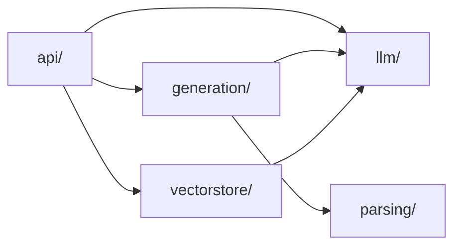
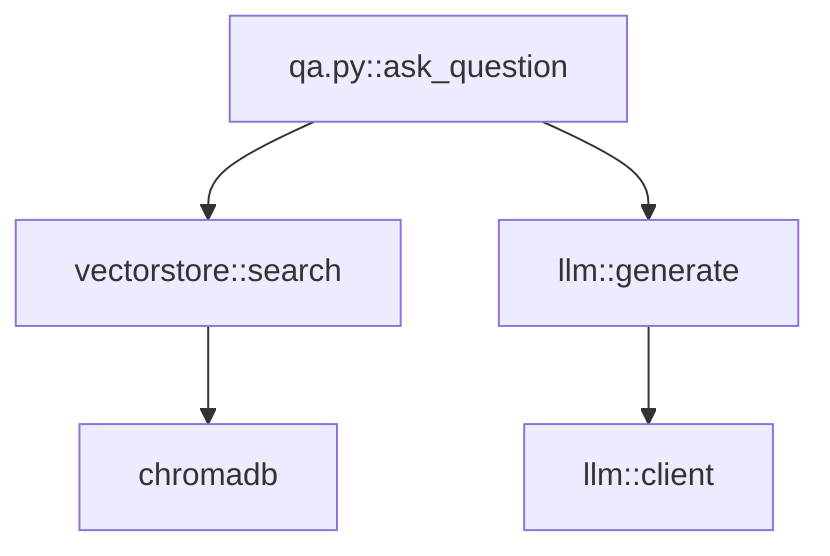

# Phase 3: Architecture Documentation Generation - Design

> **For Claude:** REQUIRED SUB-SKILL: Use superpowers:writing-plans to create the implementation plan after this design is approved.

**Goal:** Use the code graph to generate architecture documentation with real, graph-derived diagrams instead of LLM-imagined ones.

**Date:** 2026-01-17

---

## Design Decisions

| Decision | Choice | Rationale |
|----------|--------|-----------|
| Page structure | Single architecture overview page | Simpler, avoids duplication with directory pages |
| Component identification | Directories + graph connections | Predictable structure, graph shows real relationships |
| Entry point detection | `get_entry_points()` (no incoming calls) | Language-agnostic, already built in Phase 2 |
| LLM involvement | Diagrams from graph, narrative from LLM | Accuracy in structure, readability in text |
| Confidence threshold | ≥ 0.7 for diagrams | Clean diagrams, LLM can mention uncertain edges |
| Test code | Excluded from all diagrams | Keeps diagrams focused on production architecture |

---

## Architecture Page Structure

The generated architecture page will contain:

1. **Component Diagram** - Top-level directories as boxes, edges showing dependencies
2. **Key Entry Points** - Functions with no incoming calls, grouped by component
3. **Data Flow Diagrams** - For top N entry points, show 2-hop neighborhood
4. **Narrative Sections** - LLM-written prose explaining the diagrams

---

## Component Diagram

Shows top-level directories and their dependencies.

**Algorithm:**
1. Load graph, filter out test files
2. Group nodes by top-level directory
3. For each directory pair (A, B), check if any node in A calls any node in B
4. Add edge if dependency exists with confidence ≥ 0.7
5. Generate Mermaid via directory-level graph

**Example output:**


**Filtering rules:**
- Exclude directories that are entirely test code
- Exclude edges below 0.7 confidence
- Patterns to exclude: `tests/`, `test_*`, `*_test.*`, `__tests__/`

---

## Entry Points & Data Flow Diagrams

**Entry Points:**
1. Call `get_entry_points(graph)` to find functions with no incoming calls
2. Filter out test code
3. Group by component (directory)
4. Display as bulleted list with file:line links

**Data Flow Diagrams:**

For top N entry points (default 5), generate flow diagrams:

1. Select entry points with highest fan-out (touch most of system)
2. For each, call `get_neighborhood(graph, node_id, hops=2)`
3. Filter subgraph to confidence ≥ 0.7, exclude test nodes
4. Call `subgraph.to_mermaid()` to generate diagram

**Example output:**


---

## LLM Narrative Generation

The LLM receives structured context and writes prose explaining the diagrams.

**Input to LLM:**
- Component diagram (Mermaid)
- List of components with purpose (from directory summaries)
- Data flow diagrams (Mermaid)
- Entry point details (name, file, docstring)
- Graph statistics

**Prompt structure:**
```
You are writing the Architecture page for a codebase wiki.

## Components
{component_diagram_mermaid}

The codebase has these components:
{for each directory: name, file count, brief summary}

## Key Flows
{for each flow diagram: entry_point name, diagram}

Write an architecture overview that:
1. Explains what each component does (1-2 sentences each)
2. Describes how they interact based on the diagrams
3. Highlights the main request flows
4. Notes any architectural patterns visible

Keep it factual - describe what the diagrams show, don't invent relationships.
```

**Key constraint:** LLM describes diagrams, doesn't create them.

---

## Integration with Generation Pipeline

**When it runs:**
- After parsing completes and graph is built
- Before or alongside other page generation
- Only if graph exists and has sufficient nodes

**Changes to orchestrator:**
1. After `build_graph()`, call `save_graph()` (already done)
2. Add new step: `generate_architecture_page(graph)`
3. Produces `.oyawiki/architecture.md`

**New files:**
```
backend/src/oya/
├── graph/
│   └── analysis.py      # NEW: get_component_graph(), filter_test_nodes()
├── generation/
│   ├── architecture.py  # NEW: generate_architecture_page()
│   ├── prompts.py       # MODIFY: add architecture prompt
│   └── orchestrator.py  # MODIFY: call architecture generator
```

**Fallback behavior:**
- If graph is empty or < 5 nodes, fall back to existing LLM-only generation
- Log warning so users understand why

**No frontend changes needed.**

---

## Testing Strategy

**Unit tests:**
- `test_filter_test_nodes()` - verifies test file exclusion
- `test_get_component_graph()` - verifies directory-level aggregation
- `test_select_top_entry_points()` - verifies fan-out ranking
- `test_build_architecture_prompt()` - verifies prompt structure

**Integration tests:**
- `test_architecture_generation_on_oya()` - generate for Oya's own code
- `test_architecture_fallback_empty_graph()` - verify graceful degradation

**Not testing:**
- LLM output quality (non-deterministic)
- Exact diagram layout (Mermaid handles this)

---

## Dependencies

- Phase 2 complete (graph module with `get_entry_points()`, `get_neighborhood()`, `Subgraph.to_mermaid()`)
- Existing directory summaries (for component descriptions)
- Existing LLM client

---

## Next Steps

1. Create implementation plan: `docs/plans/2026-01-17-graph-phase-3-implementation.md`
2. Implement using TDD approach
3. After completion, proceed to Phase 4 (Graph-Augmented Q&A)
