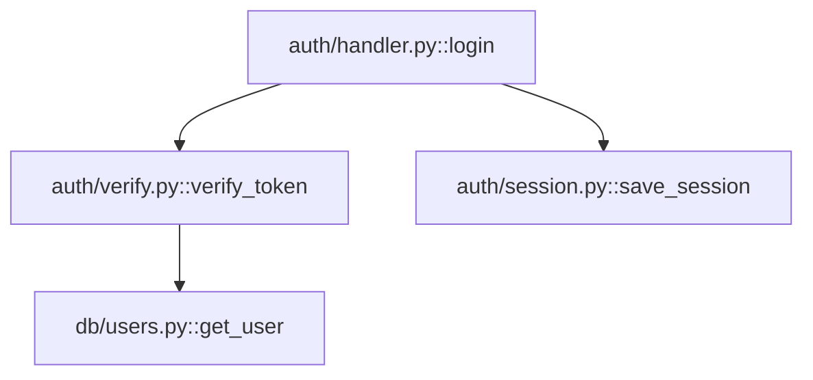

# Phase 4: Graph-Augmented Q&A Retrieval - Design

> **For Claude:** REQUIRED SUB-SKILL: Use superpowers:writing-plans to create the implementation plan after this design is approved.

**Goal:** Enhance Q&A retrieval by combining vector search with graph traversal to provide connected code context instead of isolated chunks.

**Date:** 2026-01-17

---

## Design Decisions

| Decision | Choice | Rationale |
|----------|--------|-----------|
| Retrieval strategy | Vector-first, graph-expand | Leverages existing vector search, adds structural context |
| Hop depth | Fixed 2 hops | Balances coverage vs token cost |
| Confidence threshold | ≥0.5 (in constants) | Lower than generation (0.7) to include more context for LLM |
| Context budget | Prioritized selection | Most relevant nodes first, truncate at limit |
| Subgraph presentation | Mermaid + code | Diagram shows structure, code provides detail |

---

## How It Works

1. **Vector Search (existing)** - Find top-K relevant nodes via semantic similarity
2. **Graph Expansion (new)** - For each vector result, traverse 2 hops in the graph to find connected code
3. **Prioritize & Deduplicate** - Rank all nodes by relevance, remove duplicates, fit within token budget
4. **Present to LLM** - Include Mermaid diagram showing relationships + actual code

**Example Flow:**

User asks: "How does authentication connect to the database?"

1. Vector search finds `auth/handler.py::login` and `db/users.py::save_user`
2. Graph expansion reveals `auth/handler.py::login` → calls → `auth/verify.py::verify_token` → calls → `db/users.py::get_user`
3. System includes all 4 functions plus a Mermaid diagram showing the call chain
4. LLM can now explain the full flow, not just the endpoints

---

## Implementation Changes

### New Constants (`backend/src/oya/constants/qa.py`)

```python
GRAPH_EXPANSION_HOPS = 2
GRAPH_EXPANSION_CONFIDENCE_THRESHOLD = 0.5
```

### New Module (`backend/src/oya/qa/graph_retrieval.py`)

- `expand_with_graph(node_ids: list[str], graph: CodeGraph, hops: int) -> Subgraph` - Takes vector search results, expands via graph traversal
- `prioritize_nodes(nodes: list[Node], query_embedding: list[float]) -> list[Node]` - Ranks nodes by relevance (vector similarity + graph centrality)
- `build_graph_context(subgraph: Subgraph, budget: int) -> tuple[str, str]` - Returns (mermaid_diagram, code_snippets) that fit within token budget

### Modified Module (`backend/src/oya/qa/service.py`)

- `QAService.answer()` gains optional `use_graph: bool = True` parameter
- When graph exists and `use_graph=True`:
  1. Run existing vector retrieval
  2. Call `expand_with_graph()` on results
  3. Call `prioritize_nodes()` to rank
  4. Call `build_graph_context()` to format
  5. Include Mermaid + code in LLM prompt

### Fallback Behavior

- If no graph exists → use existing vector-only retrieval
- If graph expansion returns nothing new → proceed with vector results only
- Log when falling back so users understand

---

## LLM Prompt Format

When graph context is available, the Q&A prompt includes:

```
## Code Relationships
The following diagram shows how the relevant code connects:



## Relevant Code

### auth/handler.py::login (lines 45-67)
```python
async def login(credentials: Credentials) -> Session:
    user = await verify_token(credentials.token)
    ...
```

### auth/verify.py::verify_token (lines 12-28)
```python
async def verify_token(token: str) -> User:
    ...
```

[Additional code snippets in priority order until budget reached]
```

**Key Points:**
- Mermaid diagram comes first (shows structure at a glance)
- Code snippets follow in priority order (most relevant first)
- Each snippet includes file path and line numbers for citations
- Budget allocation: ~500 tokens for diagram, remainder for code

---

## Testing Strategy

### Unit Tests (`backend/tests/test_graph_retrieval.py`)

- `test_expand_with_graph_finds_connected_nodes()` - Verifies 2-hop expansion
- `test_expand_with_graph_respects_confidence_threshold()` - Edges below 0.5 excluded
- `test_prioritize_nodes_ranks_by_relevance()` - Central + similar nodes ranked higher
- `test_build_graph_context_fits_budget()` - Output respects token limit
- `test_build_graph_context_includes_mermaid()` - Diagram present in output

### Integration Tests (`backend/tests/test_qa_service.py`)

- `test_qa_with_graph_expansion()` - End-to-end with mock graph
- `test_qa_falls_back_without_graph()` - Graceful degradation
- `test_qa_graph_expansion_disabled()` - `use_graph=False` bypasses expansion

### Not Testing

- LLM output quality (non-deterministic)
- Exact Mermaid layout (handled by renderer)

### Error Handling

- Graph load failure → log warning, use vector-only
- Empty expansion results → proceed with original vector results
- Token budget exceeded → truncate lowest-priority nodes

---

## File Changes

```
backend/src/oya/
├── constants/
│   └── qa.py                    # MODIFY: add graph expansion constants
├── qa/
│   ├── graph_retrieval.py       # NEW: graph expansion logic
│   └── service.py               # MODIFY: integrate graph retrieval
├── generation/
│   └── prompts.py               # MODIFY: add graph-augmented Q&A prompt

backend/tests/
├── test_graph_retrieval.py      # NEW: unit tests
└── test_qa_service.py           # MODIFY: integration tests
```

---

## Dependencies

- Phase 2 complete (graph with `get_neighborhood()`, `Subgraph.to_mermaid()`)
- Phase 3 complete (architecture generation proves graph integration works)
- Existing Q&A service and vector store

---

## Next Steps

1. Create implementation plan: `docs/plans/2026-01-17-graph-phase-4-implementation.md`
2. Implement using TDD approach
3. After completion, proceed to Phase 5 (Iterative Retrieval / CGRAG)
