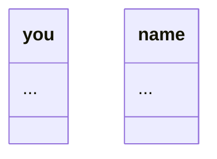

# Prevent Bad Diagrams

## Problem

The wiki generator produces useless Mermaid diagrams for simple codebases:

1. **Class diagrams with garbage names** - The fallback parser's class regex matches English prose like "class you specify" in POD documentation, extracting "you" and "name" as class names
2. **Dependency diagrams with no edges** - Files listed but no relationships shown
3. **Layer diagrams referencing undefined subgraphs** - Broken arrows to non-existent layers

Example: The `aliased` Perl module wiki contains diagrams like:


## Solution

Two-layer defense: filter garbage at the source AND validate diagram value before inclusion.

### Layer 1: Filter Documentation Files from Class Detection

**File:** `backend/src/oya/generation/fallback_parser.py`

Add documentation extensions that should skip class pattern matching:

```python
# Extensions for documentation files - skip class detection
DOCUMENTATION_EXTENSIONS = frozenset([
    ".pod",   # Perl POD
    ".md",    # Markdown
    ".rst",   # reStructuredText
    ".txt",   # Plain text
    ".adoc",  # AsciiDoc
    ".rdoc",  # Ruby documentation
])
```

Modify `parse()` to skip `CLASS_PATTERNS` for documentation files:

```python
def parse(self, file_path: Path, content: str) -> ParseResult:
    language = self._detect_language(file_path)
    symbols: list[ParsedSymbol] = []

    # Check if this is a documentation file
    is_documentation = file_path.suffix.lower() in DOCUMENTATION_EXTENSIONS

    # Extract function-like patterns (always)
    for pattern, symbol_type in FUNCTION_PATTERNS:
        # ... existing code ...

    # Extract class-like patterns (skip for documentation files)
    if not is_documentation:
        for pattern, symbol_type in CLASS_PATTERNS:
            # ... existing code ...
```

### Layer 2: Validate Diagram Usefulness

**File:** `backend/src/oya/generation/mermaid.py`

Add `is_useful()` static methods to each generator class:

#### ClassDiagramGenerator

```python
@staticmethod
def is_useful(diagram: str) -> bool:
    """Check if a class diagram adds value.

    Returns False if:
    - Contains "NoClasses" placeholder
    - All classes only have "..." as content (no real methods)
    """
    if "NoClasses" in diagram:
        return False

    # Check if any class has real content (not just ...)
    # Pattern: class definitions with only "..." inside
    lines = diagram.split('\n')
    in_class = False
    has_real_content = False

    for line in lines:
        stripped = line.strip()
        if stripped.startswith('class ') and '{' in stripped:
            in_class = True
        elif in_class and stripped == '}':
            in_class = False
        elif in_class and stripped and stripped != '...' and not stripped.startswith('class '):
            has_real_content = True
            break

    return has_real_content
```

#### DependencyGraphGenerator

```python
@staticmethod
def is_useful(diagram: str) -> bool:
    """Check if a dependency diagram adds value.

    Returns False if:
    - Contains "NoFiles" placeholder
    - Has no edges (just nodes, no relationships)
    """
    if "NoFiles" in diagram:
        return False

    # Must have at least one edge
    return "-->" in diagram
```

#### LayerDiagramGenerator

```python
@staticmethod
def is_useful(diagram: str) -> bool:
    """Check if a layer diagram adds value.

    Returns False if:
    - Contains "NoLayers" placeholder
    - Has no edges between layers
    - Has only one subgraph (single layer)
    """
    if "NoLayers" in diagram or "No layers" in diagram:
        return False

    # Count subgraphs
    subgraph_count = diagram.lower().count("subgraph ")
    if subgraph_count <= 1:
        return False

    # Must have edges between layers (outside subgraphs)
    # Look for arrows that aren't inside subgraph definitions
    return "-->" in diagram
```

### Layer 3: Only Include Useful Diagrams

**File:** `backend/src/oya/generation/architecture.py`

Modify `_inject_diagrams()`:

```python
def _inject_diagrams(self, content: str, diagrams: dict[str, str]) -> str:
    """Inject validated AND useful Mermaid diagrams into the architecture content."""
    validated_diagrams = []

    # Usefulness checkers for each diagram type
    usefulness_checks = {
        "layer": LayerDiagramGenerator.is_useful,
        "dependency": DependencyGraphGenerator.is_useful,
        "class": ClassDiagramGenerator.is_useful,
    }

    diagram_titles = {
        "layer": "System Layers",
        "dependency": "File Dependencies",
        "class": "Class Structure",
    }

    for name, diagram_content in diagrams.items():
        # Check syntax validity
        validation = validate_mermaid(diagram_content)
        if not validation.valid:
            continue

        # Check usefulness
        usefulness_check = usefulness_checks.get(name)
        if usefulness_check and not usefulness_check(diagram_content):
            continue

        title = diagram_titles.get(name, name.title())
        validated_diagrams.append((title, diagram_content))

    # If no useful diagrams, don't add section at all
    if not validated_diagrams:
        return content

    # ... rest of existing code to append diagrams ...
```

**File:** `backend/src/oya/generation/file.py`

Modify `_generate_diagrams()`:

```python
def _generate_diagrams(
    self,
    file_path: str,
    parsed_symbols: list[ParsedSymbol] | None,
    file_imports: dict[str, list[str]] | None,
) -> str:
    """Generate Mermaid diagrams for the file."""
    diagrams = []

    # Class diagram if we have parsed symbols with classes
    if parsed_symbols:
        class_diagram = self._class_diagram_gen.generate(parsed_symbols)
        if class_diagram:
            result = validate_mermaid(class_diagram)
            # Check both validity AND usefulness
            if result.valid and ClassDiagramGenerator.is_useful(class_diagram):
                diagrams.append(("Class Structure", class_diagram))

    # Dependency diagram if we have import data
    if file_imports:
        dep_diagram = self._dep_diagram_gen.generate_for_file(file_path, file_imports)
        if dep_diagram:
            result = validate_mermaid(dep_diagram)
            # Check both validity AND usefulness
            if result.valid and DependencyGraphGenerator.is_useful(dep_diagram):
                diagrams.append(("Dependencies", dep_diagram))

    if not diagrams:
        return ""

    # ... rest of existing code ...
```

## Expected Results

### For `aliased` Perl module:
- **Before:** Three garbage diagrams (class with "you"/"name", empty dependencies, broken layers)
- **After:** No diagram section at all

### For complex codebases like Oya:
- Useful diagrams still generated (real classes, actual dependencies, multiple layers)
- No change to existing good output

## Testing

Add tests in `backend/tests/test_mermaid.py`:

```python
class TestDiagramUsefulness:
    def test_class_diagram_useful_with_methods(self):
        diagram = '''classDiagram
    class UserService {
        +create_user()
        +delete_user()
    }'''
        assert ClassDiagramGenerator.is_useful(diagram) is True

    def test_class_diagram_useless_only_ellipsis(self):
        diagram = '''classDiagram
    class you {
        ...
    }
    class name {
        ...
    }'''
        assert ClassDiagramGenerator.is_useful(diagram) is False

    def test_class_diagram_useless_no_classes(self):
        diagram = '''classDiagram
    class NoClasses {
        No classes found
    }'''
        assert ClassDiagramGenerator.is_useful(diagram) is False

    def test_dependency_diagram_useful_with_edges(self):
        diagram = '''flowchart LR
    main_py["main.py"]
    config_py["config.py"]
    main_py --> config_py'''
        assert DependencyGraphGenerator.is_useful(diagram) is True

    def test_dependency_diagram_useless_no_edges(self):
        diagram = '''flowchart LR
    file1["file1.py"]
    file2["file2.py"]'''
        assert DependencyGraphGenerator.is_useful(diagram) is False

    def test_layer_diagram_useful_multiple_layers_with_edges(self):
        diagram = '''flowchart TB
    subgraph api["API Layer"]
        api_main["main.py"]
    end
    subgraph data["Data Layer"]
        data_db["db.py"]
    end
    api --> data'''
        assert LayerDiagramGenerator.is_useful(diagram) is True

    def test_layer_diagram_useless_single_layer(self):
        diagram = '''flowchart TB
    subgraph utility["Utility"]
        util_helper["helper.py"]
    end'''
        assert LayerDiagramGenerator.is_useful(diagram) is False
```

Add test for documentation file filtering in `backend/tests/test_fallback_parser.py`:

```python
def test_skips_class_detection_for_pod_files():
    """POD files should not have class patterns matched."""
    parser = FallbackParser()
    content = '''=head1 NAME

aliased - Use shorter versions of class names.

=head1 DESCRIPTION

It loads the class you specify and exports into your namespace...
'''
    result = parser.parse(Path("README.pod"), content)

    # Should not find "you" or "name" as classes
    class_symbols = [s for s in result.file.symbols if s.symbol_type == SymbolType.CLASS]
    assert len(class_symbols) == 0
```

## Files Changed

1. `backend/src/oya/parsing/fallback_parser.py` - Add DOCUMENTATION_EXTENSIONS, skip class detection
2. `backend/src/oya/generation/mermaid.py` - Add `is_useful()` methods to generators
3. `backend/src/oya/generation/architecture.py` - Check usefulness before including diagrams
4. `backend/src/oya/generation/file.py` - Check usefulness before including diagrams
5. `backend/tests/test_mermaid.py` - Add usefulness tests
6. `backend/tests/test_fallback_parser.py` - Add documentation file filtering test
